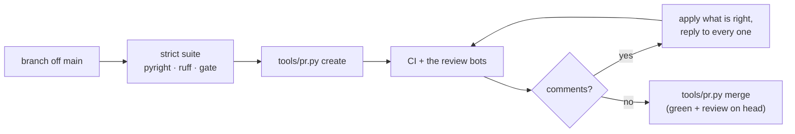
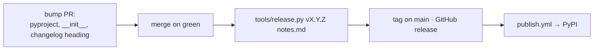

# Contributing

Other groups load this package in their experiments, so the rules keep their numbers stable. Every
rule is a command you can run.

## Setup

```bash
git clone https://github.com/myersben9/fdia-graph
cd fdia-graph
pip install -e ".[generate,se,torch,dev]"
pytest tests                                  # about a minute; one 13 MB pool download
```

`docs/ROADMAP.md` is the map and the reading order.

## The rules

| rule | means | command |
|---|---|---|
| nothing a user sees changes without a changelog entry | public API, file formats, the numbers a shard, stream or estimator produces; moved private names get a warning alias for one minor version | `CHANGELOG.md`, `## Unreleased` |
| every change is proven behaviour-free, or its effect is measured | the strict frozen suite compares a tiny shard, a stream and the scores bit for bit; an intended change re-freezes in the same PR and states the deltas | `FDIA_FROZEN_STRICT=1 pytest -W "error::DeprecationWarning:fdia_graph" tests`, `python tools/freeze_reference.py` |
| code reads as its subject | complexity 10, nesting 3, no closure captures, at most 7 parameters, no positional record indexing; every equation a named function in `formulas/` with a source key; every returned bundle a model in `models/` | `python tools/readability.py --report`, `--check --base origin/main` |
| typed, formatted, linted | pyright at zero, ruff format and check clean | `pyright src/fdia_graph`, `ruff format --check src`, `ruff check src tests tools` |
| speed is tracked | per-record timings against the last row from this machine, 3x tolerance | `python tools/bench.py --check` before a release, `python tools/bench.py` after |

## The pull request



```bash
python tools/pr.py create my-branch "One-line title" body.md   # body: what, why, what you checked
python tools/pr.py wait 80                                     # CI plus every required review bot
python tools/pr.py comments 80
python tools/pr.py reply 80 <comment-id> "what changed"
python tools/pr.py merge 80                                    # refuses unless green with every required bot's review on the head
```

Green means: every job of the smoke workflow (`tests`, `typecheck`, `format`, `readability`, the two
installs) is a completed success on the head, a job that has not started yet counts as not green,
every other listed check has finished without failure, and every required review bot has reviewed
that exact head.

Three reviewers read a pull request, in this order:

1. `/code-review ultra <number>` in Claude Code, before the bots: a multi-agent review of the whole
   branch with the repository as context. Fold what it finds into the branch first.
2. Copilot, on every push, always required on the head.
3. CodeRabbit (`.coderabbit.yaml` carries our review instructions) and Gemini Code Assist, both
   GitHub apps installed on the repository; `tools/pr.py` requires a bot's review on the head as
   soon as that bot has reviewed the pull request once, so a bot that is not installed never
   blocks a merge and an installed one is never skipped.

Bot comments are suggestions: apply the ones that are right (about one in two has been), answer
every one with what you changed or why not. The tool uses the token the
Git Credential Manager already holds for `git push`; there is no gh CLI on the lab machines. Commit
as yourself, with a message that says what the change does. If CI does not start on a push, check the
account's Actions and Copilot credits before anything else.

## Releasing



A released version is never re-cut; fix forward. Data releases (shards, pools, streams) have their
own tags and do not move the package version.

## Where things live

| you want to change | look in |
|---|---|
| an attack family, the plausibility band, the meter model | `engine/`, `formulas/attacks.py`, `formulas/noise.py` |
| what a shard or stream contains | `generation.py`, `streams.py`, then `docs/reference/DATA_DICTIONARY.md` |
| how a shard is loaded or exported | `dataset/`, one concern per file |
| an estimator | `se/methods.py`, its algebra in `formulas/estimation.py` |
| a localizer | `localization/methods.py` or `learned.py` |
| a returned record's fields | `models/` |
| a formula | `formulas/`, and its row in `docs/reference/FORMULAS.md` |

The design documents behind the current layout are archived in `docs/plans/`.
