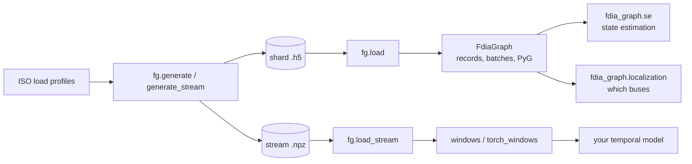

# fdia-graph

Stealthy FDIA localization datasets for power grids, PyTorch-ready in one line. Eight IEEE systems
(14 / 30 / 57 / 89 / 118 / 145 / 200 / 300 buses), 72,000 records each.

```python
import fdia_graph as fg

ds = fg.load("ieee118", split="train")     # auto-downloads + caches
for batch in ds.loader(batch_size=64):
    batch["node_x"], batch["edge_x"], batch["edge_index"], batch["y"], batch["family"]
```



| Read | To learn |
|---|---|
| [`docs/ROADMAP.md`](docs/ROADMAP.md) | which file does what, and how the paths connect |
| [`docs/reference/DATA_DICTIONARY.md`](docs/reference/DATA_DICTIONARY.md) | what every array means |
| [`docs/reference/CONCEPTS_TO_CODE.md`](docs/reference/CONCEPTS_TO_CODE.md) | paper equations to functions |
| [`docs/reference/EXAMPLES.md`](docs/reference/EXAMPLES.md) | runnable baselines, streams, dataset stats |
| [`docs/se/`](docs/se/README.md) · [`docs/localization/`](docs/localization/README.md) | the two analysis modules, with results |
| [`CONTRIBUTING.md`](CONTRIBUTING.md) | rules, pull-request flow, releases |

## Install

| command | gives |
|---|---|
| `pip install fdia-graph` | the loader (numpy, h5py) |
| `pip install "fdia-graph[torch]"` | + PyTorch DataLoader, learned localizers |
| `pip install "fdia-graph[pyg]"` | + torch_geometric records and streams |
| `pip install "fdia-graph[se]"` | + state estimation, residual localization (pandapower, scipy; add `[torch]` for speed) |
| `pip install "fdia-graph[generate]"` | + pandapower, to generate custom data |

Data is pinned per SDK version and cached in `~/.cache/fdia_graph`. `fg.load(..., release="v0.7.2")`
pins a data version; `pip install --upgrade fdia-graph` moves it forward.

## Load

```python
fg.load("ieee300", split="train")                              # 60/20/20 chronological split
fg.load("ieee118", split="test", families=["Aq", "At", "Al"])  # family subset
fg.load("ieee118", units="pu")                                 # per-unit + radians (default: physical)
```

| you want | call |
|---|---|
| a whole split at once | `ds.to_numpy()`, `ds.to_torch()`, `ds.to_pandas()` |
| custom data | `fg.generate(system, name, per_family=..., attack_intensity=...)`, then `fg.load(name)` |
| a continuous timeline for LSTM / TGN | `fg.load_stream(system)`, then `fg.windows(s, W=24)` |

## State estimation

```python
from fdia_graph.se import SubspacePrior                       # pip install "fdia-graph[se]"

train, test = fg.load("ieee118", split="train"), fg.load("ieee118", split="test")
est = SubspacePrior(rank_frac=0.5, reweight="huber", c=2.5).fit(train)
xhat = est.estimate(test)          # [n, 2N-1] = [theta rad (non-slack) | V pu (all buses)]
print(est.score(test))             # per-family angle / voltage MAE vs the clean truth
```

One solver, six estimators that each change one thing: `WLS`, `AdaptiveWeighting`, `ResidualRemoval`,
`SubspacePrior`, `JacobianWeighting`, `GatedPrior`. Results: [`docs/se/`](docs/se/README.md).

## Localization

```python
from fdia_graph.localization import SwingThreshold, BusCNN     # numpy only / [torch]

loc = SwingThreshold(fa_target=0.01).fit(train)     # per-bus thresholds from benign records only
flag = loc.localize(test)                           # [n, N] bool: which buses are called attacked
print(loc.score(test))                              # per-family node-F1, strict accuracy, DR next to FA

zs = dict(families=[0, 1, 2])                       # the papers' zero-shot protocol
cnn = BusCNN().fit(fg.load("ieee118", split="train", **zs), val=fg.load("ieee118", split="val", **zs))
```

One calibration, five localizers: `SwingThreshold`, `DeltaThreshold`, `ResidualLocalizer`, `BusMLP`,
`BusCNN`. Results: [`docs/localization/`](docs/localization/README.md).

## Data

Each record is a sparse measurement graph with **N buses** (nodes) and **E branches** (edges).
A shape reads "values per item": `[N,4]` is 4 numbers per bus.

| field | shape | columns | meaning |
|---|---|---|---|
| `node_x` | `[N,4]` | <code>&#124;V&#124;</code>, `P_inj`, `Q_inj`, `theta` | bus meters (`node_m` is the mask) |
| `edge_x` | `[E,2]` | `P_from`, `Q_from` | branch flows (`edge_m` is the mask) |
| `edge_index` | `[2,E]` | `from_bus`; `to_bus` | connectivity |
| `edge_attr` | `[E,8]` | `r`, `x`, `b`, `g`, `gs`, `bs`, `tap`, `shift` | static line physics (`Data.edge_phys` in PyG) |
| `y` | `[N]` | | 1 attacked, 0 clean |
| `family` | scalar | | 0 benign, 1 Aq, 2 Ad, 3 As, 4 Ar, 5 At, 6 Al (`fg.FAMILIES`) |
| `temporal_delta`, `swing` | `[N,2]` | `ΔP`, `ΔQ` | scan-to-scan change, and as a z-score of recent change |
| `clean`, `edge_clean`, `edge_clean_full` | `[N,4]`, `[E,2]`, `[E,2]` | as above | noiseless truth: buses, metered branches, every branch |
| `slack`, `ybus`, `yf`, `yt` | dataset attributes | | reference bus, admittance matrices |

Full reference: [`docs/reference/DATA_DICTIONARY.md`](docs/reference/DATA_DICTIONARY.md).

## Attacks

| family | attack | classical BDD | plausibility |
|---|---|---|---|
| `Aq` | load rescale, AC re-solve | evades | every per-bus change within a 2% to 20% band |
| `At` | slow load ramp, AC re-solve | evades | same band, spread over 60 scans |
| `Al` | load redistribution that hides an overload | evades | same band, load conserved |
| `Ad` / `As` / `Ar` | meter bias / scaling / replay | caught | same band |


*Bad-data statistic relative to the alarm threshold, per family. Green families are indistinguishable
from benign; red ones trip the alarm.* Meter error follows an accuracy-class model (per-meter bias
plus per-scan jitter). Report per-family node-F1 next to the false-alarm rate, never accuracy.

## Citation

| cite | for |
|---|---|
| Yuan, Li & Ren, *Modeling load redistribution attacks in power systems*, IEEE T-SG 2(2), 2011 | LRA |
| Haghshenas, Hasnat & Naeini, *A Temporal GNN for Cyber Attack Detection and Localization in Smart Grids*, IEEE ISGT 2023 | ramp |
| Zaman & Lin, *PING: Physics-Informed GNNs to Generalize FDIA Localization*, NAPS 2025 | measurement model |
| Asprou, Kyriakides & Albu, *Variable Weights in a WLS State Estimator*, IEEE T-IM 63, 2014 | meter noise |
| Boyaci et al., *Joint Detection and Localization of Stealth FDIA*, IEEE T-SG, 2022 | protocol |

## License

Data under CC BY 4.0, code under MIT (see `LICENSE`). Synthetic, from public IEEE cases. Not for
operational decisions.
