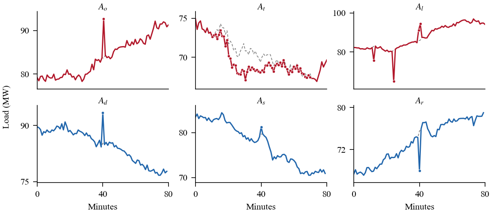
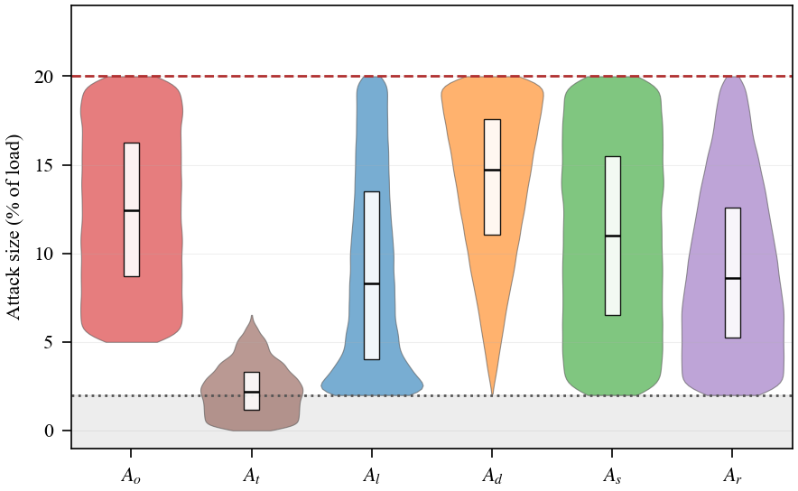
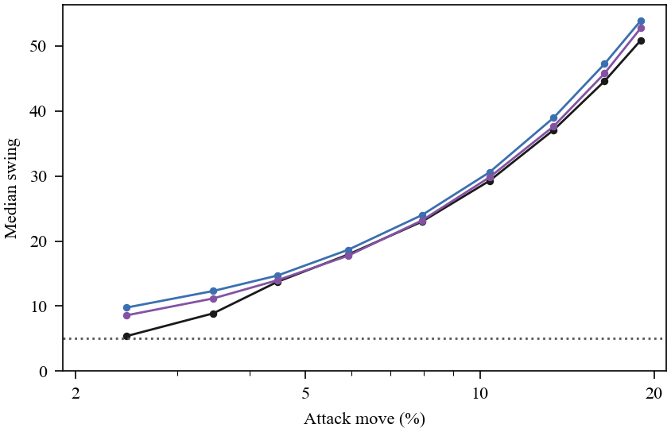
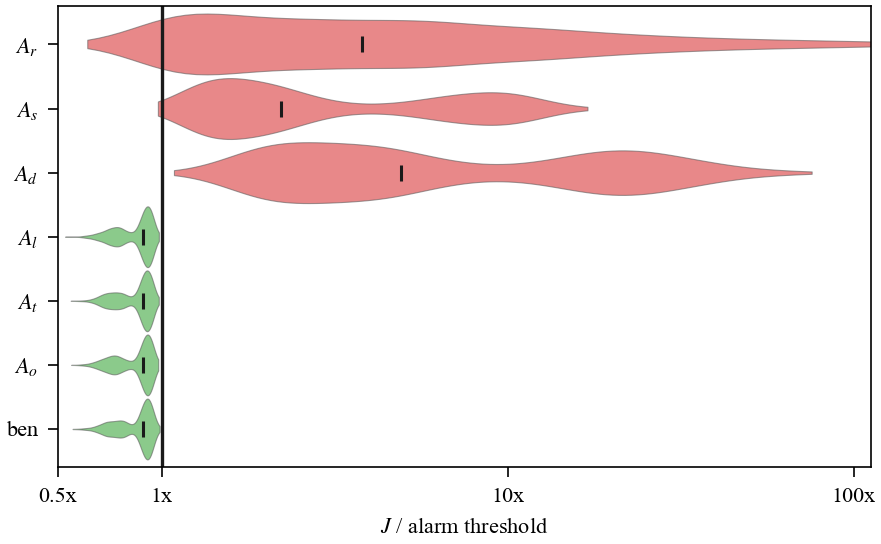
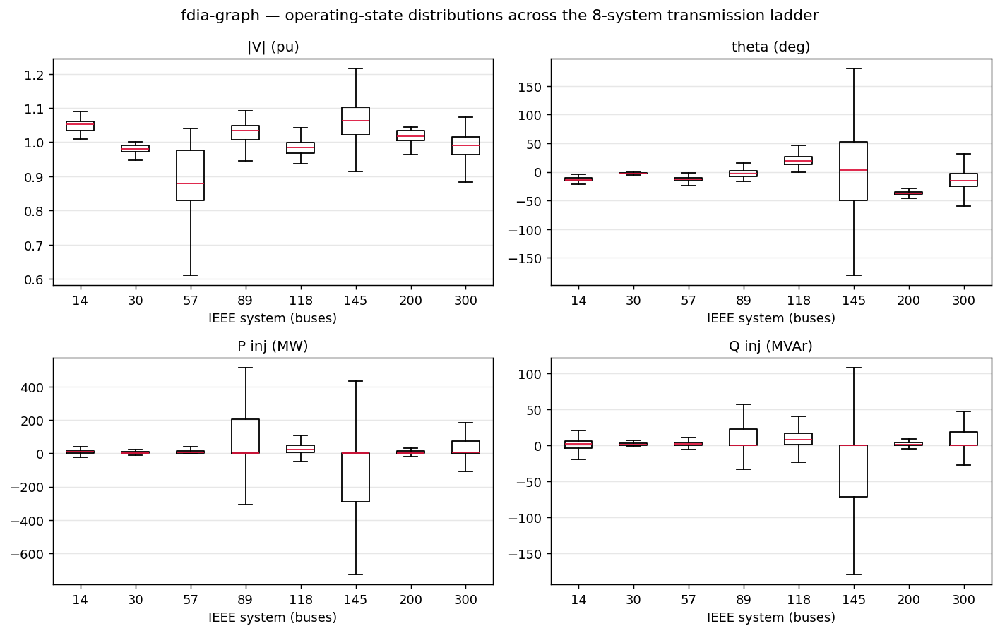

# fdia-graph

**Load and generate stealthy FDIA localization datasets for power grids — PyTorch-ready, one line, zero data plumbing.**

A benchmark of false-data-injection attacks that evade classical bad-data detection but are localizable by a model, on realistic sparse SCADA/PMU measurement graphs across a transmission size ladder of eight IEEE systems: 14 / 30 / 57 / 89 / 118 / 145 / 200 / 300 buses.

```python
import fdia_graph as fg

ds = fg.load("ieee118", split="train")     # auto-downloads + caches the newest release
loader = ds.loader(batch_size=64)          # ready-to-train PyTorch DataLoader
for batch in loader:
    batch["node_x"], batch["edge_x"], batch["edge_index"], batch["y"], batch["family"], ...
```



*One IEEE-118 bus under each attack (dashed = benign load). Only the slow ramp `At` perturbs many scans.*



*Attack magnitude per family, inside the 2%–20% plausibility band (dotted floor, dashed cap).*



*Attacked-bus swing rises with attack size; below ~2% it falls into the benign floor (dotted).*



*Bad-data statistic per family. Stealthy families stay below the alarm line (1×), detectable ones sit well above.*

## Why this dataset

Most FDIA benchmarks contain attacks a bad-data detector (BDD) catches, so "ML beats BDD" is unsurprising. This one is built around the opposite: three stealthy families that provably evade classical detection and are genuinely dangerous, alongside three detectable families as a contrast set.

| Family | Type | Classical BDD |
|--------|------|---------------|
| `Aq`   | stealthy load scaling: bounded per-bus rescale + AC re-solve — **our contribution** (cf. Boyaci `Ao`, Liu FDIA) | **evades (stealthy)** |
| `At`   | temporal load surge, ramps up then back down (Haghshenas et al., IEEE ISGT 2023) | **evades (stealthy)** |
| `Al`   | targeted masked-overload / load redistribution (Yuan, Li & Ren, IEEE T-SG 2011) | **evades (stealthy)** |
| `Ad`   | random meter corruption | caught |
| `As`   | meter scaling | caught |
| `Ar`   | replay | mostly caught |

Two things keep it honest: every attack's per-bus magnitude sits in a **plausibility band** — above a ~2% meter-noise floor (can't hide in noise) and below a 20% cap (stays realistic), with the slow ramp `At` exempt from the floor by design — and meter error follows an **accuracy-class model** (Asprou class-0.2, a fixed per-meter bias plus a per-scan jitter) rather than a single made-up variance. Each record is a PING-style measurement graph (branch flows as edges, metered injections + |V| + sparse PMU angles as nodes, with availability masks) at a realistic redundancy of ≈ 2–3.

## Install

Install the current release straight from GitHub (the PyPI package can lag behind `main`):

```bash
pip install "git+https://github.com/myersben9/fdia-graph"                 # loader (numpy + h5py)
pip install "fdia-graph[torch] @ git+https://github.com/myersben9/fdia-graph"   # + PyTorch Dataset/DataLoader
pip install "fdia-graph[pyg]   @ git+https://github.com/myersben9/fdia-graph"   # + torch_geometric graph format
pip install "fdia-graph[generate] @ git+https://github.com/myersben9/fdia-graph" # + pandapower, generate custom data
pip install "fdia-graph[all]   @ git+https://github.com/myersben9/fdia-graph"   # everything (adds gridstatus for ISO load)
```

Once the matching version is on PyPI you can also `pip install fdia-graph` (add `--upgrade` to move an existing install forward). To upgrade an existing git install, add `--upgrade --force-reinstall` so pip re-pulls `main`.

### Versioning and updates

The dataset does **not** auto-update. Each installed SDK version pins a data release (`fdia_graph.__version__` ships a fixed `_RELEASE` tag), and downloaded shards are cached under `~/.cache/fdia_graph`, so a given install always sees the same data. To change what you get:

- **Pin a version explicitly** — `fg.load("ieee118", release="v0.7.1")` — reproducible regardless of the installed default.
- **Move the default forward** — upgrade the package (the SDK version carries its pinned data release with it).
- **Force a re-fetch** of the same version — delete `~/.cache/fdia_graph`.

Datasets, operating-point pools, and the whole simulation pipeline all ship through the package and its GitHub releases. There is no separate data drop to sync.

## Load

```python
ds  = fg.load("ieee300", split="train")                             # 60/20/20 chronological split
stealthy = fg.load("ieee118", split="test", families=["Aq","At","Al"])   # family subset ("Ao"/"ramp"/"LRA" alias)
heldout  = fg.load("ieee118", split="train", heldout=True)          # As/Ar excluded from train (Boyaci et al. 2022)

fg.load("ieee118", units="physical")   # default: |V| p.u., P/Q in MW/MVAr, θ in degrees
fg.load("ieee118", units="pu")         # everything per-unit on baseMVA, θ in radians (for ML/physics models)
fg.load("ieee118", release="v0.7.1")   # pin a version for a reproducible experiment (default: the release the installed SDK pins)
```

Pull a whole split at once for analysis with `ds.to_numpy()`, `ds.to_torch()`, `ds.to_tf()`, or `ds.to_pandas()`.

## Generate

Turn any research knob and load the result by name:

```python
fg.generate("ieee118", name="custom",
            per_family=5000, families=["Aq","At","Al"],
            attack_intensity=0.25,          # top of the plausibility band (floor is the ~2% noise level)
            n_benign=30000, seed=7,
            targeting="centrality",         # "uniform" (default) | "centrality" — bias toward critical buses
            targeting_strength=1.5)         # exponential tilt; 0 == uniform, larger = more concentrated

ds = fg.load("custom", split="train")
```

`targeting="centrality"` draws attacked buses toward the structurally critical ones (degree + closeness + betweenness centrality; Doostinia et al., IEEE T-IA 2025), modeling a smart attacker instead of a uniform random one. Each generated `.h5` also gets a `<out>.mag.npz` sidecar recording the designed per-bus magnitude and swing plus the band's floor/cap, so you can verify the attacks really landed inside the band.

Also supported: an **`replay_tau`** knob (fix the `Ar`/`As` replay depth to exactly N frames back, default is a random lag ≥20), **N-1 line outages** (`outage=` builds a shard under a post-contingency topology), and **your own load profiles** (`fg.fetch_profile(...)` for NYISO/CAISO/ERCOT or bring your own array → `fg.generate_states(...)` → `fg.generate(...)`). See docstrings in `profiles.py` and `_core.py`.

## Continuous streams (LSTM / TGN)

The `load`/`generate` shard is a shuffled table of independent labeled snapshots — ideal for a per-scan classifier, but its rows are not consecutive in time. For temporal models and state estimation, each system also ships a **continuous attacked stream**: one running timeline of **72,000 distinct real-profile operating states** (no reuse), ~50% under attack as timed episodes (re-solved on the real NYISO load trajectory), with per-timestep, per-bus labels. Every record carries **three aligned measurement layers** — for both node and branch-flow measurements:

```python
s = fg.load_stream("ieee118")          # download the published stream (or fg.generate_stream(...) to build one)

# node measurements [T, N, 4] = [|V|, Pinj, Qinj, angle]
s["node_x"]   # OBSERVED feed: attacked+noisy where attacked, benign+noisy elsewhere (the model input)
s["benign"]   # the same meters with the ATTACK REMOVED (noise kept) — what they would read un-attacked
s["clean"]    # NOISELESS, attack-free TRUE state — the SE / reconstruction target
# branch-flow measurements [T, E, 2] = [P_from, Q_from], same three layers
s["edge_x"], s["edge_benign"], s["edge_clean"]

s["y"]          # [T, N] per-bus attack label   s["family"]  # [T] active family (0 = benign)
s["edge_index"] # [2, E] PyG connectivity        s["edge_attr"]  # [E, 8] line features (r,x,b,g,gs,bs,tap,shift)
s["node_m"], s["edge_m"]   # static meter masks — metering is SPARSE, so unmetered channels are zero-filled

Xw, yw = fg.windows(s, W=24, stride=12)  # slice [n, 24, N, 4] LSTM windows + labels
```

On the **measured** channels (see `node_m`/`edge_m`), `observed − benign` isolates the attack and `benign − clean` is meter noise. Those hold exactly for the in-place corruption families (`Ad`/`As`/`Ar`), which share the benign meter draw; for the stealthy re-solve families (`Aq`/`At`/`Al`) the whole operating point moves, so `benign` is a separate noise draw and the differences carry the state change plus noise — `clean` (the noiseless true state) is always the exact SE target.

### Recipe: a temporal state estimator (attacked window → clean V/θ)

Feed an LSTM/TGN windows of the **attacked** measurements and train it to recover the **clean** state. The `clean` field is the noiseless, attack-free truth at every timestep (even on attacked ones), so the loss is estimated-state-vs-clean-target:

```python
import fdia_graph as fg
import numpy as np

s = fg.load_stream("ieee118")               # one continuous timeline (attacks as timed episodes)

W, stride = 24, 12
Xw, yw = fg.windows(s, W, stride)           # Xw [n,W,N,4] attacked measurements, yw [n,N] attack label
starts = range(0, len(s["node_x"]) - W + 1, stride)
clean_w = np.stack([s["clean"][t:t+W] for t in starts])   # [n,W,N,4] clean state, windowed the same way

# column order is [|V|, Pinj, Qinj, angle]; the SE target is clean |V| and angle:
target = clean_w[..., [0, 3]]               # [n,W,N,2] clean V and theta

# training loop (sketch):
#   pred = model(Xw)                        # your LSTM/TGN: [n,W,N,2] estimated V, theta
#   loss = mse(pred, target)                # estimated state vs clean V/theta
```

`Xw` is the attacked, noisy input; `target` is the clean V/θ it should reconstruct. For a full SE measurement set, add the **branch-flow** measurements `s["edge_x"]` (windowed the same way) alongside the node measurements — node + edge from the same scan is exactly what a WLS/robust estimator consumes. Swap `"ieee118"` for any of the 8 systems, and `attacked_frac`/`families` via `fg.generate_stream(...)` to build a custom stream. The static branch *admittance* (`ds.edge_attr`, `[E,8]`, includes `edge_gs, edge_bs = 1/(r+jx)`) comes from the matching shard `fg.load("ieee118")` if the model also needs line physics.

Temporal features (`temporal_delta`, `swing`) compare each frame to the previous **emitted** frame, so a stealthy ramp stays a small per-step change while a spike reads as an abrupt jump. Build a custom stream with `fg.generate_stream(system, attacked_frac=0.5, families=[...], seed=...)`.

### Three runnable baselines

All three report **DR / FA / F1**, never raw accuracy: ~98% of bus-scans are clean, so an all-negative model scores 0.98 accuracy while detecting nothing. Decision thresholds are selected on the **val** split (best F1) and test is evaluated once at that threshold. The headline example follows the protocol our papers use (train on benign + `Aq` + `Ad`, hold out `As`/`Ar` zero-shot, exclude the slow ramp, score **macro-F1 over attackable buses**); the other two train on every family so the hard ones stay visible. Each baseline trains in a few CPU minutes.

```python
# shared helpers, used by all three examples
import torch

def pick_tau(logits, y):
    """Decision threshold with the best F1 on the VALIDATION split (never tune on test)."""
    best, tau = 0.0, 0.0
    for q in torch.linspace(0.80, 0.999, 60):
        c = torch.quantile(logits, q)
        p = logits > c
        f1 = 2 * (p & y).sum() / (p.sum() + y.sum()).clamp(min=1)
        if f1 > best: best, tau = float(f1), float(c)
    return tau

def report(p, t):
    dr = (p & t).sum() / t.sum(); fa = (p & ~t).sum() / (~t).sum()
    prec = (p & t).sum() / p.sum().clamp(min=1)
    print(f"DR {dr:.3f}  FA {fa:.4f}  F1 {2*prec*dr/(prec+dr):.3f}")

def macro_f1(p, t):
    """Per-bus F1 averaged over the attackable buses — the localization metric our papers report."""
    f1s = []
    for b in range(t.shape[1]):
        if not t[:, b].any(): continue
        tp = (p[:, b] & t[:, b]).sum(); fp = (p[:, b] & ~t[:, b]).sum(); fn = (~p[:, b] & t[:, b]).sum()
        pr = tp / max(tp + fp, 1); dr = tp / max(tp + fn, 1)
        f1s.append(2 * pr * dr / max(pr + dr, 1e-12))
    return sum(f1s) / len(f1s)
```

**1. Per-bus MLP on the papers' 14-dim feature vector — the headline localizer.** Each bus is described by the standardized measurements (4), the meter-availability mask (4, so the model can tell an unobserved channel from a genuine zero on this sparsely metered grid), a local Kirchhoff power residual (2, injection minus incident *metered* flows — a partial balance, since sparse metering leaves it incomplete at buses with an unmetered incident branch; the meter mask lets the model discount those), the scan-to-scan `temporal_delta` (2), and the windowed `swing` (2). Trained under the published protocol — benign + `Aq` + `Ad`, with `As`/`Ar` held out zero-shot — a 28k-parameter MLP localizes at **0.915 macro-F1** in about five CPU minutes; our tuned paper models reach 0.93–0.95 on the same protocol. Needs `pip install "fdia-graph[torch]"`.

```python
import numpy as np
import torch.nn as nn, torch.nn.functional as F
import fdia_graph as fg

torch.manual_seed(0)
FIELDS = ["node_x", "node_m", "edge_x", "temporal_delta", "swing", "y", "family"]
splits = {"train": fg.load("ieee118", split="train", families=[0, 1, 2]).to_numpy(FIELDS),
          "val":   fg.load("ieee118", split="val",   families=[0, 1, 2]).to_numpy(FIELDS),
          "test":  fg.load("ieee118", split="test",  families=[0, 1, 2, 3, 4]).to_numpy(FIELDS)}
ei = fg.load("ieee118", split="train").edge_index_np
N = splits["train"]["node_x"].shape[1]

def kcl(d):
    """Partial nodal power balance: injection minus incident metered branch flows (a true balance only
    where all incident branches are metered; the meter-mask channels flag the rest)."""
    r = np.array(d["node_x"][:, :, 1:3], np.float32)   # start from [P_inj, Q_inj]
    np.subtract.at(r, (slice(None), ei[0]), d["edge_x"])   # flows leaving the from-bus
    np.add.at(r, (slice(None), ei[1]), d["edge_x"])        # arriving at the to-bus
    return r

def feats(d, stats=None):
    """The papers' 14-dim per-bus vector: measurements(4) + meter mask(4) + KCL(2) + delta(2) + swing(2)."""
    raw = np.concatenate([d["node_x"], kcl(d), d["temporal_delta"]], -1)
    if stats is None: stats = (raw.mean((0, 1)), raw.std((0, 1)) + 1e-9)   # train statistics only
    z = (raw - stats[0]) / stats[1]
    return np.concatenate([z, d["node_m"], d["swing"]], -1).astype(np.float32), stats

Ftr, st = feats(splits["train"])
X = {"train": torch.tensor(Ftr).reshape(-1, 14)}
for s in ("val", "test"): X[s] = torch.tensor(feats(splits[s], st)[0]).reshape(-1, 14)
Y = {s: torch.tensor(d["y"], dtype=torch.float32).reshape(-1) for s, d in splits.items()}

m = nn.Sequential(nn.Linear(14, 160), nn.ReLU(), nn.Dropout(0.1),
                  nn.Linear(160, 160), nn.ReLU(), nn.Dropout(0.1), nn.Linear(160, 1))
opt = torch.optim.AdamW(m.parameters(), 1e-3)
pw = (1 - Y["train"].mean()) / Y["train"].mean()          # class weight from the TRAIN base rate
for step in range(12000):
    j = torch.randint(0, len(X["train"]), (4096,))
    opt.zero_grad()
    F.binary_cross_entropy_with_logits(m(X["train"][j]).squeeze(-1), Y["train"][j], pos_weight=pw).backward(); opt.step()
m.eval()

with torch.no_grad():
    lo = {s: torch.cat([m(X[s][i:i + 65536]).squeeze(-1) for i in range(0, len(X[s]), 65536)]) for s in ("val", "test")}
tau = pick_tau(lo["val"], Y["val"] > 0)                    # threshold tuned on VAL ...
p = (lo["test"] > tau).reshape(-1, N).numpy(); t = (Y["test"] > 0).reshape(-1, N).numpy()
print(f"localization macro-F1: {macro_f1(p, t):.3f}")      # ... reported on TEST
report(torch.tensor(p.ravel()), torch.tensor(t.ravel()))
# localization macro-F1: 0.915
# DR 0.859  FA 0.0002  F1 0.916          (~5 min CPU)
```

Per-family test DR at that operating point (benign-bus FA 0.01%): `Ad` 0.94, `Aq` 0.90, `As` 0.87 zero-shot, `Ar` 0.73 zero-shot. Adding the excluded families back drops the pooled all-family F1 to ~0.83, almost entirely because the slow ramp `At` (DR ~0.10) evades the temporal feature by construction — that gap is the open problem this dataset poses, and the examples below keep it visible by training on every family.

**2. Graph model — ARMAConv (PyTorch-Geometric), all families.** `format="pyg"` yields ready `Data` objects (`swing` rides along as a node attribute) and a graph-batching loader; `preload=True` caches the split in RAM so epochs take seconds instead of minutes. Needs `pip install "fdia-graph[pyg]"`.

```python
import torch, torch.nn.functional as F
from torch_geometric.nn import ARMAConv
import fdia_graph as fg

ds = {s: fg.load("ieee118", split=s, format="pyg", preload=True) for s in ("train", "val", "test")}
stats = fg.load("ieee118", split="train").to_numpy(["node_x"])["node_x"]
MU = torch.tensor(stats.mean((0, 1))); SD = torch.tensor(stats.std((0, 1)) + 1e-9)

class GNN(torch.nn.Module):
    def __init__(self, c=6, h=32):
        super().__init__(); self.a = ARMAConv(c, h); self.b = ARMAConv(h, 1)
    def forward(self, g):
        x = torch.cat([(g.x - MU) / SD, g.swing], -1)      # measurements + the swing feature
        return self.b(F.relu(self.a(x, g.edge_index)), g.edge_index).squeeze(-1)

net = GNN(); opt = torch.optim.Adam(net.parameters(), 1e-3); pw = torch.tensor(43.0)
for epoch in range(8):
    for batch in ds["train"].loader(batch_size=64):
        opt.zero_grad()
        F.binary_cross_entropy_with_logits(net(batch), batch.y, pos_weight=pw).backward(); opt.step()

with torch.no_grad():
    ev = {s: [(net(b), b.y > 0) for b in ds[s].loader(batch_size=256, shuffle=False)] for s in ("val", "test")}
lo = {s: torch.cat([x for x, _ in ev[s]]) for s in ev}; yy = {s: torch.cat([y for _, y in ev[s]]) for s in ev}
tau = pick_tau(lo["val"], yy["val"])
report(lo["test"] > tau, yy["test"])
# DR 0.455  FA 0.0009  F1 0.609          (~2.5 min CPU; val F1 is flat from epoch 1 — saturated)
```

The honest reading: the graph model saturates **below** the per-bus MLP, and in our papers the same holds with both reading the identical 14-dim input. Spatial message passing smooths exactly the localized per-bus signal `swing` carries, so graph structure alone does not add localization power here — beating the lightweight baseline with graph or physics information is a research target, not a given.

**3. Temporal model — a plain LSTM on the continuous stream.** The stream ships raw measurements only, so the example builds its features in place: train-normalized raw channels plus a per-window z-score. Numbers are lower than on the shard for a structural reason: inside a sustained attack episode the rolling window is already contaminated by the attack, so the anomaly fades after onset (temporal-baseline poisoning). The shard's `swing` avoids this because it was computed against clean history at generation time. Needs `pip install "fdia-graph[torch]"`.

```python
import torch, torch.nn as nn, torch.nn.functional as F
import fdia_graph as fg

(Xtr, ytr), (Xva, yva), (Xte, yte) = fg.torch_windows("ieee118", W=16, stride=8, val_frac=0.1)
mu = Xtr.mean((0, 1)); sd = Xtr.std((0, 1)) + 1e-9
def feats(X):     # measurements (train-normalized) + per-window z-score (the temporal spike feature)
    return torch.cat([(X - mu) / sd, (X - X.mean(1, keepdim=True)) / (X.std(1, keepdim=True) + 1e-6)], -1)
Xtr, Xva, Xte = feats(Xtr), feats(Xva), feats(Xte)

class LSTMDet(nn.Module):
    def __init__(self, c=8, h=32):
        super().__init__(); self.lstm = nn.LSTM(c, h, batch_first=True); self.fc = nn.Linear(h, 1)
    def forward(self, x): return self.fc(self.lstm(x)[0][:, -1]).squeeze(-1)

m = LSTMDet(); opt = torch.optim.Adam(m.parameters(), 1e-3)
pw = (1 - ytr.mean()) / ytr.mean()
for epoch in range(10):
    for i in range(0, len(Xtr), 256):
        opt.zero_grad()
        F.binary_cross_entropy_with_logits(m(Xtr[i:i + 256]), ytr[i:i + 256], pos_weight=pw).backward(); opt.step()

with torch.no_grad():
    lova = torch.cat([m(Xva[i:i + 4096]) for i in range(0, len(Xva), 4096)])
    lote = torch.cat([m(Xte[i:i + 4096]) for i in range(0, len(Xte), 4096)])
tau = pick_tau(lova, yva > 0)
report(lote > tau, yte > 0)
# DR 0.372  FA 0.0055  F1 0.463          (~3.5 min CPU; val F1 0.39 -> 0.47 from 5 to 10 epochs — some headroom left)
```

These are minutes-of-CPU baselines with deliberate headroom, not the dataset's ceiling. `layer="benign"`/`"clean"` on the stream helpers swaps the model input layer (the label stays the attack target); for a state estimator, window the `clean` layer as the target per the recipe above.


## Schema

One HDF5 file per system (`ml_only_ieee{14,30,57,89,118,145,200,300}.h5`), `N` buses and `E` branches. The static graph is stored once; everything else is per record (`T` total). Access one record via `ds[i]`, a whole split via `ds.to_numpy()`.

**Static graph:** `edge_index [2,E]` (`[from_bus; to_bus]`, lines then transformers) and per-unit branch physics via `ds.edge_attr [E,8]` = series impedance `edge_r, edge_x`, branch shunt / line charging `edge_b, edge_g`, series admittance `edge_gs, edge_bs = 1/(r+jx)`, and transformer `edge_tap, edge_shift`. Bus shunts are node attributes (`bus_shunt_g, bus_shunt_b`); together they reconstruct Ybus exactly.

**Per record:**

| Field | Shape | Dtype | Meaning |
|-------|-------|-------|---------|
| `node_x`         | `[N, 4]` | float32 | node features `[ \|V\|,  P_inj,  Q_inj,  θ ]` (units per `units=`) |
| `node_m`         | `[N, 4]` | float32 | node **availability mask** (1 = meter exists; masked entries zeroed) |
| `edge_x`         | `[E, 2]` | float32 | branch-flow features `[ P_from,  Q_from ]` |
| `edge_m`         | `[E, 2]` | float32 | edge availability mask |
| `y`              | `[N]`    | float32 | **localization target** — per-bus label, `1` = attacked |
| `temporal_delta` | `[N, 2]` | float32 | current-minus-previous-scan injection `[ΔP, ΔQ]` |
| `swing`          | `[N, 2]` | float32 | *(v0.6+)* windowed per-bus swing — reading minus recent-window mean, over recent-window std (spikes big, ramps small) |
| `family`         | scalar   | int     | `0` benign · `1` Aq · `2` Ad · `3` As · `4` Ar · `5` At · `6` Al |
| `stealthy`       | scalar   | int     | `1` if the attack evades classical BDD |
| `split`          | scalar   | int     | `0` train · `1` val · `2` test (60/20/20 chronological, sequence-safe) |
| `seq_id`         | scalar   | int     | ramp-sequence id (`≥0` groups a ramp's scans; `-1` otherwise) |
| `timestep`       | scalar   | int     | source operating-point index |
| `gap`            | scalar   | int     | `1` for a physics non-convergence NA row (`≈0%` shipped) |

Sparsity is real: `node_m`/`edge_m` encode redundancy ≈ 2–3, so a model must consume the masks.

## Dataset statistics

**Per-system size** — the classification shard (`fg.load`) is 72,000 records per system (36k benign + 6k × 6 attack families), split chronologically 60/20/20:

| system | N buses | E branches | records | train | val | test |
|--------|--------:|-----------:|--------:|------:|----:|-----:|
| ieee14  | 14  | 20  | 72,000 | 43,200 | 14,400 | 14,400 |
| ieee30  | 30  | 41  | 72,000 | 43,200 | 14,400 | 14,400 |
| ieee57  | 57  | 80  | 72,000 | 43,200 | 14,400 | 14,400 |
| ieee89  | 89  | 210 | 72,000 | 43,200 | 14,400 | 14,400 |
| ieee118 | 118 | 186 | 72,000 | 43,200 | 14,400 | 14,400 |
| ieee145 | 145 | 453 | 70,039 | 42,030 | 14,002 | 14,007 |
| ieee200 | 200 | 245 | 72,000 | 43,200 | 14,400 | 14,400 |
| ieee300 | 300 | 411 | 72,000 | 43,200 | 14,400 | 14,400 |

(ieee145 is slightly short because ~2.7% of its operating points don't converge.)

**Attacks per split** — every system uses the same recipe, and families are drawn from random timesteps, so each family is split ~60/20/20 with none concentrated in a partition (shown for ieee118):

| family | train | val | test | total |
|--------|------:|----:|-----:|------:|
| benign (0) | 21,646 | 7,239 | 7,115 | 36,000 |
| `Aq` stealthy load-scale | 3,616 | 1,228 | 1,156 | 6,000 |
| `Ad` meter corruption    | 3,620 | 1,178 | 1,202 | 6,000 |
| `As` meter scaling       | 3,587 | 1,233 | 1,180 | 6,000 |
| `Ar` replay              | 3,666 | 1,121 | 1,213 | 6,000 |
| `At` temporal ramp       | 3,480 | 1,200 | 1,320 | 6,000 |
| `Al` load redistribution | 3,585 | 1,201 | 1,214 | 6,000 |

The **continuous stream** (`fg.load_stream`, v0.7.1) is a separate 72,000-timestep timeline per system, **~50% attacked** as timed episodes (At/ramp episodes are longest, so they carry the most attacked frames).

**Operating-state distributions** (from the 72k pool per system):

| system | \|V\| p1 / med / p99 (pu) | θ min / med / max (deg) |
|--------|--------------------------|--------------------------|
| ieee14  | 1.010 / 1.052 / 1.090 | −21 / −14 / 0 |
| ieee30  | 0.956 / 0.980 / 1.000 | −6 / −2 / 3 |
| ieee57  | 0.689 / 0.880 / 1.040 | −34 / −13 / 0 |
| ieee89  | 0.961 / 1.034 / 1.084 | −17 / −3 / 33 |
| ieee118 | 0.943 / 0.984 / 1.050 | −1 / 20 / 46 |
| ieee145 | 0.920 / 1.064 / 1.155 | −180 / 2 / 180 |
| ieee200 | 0.980 / 1.018 / 1.040 | −46 / −37 / −22 |
| ieee300 | 0.869 / 0.992 / 1.065 | −91 / −15 / 64 |



*Per-bus |V|, θ, and P/Q injection distributions across the ladder (box = IQR, red = median; data in `docs/fig_dataset_stats.csv`).* Two systems are outliers **by construction of the MATPOWER base case, not our generation**: `case57` runs chronically low-voltage (33 of 57 buses below 0.9 pu even unscaled) and `case145` has a very wide angle spread. Both are valid converged operating points; the states are still real, just atypical.

## Evaluation protocol

60/20/20 **chronological** split cut on sequence boundaries (ramps never straddle a split). Equal count per family. **Report per-attack-type node-F1**, not accuracy — the stealthy families are the hard ones and accuracy hides them.

## Citation

If you use this dataset, please cite the attack- and measurement-model sources:

- Yuan, Li & Ren, *Modeling load redistribution attacks in power systems*, IEEE Trans. Smart Grid 2(2), 2011. *(LRA attack)*
- Haghshenas, Hasnat & Naeini, *A Temporal Graph Neural Network for Cyber Attack Detection and Localization in Smart Grids*, IEEE ISGT 2023. *(ramp attack)*
- Zaman & Lin, *PING: Physics-Informed GNNs to Generalize FDIA Localization*, NAPS 2025. *(measurement model)*
- Asprou, Kyriakides & Albu, *The Effect of Variable Weights in a WLS State Estimator Considering Instrument Transformer Uncertainties*, IEEE Trans. Instrum. Meas. 63, 2014. *(accuracy-class meter noise)*
- Doostinia, Falabretti, Verticale & Bolouki, *A Novel Centrality-Driven ML Approach for Clustering Critical Nodes in Cyber-Physical Power Systems*, IEEE Trans. Ind. Appl., 2025. *(centrality-guided targeting)*
- Boyaci et al., *Joint Detection and Localization of Stealth FDIA*, IEEE Trans. Smart Grid, 2022. *(protocol)*

## License

Dataset (HDF5 shards and operating-point pools) under CC BY 4.0; source code in `src/` and `examples/` under MIT. See `LICENSE`. The data is synthetic, generated from public IEEE test cases, and must not be used for operational decisions.
