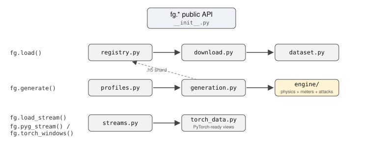

# Repo roadmap

The package is two halves, and the folder structure shows it:

- **SDK** (package root): load and serve data, plus the `se/` and `localization/` analysis modules.
  Runs on the base install.
- **Engine** (`engine/`): the theory. Power-flow physics, meter models, attack math. Needs the
  `[generate]` extra, as do its drivers `generation.py` and `profiles.py`.

Users touch three things: the `fg.*` functions in `__init__.py`, `fdia_graph.se`, and
`fdia_graph.localization`.

```
src/fdia_graph/          (the package root)
├── __init__.py                      fg.* public API
├── dataset.py registry.py download.py     SDK: load path
├── streams.py torch_data.py               SDK: stream path
├── generation.py profiles.py              SDK: generation drivers
├── se/                              state estimation (WLS, robust, subspace prior)
├── localization/                    per-bus attack localization (swing, delta, residual)
└── engine/                          theory: FdiaGenerator
    ├── core.py                        assembly + targeting
    ├── measurement.py                 meters + noise  h(x)
    ├── physics.py                     AC solves, Ybus
    ├── attacks.py                     the six families
    └── base.py                        shared typed contract
```

How the three paths connect (generate produces the shard the load path serves):



## SDK (package root `src/fdia_graph/`)

| File | What it is |
|---|---|
| `__init__.py` | Public API. Thin wrappers with lazy imports so `load()` users never need torch/pandapower. |
| `dataset.py` | `FdiaGraph`: Dataset over one `.h5` shard. Splits, family filters, units, dict/PyG loaders. |
| `registry.py` | Dataset version control. `(name, release)` → download spec; `register_local` for generated sets. |
| `download.py` | Fetch a shard to `~/.cache/fdia_graph`, sha256-verified, atomic rename. |
| `streams.py` | Continuous attacked time series (`generate_stream`/`load_stream`) + windowing for LSTMs. |
| `torch_data.py` | `pyg_stream`/`torch_windows`: streams as ready PyG graphs / per-bus sequence tensors. |
| `generation.py` | `generate()`: drives the engine over a state pool, writes + registers the shard. |
| `profiles.py` | ISO load profiles (NYISO/CAISO/ERCOT) → normalized scaling → AC operating-state pools. |
| `se/` | sklearn-style state estimation: `SEBase` chord-Newton core + WLS/robust/prior classes. |
| `localization/` | sklearn-style per-bus localization: `LocalizerBase` FA-budget calibration + swing/delta/residual classes. |

## `engine/` (physics, meters, attack math)

| File | What it is |
|---|---|
| `core.py` | `FdiaGenerator` assembly: grid setup, meter plan, RNG, attack targeting. |
| `measurement.py` | Mixin: meter placement + accuracy-class noise (per-meter bias + per-scan jitter); `h(x)`. |
| `physics.py` | Mixin: AC solves, Ybus, emit exact measurements from a stored state. |
| `attacks.py` | Mixin: the six attack families (`Aq Ad As Ar At Al`). |
| `base.py` | Typed attribute contract the three mixins share (no runtime behavior). |

## Docs layout

| Folder | Holds |
|---|---|
| `docs/reference/` | lookup material (data dictionary, concept map, examples) |
| `docs/guides/` | task walkthroughs |
| `docs/figures/` | every shared image and its data sidecar |
| `docs/se/`, `docs/localization/` | per-module example folders: a runnable script, a README that reads the results, and the `results/` it produced |

New docs go in `reference/` or `guides/`. A new analysis module gets an example folder like the two above.

## Reading order for new students

1. `README.md`: install + quickstart.
2. `docs/reference/DATA_DICTIONARY.md`: what every array and shape means.
3. This page: which file does what.
4. `docs/reference/CONCEPTS_TO_CODE.md`: paper formulas → the code that implements them.
5. `docs/reference/EXAMPLES.md`: full training examples to copy from.
6. `docs/se/README.md` and `docs/guides/state_estimation.md`: measurements in, better-than-WLS state out.
7. `docs/localization/README.md`: which buses are under attack, and why the slow ramp is the open case.
