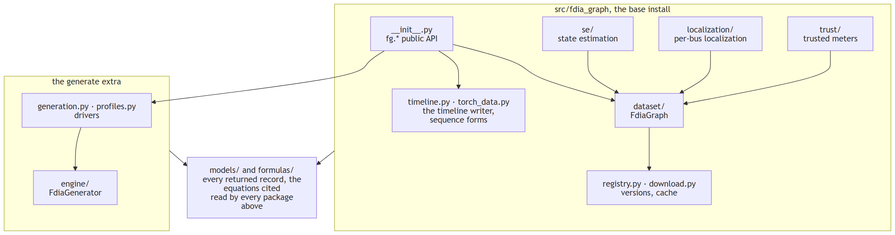
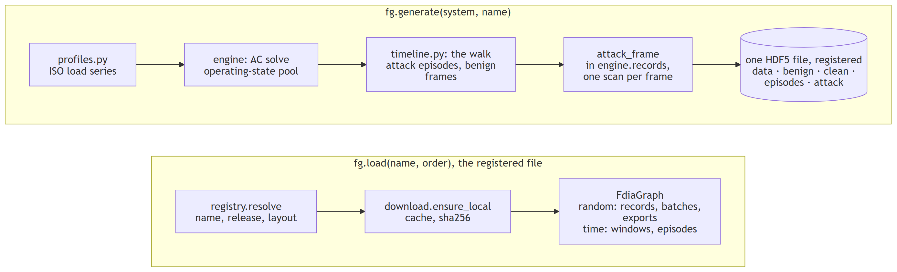

# Repo roadmap

Two halves. The **SDK** loads and serves data and runs on the base install; the **engine** is the
theory (power flow, meters, attacks) and needs `[generate]`. Users touch `fg.*`, `fdia_graph.se`
and `fdia_graph.localization`.

## The two paths

## Files

| file | what it is |
|---|---|
| `__init__.py` | public API; the heavy helpers resolve lazily so `load()` never imports torch or pandapower |
| `dataset/` | `FdiaGraph` from `graph` (static graph), `physics` (admittances, clean flows), `records` (items, collate, DataLoader), `export` (whole-split arrays), `sequence` (windows, episodes) over `base` (shared state) |
| `registry.py`, `download.py` | `(name, release)` to a download spec with that release's file layout; fetch to `~/.cache/fdia_graph`, sha256-verified |
| `timeline.py`, `generation.py`, `profiles.py` | the timeline walker and writer; the pool, frame context and file attributes; ISO load profiles to AC operating-state pools |
| `torch_data.py`, `streams.py` | PyG and per-bus sequence forms of a time-ordered dataset; the deprecated stream entry points |
| `se/` | `SEBase` (measurement model, chord-Newton, calibration) plus one class per estimator |
| `localization/` | `LocalizerBase` (false-alarm calibration, metrics) plus threshold and learned classes |
| `models/` | every value bundle a function returns, grouped `grid`, `frames`, `data`, `scores`, `assets` |
| `formulas/` | the mathematics as pure functions with source keys; catalogue in `reference/FORMULAS.md` |
| `engine/` | `FdiaGenerator` = `MeasurementMixin` (meters, noise) + `PhysicsMixin` (AC solves) + `AttackMixin` (the attack constructions) over `GridBase`; `records.py` builds one scan of any of the seven families |

## Docs

| folder | holds |
|---|---|
| `reference/` | data dictionary, concepts to code, formulas, examples, benchmarks |
| `guides/` | task walkthroughs |
| `se/`, `localization/` | `run_*.py` fits one system and writes `results/*.json`; `make_report.py` renders the README tables and figures |
| `figures/` | shared images with their data sidecars |
| `plans/` | the design documents behind the 0.16 and 0.17 refactors (history, not instructions) |

## Tests and releases

| | |
|---|---|
| `pytest tests` | builds a tiny IEEE-14 timeline in a throwaway cache (about a minute) and checks the documented contracts |
| `FDIA_FROZEN_STRICT=1 pytest tests` | bit-identical comparison against `tests/frozen/`; run before every push |
| `FDIA_SLOW=1 pytest tests` | adds a sanity test on the published IEEE-118 file |
| CI | tests, pyright, ruff format and check, the readability gate, install on 3.9 and 3.12 |
| release | bump PR, then `python tools/release.py vX.Y.Z notes.md` (tag, GitHub release, PyPI); see `CONTRIBUTING.md` |

## Reading order

| step | read | to learn |
|---|---|---|
| 0 | `CONTRIBUTING.md` | the rules and the pull-request flow |
| 1 | `README.md` | install and quickstart |
| 2 | `reference/DATA_DICTIONARY.md` | every array and shape |
| 3 | this page | which file does what |
| 4 | `reference/CONCEPTS_TO_CODE.md` | paper formulas to code |
| 5 | `reference/EXAMPLES.md` | training examples to copy from |
| 6 | `se/README.md`, `guides/state_estimation.md` | measurements in, better-than-WLS state out |
| 7 | `localization/README.md` | which buses are under attack, and why the slow ramp is open |
