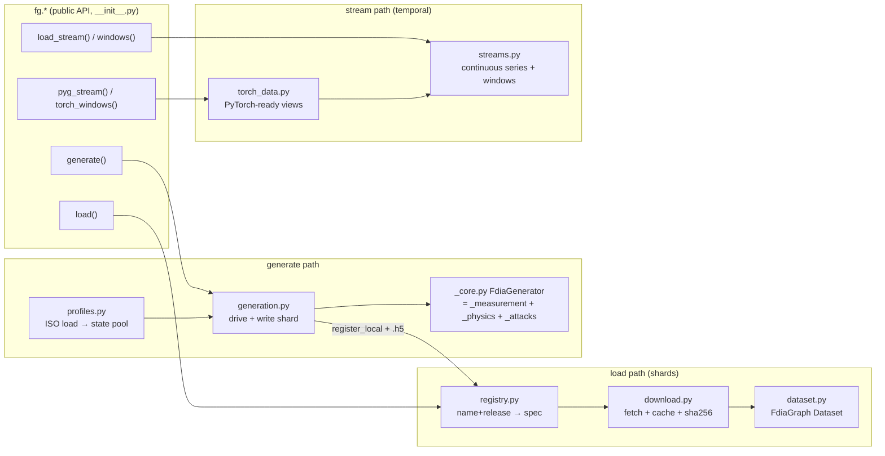

# Repo roadmap

How the files connect. The SDK has two halves: **loading** published data (light deps, just numpy/h5py)
and **generating** new data (heavy deps: pandapower, the `[generate]` extra). Users only touch
`fdia_graph/__init__.py`'s functions; everything else is plumbing behind them.

## File map

| File | What it is |
|---|---|
| `__init__.py` | Public API. Thin wrappers with lazy imports so `load()` users never need torch/pandapower. |
| `dataset.py` | `FdiaGraph`: Dataset over one `.h5` shard. Splits, family filters, units, dict/PyG loaders. |
| `registry.py` | Dataset version control. `(name, release)` → download spec; `register_local` for generated sets. |
| `download.py` | Fetch a shard to `~/.cache/fdia_graph`, sha256-verified, atomic rename. |
| `generation.py` | `generate()`: runs the generator over a state pool, writes + registers the shard. |
| `_core.py` | `FdiaGenerator` assembly: grid setup, meter plan, RNG. The engine the mixins hang off. |
| `_measurement.py` | Mixin: meter placement + accuracy-class noise (per-meter bias + per-scan jitter). |
| `_physics.py` | Mixin: AC solves, Ybus, emit exact measurements from a stored state. |
| `_attacks.py` | Mixin: the six attack families (`Aq Ad As Ar At Al`). |
| `_base.py` | Typed attribute contract the three mixins share (no runtime behavior). |
| `profiles.py` | ISO load profiles (NYISO/CAISO/ERCOT) → normalized scaling → AC operating-state pools. |
| `streams.py` | Continuous attacked time series (`generate_stream`/`load_stream`) + windowing for LSTMs. |
| `torch_data.py` | `pyg_stream`/`torch_windows`: streams as ready PyG graphs / per-bus sequence tensors. |

## Reading order for new students

1. `README.md` — install + quickstart.
2. `docs/DATA_DICTIONARY.md` — what every array and shape means (`node_x`, `edge_attr`, ...).
3. This page — which file does what.
4. `docs/CONCEPTS_TO_CODE.md` — paper formulas → the code that implements them.
5. `docs/EXAMPLES.md` — full training examples to copy from.
