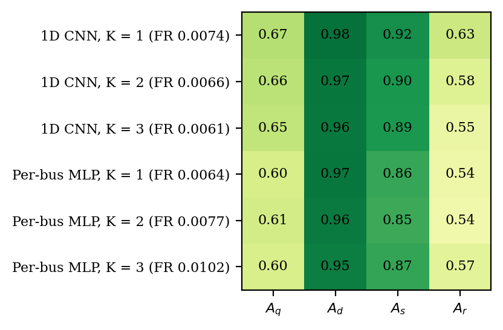
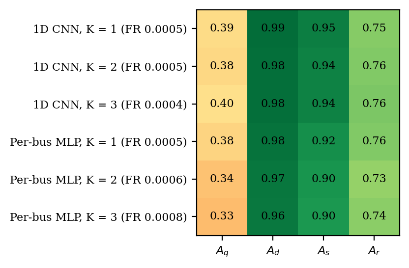
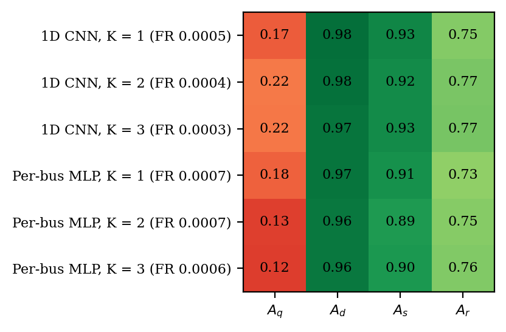

# Federated localization with `fdia_graph.federated`

The federated localization papers' protocol, run by the SDK on the v0.8.1 timelines (pinned in the run script) with
the 14-dim per-bus vector plus the Jacobian block.

```python
import fdia_graph as fg
from fdia_graph.federated import FedBusCNN

rel = dict(release="v0.8.1")  # the release these results are on
zs = dict(families=[0, 1, 2], **rel)  # benign + Aq + Ad
train = fg.load("ieee118", split="train", **zs)
val = fg.load("ieee118", split="val", **zs)
test = fg.load("ieee118", split="test", families=[0, 1, 2, 3, 4], **rel)  # adds As and Ar

loc = FedBusCNN(K=3, rounds=60, local_epochs=3, features="full14+jac").fit(train, val=val)
tab = loc.score_perbus(test, buses="attackable", fr_over="all")  # the paper's Table IV block
```

`release=` pins the built-in data only: a dataset registered locally under the same name loads in
its place. `fg.list_datasets()["ieee118"]` reads `"builtin"` when these are the release's records,
and the run script refuses to fit otherwise.

| | |
|---|---|
| clients | K utilities from the spectral partition of the bus graph (random_state 42); each client reads only its own buses and its own flow meters for the power balance |
| training | FedAvg with uniform weights, 60 rounds of 3 local epochs, AdamW lr 5e-4, weight decay 0.01, batch 256, gradient clip 1.0, the final-round weights |
| features | the papers' 14-dim per-bus vector built per client, plus the 8-channel Jacobian block, computed once centrally and shared, the one feature a client does not build from its own meters |
| threshold | the papers' validation-best global tau on the 0.05 to 0.95 grid, from per-client confusion counts summed at the server |
| what crosses a boundary | per-channel moments once, the model weights every round, the per-bus confusion counts once, and the central Jacobian block |

## Results

These runs used the earlier Jacobian block, which took the change against the previous frame's true
state. The block now reads observed data only (the previous frame's estimate), and these tables
await a rerun on it.

Zero-shot: train and val hold benign, `Aq` and `Ad`; test adds `As` and `Ar`, never seen in
training. F1, DR and FR are the paper's per-bus macro scores over the attackable buses, mean and
standard deviation over seeds 123, 124 and 125. Every run is in `results/runs/`, the aggregates in
`results/fed_ieee{14,118,300}.json`.

**Table IV layout** (FR over every test record, the paper's convention)

| Model | F1 14 | DR 14 | FR 14 | F1 118 | DR 118 | FR 118 | F1 300 | DR 300 | FR 300 |
|---|---:|---:|---:|---:|---:|---:|---:|---:|---:|
| 1D CNN, K = 1 | 0.878 ± 0.002 | 0.825 ± 0.009 | 0.0074 ± 0.0014 | 0.899 ± 0.002 | 0.848 ± 0.003 | 0.0005 ± 0.0000 | 0.847 ± 0.008 | 0.790 ± 0.018 | 0.0005 ± 0.0001 |
| 1D CNN, K = 2 | 0.860 ± 0.007 | 0.792 ± 0.015 | 0.0066 ± 0.0008 | 0.898 ± 0.001 | 0.847 ± 0.006 | 0.0005 ± 0.0001 | 0.861 ± 0.004 | 0.802 ± 0.011 | 0.0004 ± 0.0000 |
| 1D CNN, K = 3 | 0.850 ± 0.002 | 0.775 ± 0.006 | 0.0061 ± 0.0006 | 0.904 ± 0.001 | 0.853 ± 0.005 | 0.0004 ± 0.0001 | 0.861 ± 0.003 | 0.800 ± 0.006 | 0.0003 ± 0.0000 |
| Per-bus MLP, K = 1 | 0.833 ± 0.016 | 0.750 ± 0.028 | 0.0064 ± 0.0009 | 0.885 ± 0.001 | 0.829 ± 0.002 | 0.0005 ± 0.0000 | 0.834 ± 0.004 | 0.791 ± 0.022 | 0.0007 ± 0.0002 |
| Per-bus MLP, K = 2 | 0.828 ± 0.014 | 0.753 ± 0.027 | 0.0077 ± 0.0016 | 0.865 ± 0.004 | 0.802 ± 0.010 | 0.0006 ± 0.0001 | 0.821 ± 0.004 | 0.774 ± 0.008 | 0.0007 ± 0.0001 |
| Per-bus MLP, K = 3 | 0.832 ± 0.010 | 0.770 ± 0.022 | 0.0102 ± 0.0017 | 0.861 ± 0.003 | 0.805 ± 0.008 | 0.0008 ± 0.0001 | 0.822 ± 0.001 | 0.776 ± 0.008 | 0.0006 ± 0.0001 |

**FR over benign records only** (the budget the localization guide reports)

| Model | FR 14 | FR 118 | FR 300 |
|---|---:|---:|---:|
| 1D CNN, K = 1 | 0.00000 ± 0.00001 | 0.00000 ± 0.00000 | 0.00000 ± 0.00000 |
| 1D CNN, K = 2 | 0.00000 ± 0.00001 | 0.00001 ± 0.00001 | 0.00001 ± 0.00000 |
| 1D CNN, K = 3 | 0.00014 ± 0.00014 | 0.00002 ± 0.00000 | 0.00001 ± 0.00000 |
| Per-bus MLP, K = 1 | 0.00009 ± 0.00005 | 0.00002 ± 0.00000 | 0.00004 ± 0.00001 |
| Per-bus MLP, K = 2 | 0.00010 ± 0.00006 | 0.00006 ± 0.00004 | 0.00014 ± 0.00003 |
| Per-bus MLP, K = 3 | 0.00007 ± 0.00005 | 0.00007 ± 0.00001 | 0.00008 ± 0.00003 |

**Per-family node F1** (that family plus benign, mean over seeds)

| Model | Aq 14 | Ad 14 | As 14 | Ar 14 | Aq 118 | Ad 118 | As 118 | Ar 118 | Aq 300 | Ad 300 | As 300 | Ar 300 |
|---|---:|---:|---:|---:|---:|---:|---:|---:|---:|---:|---:|---:|
| 1D CNN, K = 1 | 0.671 | 0.980 | 0.917 | 0.627 | 0.391 | 0.985 | 0.950 | 0.749 | 0.173 | 0.982 | 0.934 | 0.754 |
| 1D CNN, K = 2 | 0.656 | 0.965 | 0.900 | 0.585 | 0.384 | 0.982 | 0.942 | 0.757 | 0.219 | 0.977 | 0.925 | 0.769 |
| 1D CNN, K = 3 | 0.647 | 0.962 | 0.895 | 0.554 | 0.399 | 0.981 | 0.945 | 0.762 | 0.215 | 0.973 | 0.925 | 0.771 |
| Per-bus MLP, K = 1 | 0.602 | 0.966 | 0.863 | 0.544 | 0.376 | 0.976 | 0.917 | 0.756 | 0.182 | 0.969 | 0.911 | 0.734 |
| Per-bus MLP, K = 2 | 0.613 | 0.958 | 0.855 | 0.537 | 0.342 | 0.967 | 0.903 | 0.725 | 0.127 | 0.964 | 0.891 | 0.747 |
| Per-bus MLP, K = 3 | 0.599 | 0.953 | 0.866 | 0.571 | 0.331 | 0.962 | 0.897 | 0.740 | 0.123 | 0.962 | 0.895 | 0.757 |

Per-bus F1 by attack family, row labels carrying each row's FR over every record.

| IEEE 14 | IEEE 118 | IEEE 300 |
|---|---|---|
|  |  |  |

## Three readings

| reading | evidence | open case |
|---|---|---|
| federating costs little | from one client to three the CNN moves 0.878 to 0.850 on IEEE-14 and holds 0.899 to 0.904 on 118 and 0.847 to 0.861 on 300 | the MLP loses 1 to 3 points on 118 and 300 as K grows |
| the CNN is the arm to deploy | its macro F1 leads the per-bus MLP's at every K on every system, at FR below 0.001 on 118 and 300 | the MLP is a third of the parameters (52k against 154k) for 1 to 5 points of F1, and matches the CNN on `Aq` at K = 1 on 300 |
| the stealthy re-solve falls with size | `Aq` node F1 is about 0.65, 0.39 and 0.20 on 14, 118 and 300 while `Ad`, `As` and `Ar` stay at or above 0.53 | a sustained local false state inside an episode, the same frontier as in [`../localization/README.md`](../localization/README.md); the v0.8.1 timelines hold `Aq` over multi-frame episodes, while the generator in this package makes every `Aq` episode one frame |

The papers report CNN macro F1 of 0.963, 0.963 and 0.952 on the v0.4.1 record shards, and the SDK
reproduces them within half a point on the v0.7.2 shards. On a timeline the 14-dim vector alone
drops, because its temporal features compare each frame with the frame one minute before rather
than with the benign scan before an attacked snapshot. The Jacobian block reads each frame's
physics instead of its history, which recovers most of that drop on 118 and 300 and about half of
it on 14; the centralized comparison with and without the block is in
[`../localization/README.md`](../localization/README.md).

## Regenerate

```bash
FG_SYSTEM=ieee14 python docs/federated/run_federated.py     # 18 runs, writes results/runs/ + fed_ieee14.json
FG_SYSTEM=ieee118 python docs/federated/run_federated.py
FG_SYSTEM=ieee300 python docs/federated/run_federated.py
python docs/federated/make_report.py                        # tables (markdown) + figures + CSV from the JSON
```

Five to twelve minutes a run on one GPU, about three hours a system with the three systems sharing
the GPU; saved runs are skipped, so a re-run only aggregates.
