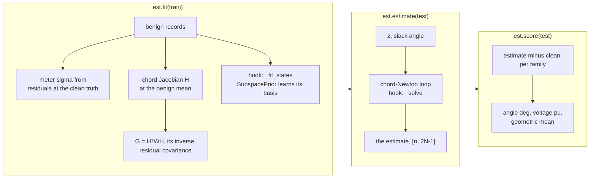

# Beating WLS: state estimation with the SDK

Measurements in, state out, better than weighted least squares on the public test cases. Runs off
a shard download; `pip install "fdia-graph[se]"`.



## Baseline first

```python
import fdia_graph as fg
from fdia_graph.se import WLS

train, test = fg.load("ieee14", split="train"), fg.load("ieee14", split="test")
wls = WLS().fit(train)
xhat = wls.estimate(test)              # [n, 2N-1] = [theta rad (non-slack) | V pu (all buses)]
print(wls.score(test).geo)             # angle_mae_deg 0.108, voltage_mae_pu 6.06e-4
```

| `fit()` learns | `estimate()` returns |
|---|---|
| per-meter error scales: RMS of benign residuals at the shard's `clean` truth | the classical 2N-1 state, every voltage magnitude and every non-slack angle |
| the chord Jacobian at the benign mean state | already in the truth's angle frame: the slack angle is pinned per record to `clean[slack]` (`ds.slack`) |

## The better estimator

```python
from fdia_graph.se import SubspacePrior

est = SubspacePrior(rank_frac=0.2, reweight="huber", c=1.5).fit(train)
print(est.score(test).geo)             # angle_mae_deg 0.059, voltage_mae_pu 1.47e-4
```

| piece | does | why it helps |
|---|---|---|
| prior | restricts the estimate to the low-rank subspace benign operation occupies (SVD of the training states) | learns generator voltage setpoints from history instead of re-estimating them from noisy meters every scan |
| Huber | down-weights measurements the physics cannot explain | rejects in-place meter corruption |
| together on IEEE-14 test | 45% lower angle error, 76% lower voltage error than WLS | geometric mean over the seven record classes, v0.7.2 data |

Validation-selected hyperparameters from the estimation paper:

| system | `rank_frac` | Huber `c` | `ResidualRemoval` threshold |
|---|---|---|---|
| ieee14 | 0.20 | 1.5 | 4.0 |
| ieee118 | 0.50 | 2.5 | 5.0 |
| ieee300 | 0.50 | 6.0 | none helps |

## What to expect per family

| records | behaviour | why |
|---|---|---|
| `Ad` bias, `As` scaling, `Ar` replay | improve a lot | meters corrupted in place, which robust weighting exists to reject |
| `Aq`, `At`, `Al` (stealthy) | near parity for every estimator | a physically valid state inside the learned subspace; no single-scan method can reject it |
| benign | improves on the larger systems, can lose slightly on ieee14 | the baseline is already at the noise floor there |

Full per-family table and figures: [`../se/README.md`](../se/README.md).

## Your own estimator

Subclass `SEBase` and override one hook; the rest is shared, so comparisons are estimator against
estimator.

| hook | does |
|---|---|
| `_fit_states(x_benign)` | learn anything from the benign training states |
| `_basis()` | a `[2N-1, K]` basis that restricts the state space, or `None` for the full state |
| `_solve(z, thsl)` | the per-batch solve; `thsl` is the per-record slack angle reference |

Inside `_solve`: `self._w_solve(z, w, thsl)` is the divergence-guarded weighted iteration,
`self._nres(x, z, thsl)` the normalized residuals, and `formulas.estimation` holds every equation
(`huber_weights`, `wls_step`, `normalized_residual`, ...).
