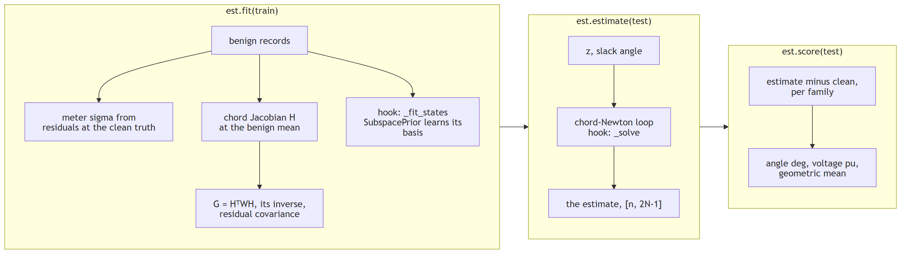

# Beating WLS: state estimation with the SDK

Measurements in, state out, better than weighted least squares on the public test cases. Runs off
the default timeline download (data release v0.8.3); `pip install "fdia-graph[se]"`.



## Baseline first

```python
import fdia_graph as fg
from fdia_graph.se import WLS

train, test = fg.load("ieee14", split="train"), fg.load("ieee14", split="test")
wls = WLS().fit(train)
xhat = wls.estimate(test)              # [n, 2N-1] = [theta rad (non-slack) | V pu (all buses)]
print(wls.score(test).geo)             # angle_mae_deg 0.091, voltage_mae_pu 8.39e-4
```

| `fit()` learns | `estimate()` returns |
|---|---|
| per-meter error scales: RMS of benign residuals at the dataset's `clean` truth (the benchmark default, `calibrate="truth"`), or each meter's accuracy class from measurements alone (`calibrate="measured"`, what every detector path uses); the reference angle `theta_ref` | the classical 2N-1 state, every voltage magnitude and every non-slack angle |
| the chord Jacobian at the benign mean state | in one angle frame: the slack angle is fixed to `theta_ref`, taken from the training truth at fit time (the case's reference angle on the released pools) |

## The better estimator

```python
from fdia_graph.se import SubspacePrior

est = SubspacePrior(rank_frac=0.2, reweight="huber", c=1.5).fit(train)
print(est.score(test).geo)             # angle_mae_deg 0.050, voltage_mae_pu 1.60e-4
```

| piece | does | why it helps |
|---|---|---|
| prior | restricts the estimate to the low-rank subspace benign operation occupies (SVD of the training states) | learns generator voltage setpoints from history instead of re-estimating them from noisy meters every scan |
| Huber | down-weights measurements the physics cannot explain | rejects in-place meter corruption |
| together on IEEE-14 test | 45% lower angle error, 81% lower voltage error than WLS | geometric mean over the eight record classes (benign and seven families), v0.8.3 timeline |

Validation-selected hyperparameters from the estimation paper:

| system | `rank_frac` | Huber `c` | `ResidualRemoval` threshold |
|---|---|---|---|
| ieee14 | 0.20 | 1.5 | 4.0 |
| ieee118 | 0.50 | 2.5 | 5.0 |
| ieee300 | 0.50 | 6.0 | none helps |

## PMU pseudo-measurements

On a hybrid-meter file (new generation) a SCADA voltmeter reads no angle, so the angle comes from the
PMUs and the power meters alone. `pmu_pseudo=True` (every estimator, `JacobianWeighting` included, which
reads the previous frame's currents from `prev_pmu_i`) adds the pseudo-measurements of [WU26, eq. (3)]: a PMU at
the near end n of a branch reads `V_n` and `I_n`, and the branch's pi model gives the voltage at the
far end f,

    V_f = (I_n - y_nn V_n) / y_nf

with `y_nn`, `y_nf` the branch's `Y_f` or `Y_t` entries (taps and phase shifts included), averaged over
the branches that reach f (`formulas.estimation.pmu_pseudo_voltages`). The pseudo `|V|` and angle
fill the slots of the reached buses that no meter reads; a SCADA `|V|` is kept where one exists. Their
first-order error, with independent PMU errors, is the covariance of

    dV_f = R(1/y_nf) dI_n - R(y_nn/y_nf) P_n (d|V_n|, dtheta_n)

(R(c) the real 2x2 matrix of multiplying by c, P_n the polar-to-rectangular Jacobian at V_n), summed
over the links with the voltage terms grouped by PMU bus, then carried to `|V_f|` and `theta_f`
through the rectangular-to-polar gradients; for a round error of complex variance s^2 this is
`var|V_f| = s^2 / 2` and `var theta_f = s^2 / (2 |V_f|^2)`. `calibrate="measured"` weights the pseudo
slots by that variance, `calibrate="truth"` by their benign residual like every other slot. The
formula is exact without noise (to 1e-16 on IEEE-14 and 118) and its variance matches a Monte Carlo
of 20,000 draws to within 3% (`tests/test_pmu_channels.py`).

Measured with `WLS` on the test split, same seed and pool, only the meter model changed (IEEE-14 3,000 frames, IEEE-118 2,000): benign angle MAE with an angle at every voltmeter 0.0097 and 0.0105 degrees, with angles at the PMUs only 0.0113 and 0.0118 (17% and 12% higher), and with the eq. (3) pseudo-measurements added 0.0113 and 0.0096 (level with PMUs only on IEEE-14, 18% lower on IEEE-118); on `At` records 0.063, 0.079 and 0.075 degrees on IEEE-14 and 0.0103, 0.0125 and 0.0120 on IEEE-118. The two meter models draw different noise and different episodes, so the attacked rows compare different attacks. Measured when the recipe drove one line per episode on the PGLib-OPF ratings (the plan's D11, before D14 to D17; `At` and `Am`, seed 1; IEEE-14 3,000 frames, IEEE-118 2,000), IEEE-14: `Am` 12 stealthy overload episodes on the hybrid meters (6.7 devices, 23.6 channels on average) and 14 on the v0.8.3 meters (5.6 devices), against 0 under the bound; 0 frames fell back to benign instead of 720; `At`, still bounded, 10.3 devices on the hybrid meters and 8.5 on the v0.8.3 ones; IEEE-118: `Am` 7 stealthy overload episodes on the hybrid meters (7.3 devices, 23.7 channels on average) and 8 on the v0.8.3 meters (4.4 devices), against 3 under the bound; 0 frames fell back to benign instead of 220; `At`, still bounded, 11.7 devices on the hybrid meters and 8.8 on the v0.8.3 ones.

## What to expect per family

| records | behaviour | why |
|---|---|---|
| `Ad` bias, `As` scaling, `Ar` replay | improve a lot | meters corrupted in place, which robust weighting exists to reject |
| `Aq`, `At`, `Al`, `Am` (stealthy) | robust weighting sees nothing; the prior moves them part of the way | a consistent AC state leaves no residual, and it sits off the benign operating subspace, so the prior pulls the estimate part of the way back |
| benign | improves on the larger systems, can lose slightly on ieee14 | the baseline is already at the noise floor there |

Full per-family table and figures: [`../se/README.md`](../se/README.md).

## Your own estimator

Subclass `SEBase` and override one hook; the rest is shared, so comparisons are estimator against
estimator.

| hook | does |
|---|---|
| `_fit_states(x_benign)` | learn anything from the benign training states |
| `_subspace()` | a `[2N-1, K]` basis that restricts the state space, or `None` for the full state |
| `_solve(z, w)` | the per-batch solve; `w` is per-record weights `[n, m]`, or `None` for the shared ones |

Inside `_solve`: `self._w_solve(z, w)` is the divergence-guarded weighted iteration,
`self._nres(x, z)` the normalized residuals, and `formulas.estimation` holds every equation
(`huber_weights`, `wls_step`, `normalized_residual`, ...).
