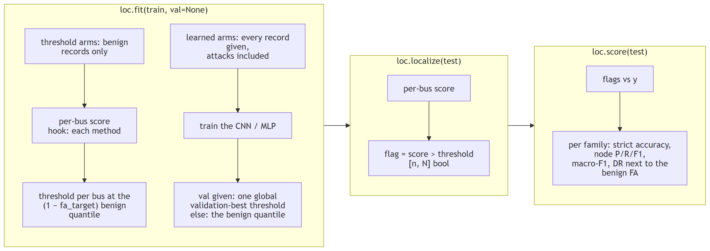

# Localization with `fdia_graph.localization`

Which buses are under attack, per scan.

```python
import fdia_graph as fg
from fdia_graph.localization import SwingThreshold, DeltaThreshold, ResidualLocalizer, BusCNN, BusMLP

train = fg.load("ieee14", split="train")
test  = fg.load("ieee14", split="test")

loc  = SwingThreshold(fa_target=0.01).fit(train)   # thresholds set on benign records only
flag = loc.localize(test)                          # [n, N] bool: which buses are called attacked
rep  = loc.score(test)                             # per-family metrics + benign false alarms
```



| | |
|---|---|
| shared | metrics and the benign-quantile calibration in `LocalizerBase`; a threshold arm changes only the per-bus score, a learned arm also overrides `fit` to train on every record and, given `val`, the threshold |
| budget | every method runs at the same false-alarm rate, set on benign records; the one exception is a learned arm given `val`, which picks one global validation-best threshold from labelled records (the papers' zero-shot protocol) |
| `"all"` entry | pools every record; the papers' per-bus macro F1, DR and FR over the attackable buses |

## The methods

| Class | Score | Needs |
|---|---|---|
| `SwingThreshold` | The dataset's windowed swing feature: each scan's injection change as a z-score of the bus's typical recent change | numpy only |
| `DeltaThreshold` | The raw one-scan change scaled by the bus's benign RMS. Same signal without the windowing, so the gap shows what windowing buys | numpy only |
| `ResidualLocalizer` | Largest normalized residual from a state-estimation solve (any `fdia_graph.se` estimator, default `WLS`), aggregated to each bus's own meters and incident flows. Textbook bad-data identification | `[se]` extra |
| `BusMLP` | The papers' lightweight arm: one 4x128 MLP applied to every bus's own 14-dim vector (readings, meter mask, partial KCL residual, delta, swing). 52k parameters | `[torch]` extra |
| `BusCNN` | The papers' best localizer: a 1-D convolution across the bus axis over the same 14-dim vector, 4 layers of 128 channels, kernel 3. No graph read. 154k parameters | `[torch]` extra |

The learned arms train on the records they are given, so the protocol is the load call;
`fit(train, val=val)` picks the papers' validation-best threshold instead of the false-alarm one.

## Results

| protocol | train and val | test | threshold |
|---|---|---|---|
| zero-shot (the paper's) | benign + `Aq` + `Ad` | adds `As` and `Ar`, never seen in training | learned arms validation-best; swing keeps its benign calibration |
| common | every family, unfiltered | the full split | benign quantile at `fa_target=0.01` for every method |

F1, DR and FR are the paper's per-bus macro scores over the attackable buses (F1 and recall over
every test record, FR the per-bus false-positive rate on benign records); full metrics in
`results/loc_ieee{14,118,300}.json`. Bold marks the papers' headline localizer, not the best cell.

**Zero-shot protocol**

| Method | F1 14 | DR 14 | FR 14 | F1 118 | DR 118 | FR 118 | F1 300 | DR 300 | FR 300 |
|---|---:|---:|---:|---:|---:|---:|---:|---:|---:|
| Per-bus MLP | 0.7617 | 0.6785 | 0.0043 | 0.5479 | 0.4533 | 0.0020 | 0.4891 | 0.4568 | 0.0025 |
| **1D CNN** | 0.7833 | 0.7209 | 0.0013 | 0.5394 | 0.4180 | 0.0005 | 0.4885 | 0.4505 | 0.0024 |
| Swing threshold | 0.1182 | 0.0658 | 0.0066 | 0.5518 | 0.6474 | 0.0097 | 0.5098 | 0.7876 | 0.0092 |

The paper reports 0.9634 / 0.9625 / 0.9524 for the CNN and 0.9626 / 0.9570 / 0.9327 for the MLP on
v0.4.1 data, and the SDK classes reproduce them on the v0.7.2 record shards. The v0.8.1 timeline columns are lower for the same detectors because their temporal features compare each frame with the frame emitted one minute earlier rather than with the benign scan before an attacked snapshot, so a sustained episode spikes at its onset and a one-frame family also spikes on the benign frame after it. Those post-attack benign frames stay in the benign calibration set on purpose: an operator's detector sees them too, so leaving them out would set lower thresholds and let the realized false-alarm rate exceed `fa_target`.

**Common protocol**

| Method | F1 14 | DR 14 | FR 14 | F1 118 | DR 118 | FR 118 | F1 300 | DR 300 | FR 300 |
|---|---:|---:|---:|---:|---:|---:|---:|---:|---:|
| Swing threshold | 0.1026 | 0.0566 | 0.0066 | 0.4717 | 0.5342 | 0.0097 | 0.4356 | 0.6432 | 0.0092 |
| Delta threshold | 0.1004 | 0.0551 | 0.0062 | 0.4745 | 0.5507 | 0.0100 | 0.4371 | 0.6443 | 0.0092 |
| Residual (LNR) | 0.3885 | 0.4706 | 0.0041 | 0.1981 | 0.5953 | 0.0075 | 0.1855 | 0.5925 | 0.0064 |
| Per-bus MLP | 0.7813 | 0.7178 | 0.0106 | 0.5974 | 0.7187 | 0.0108 | 0.4358 | 0.6562 | 0.0105 |
| **1D CNN** | 0.8255 | 0.8956 | 0.0209 | 0.5599 | 0.7184 | 0.0113 | 0.4570 | 0.6884 | 0.0119 |
| 1D CNN + Jacobian (C) | 0.8856 | 0.9634 | 0.0158 | 0.4206 | 0.9326 | 0.0107 | 0.3235 | 0.9033 | 0.0090 |

Per-bus F1 by attack family, common protocol. Row labels carry each method's FR.

| IEEE 14 | IEEE 118 | IEEE 300 |
|---|---|---|
|  |  |  |

## Jacobian-informed features: the digest's ablation

`fdia_graph.se.JacobianFeatures` transforms the measurement change through the estimator's Jacobian
(implied state move `H⁺Δz`, explained and unexplained parts and their ratio, sensitivity, leverage,
weak-direction energy) and aggregates it to buses; `BusCNN` / `BusMLP` take `features=`:

| set | input |
|---|---|
| A | measurements only |
| B | the papers' 14-dim vector (the rows above) |
| C | B + the 8 Jacobian features |
| D | the Jacobian features alone |

Zero-shot protocol on the v0.8.1 timelines (benign, `Aq` and `Ad` seen; `As` and `Ar` unseen):

| Model (1D CNN, zero-shot) | F1 14 | DR 14 | FR 14 | F1 118 | DR 118 | FR 118 | F1 300 | DR 300 | FR 300 |
|---|---:|---:|---:|---:|---:|---:|---:|---:|---:|
| A: measurements only | 0.609 | 0.657 | 0.0000 | 0.000 | 0.000 | 0.0000 | 0.000 | 0.000 | 0.0000 |
| B: measurements + temporal (the papers' 14) | 0.783 | 0.721 | 0.0013 | 0.539 | 0.418 | 0.0005 | 0.488 | 0.451 | 0.0024 |
| C: B + Jacobian features | **0.873** | 0.805 | 0.0000 | **0.896** | 0.842 | 0.0000 | **0.840** | 0.759 | 0.0000 |
| D: Jacobian features only | 0.827 | 0.771 | 0.0000 | 0.811 | 0.741 | 0.0000 | 0.759 | 0.734 | 0.0000 |

In the common protocol (every family in distribution) C wins on 14 (0.886 vs 0.825) and loses on 118
(0.421 vs 0.560) and 300 (0.323 vs 0.457) at the same false-alarm target (`fa_target=0.01`, and C's
measured FR is in fact the lower): it has a far higher per-bus detection rate (0.93 against 0.72 on
118, 0.90 against 0.69 on 300) and pays in precision on the buses around a
local false state.

| finding | evidence |
|---|---|
| the features carry the digest's signal | on `Aq` the zero-shot macro-F1 is 0.74, 0.03 and 0.06 for B on 14, 118 and 300 and 0.94, 0.82 and 0.58 for D alone: the per-frame physics sees the local false state where the history does not |
| on a timeline they are what makes the vector work | B to C is +9, +36 and +35 zero-shot points; the papers' vector was built for the v0.7.2 shards, whose temporal features compared an attacked snapshot with the benign scan before it, and on a timeline a sustained episode spikes at its onset only |
| where they pay again | as the localizer that gates the estimator once meters are secured, [`../trust/README.md`](../trust/README.md) |

## Three readings

| reading | evidence | open case |
|---|---|---|
| the temporal spike is an onset signal | the swing threshold alone reads 0.10, 0.47 and 0.44 macro-F1 in the common protocol on 14, 118 and 300: it catches the one-frame families and the first frame of an episode, then the feature fades because each frame is compared with the frame emitted a minute earlier | `Aq`, the slow ramp `At` and the held redistribution `Am` inside an episode |
| the classical arm misses every stealthy family | `ResidualLocalizer` finds in-place corruption and smears it over neighbours; on `Aq` / `At` / `Al` / `Am` its node-F1 is 0.015 or less, there is no residual | it opens with a trusted set of meters, [`../trust/README.md`](../trust/README.md) |
| learning plus physics holds with size | zero-shot CNN with the Jacobian block 0.873, 0.896 and 0.840 from 14 to 300 buses at FR 1e-4 or below | the common protocol, with `At`, `Al` and `Am` in distribution, falls 0.886, 0.421, 0.323 with size: the per-frame localization of a sustained local false state is the frontier |

## Regenerate

```bash
FG_SYSTEM=ieee14 python docs/localization/run_localization.py    # fits, writes results/loc_ieee14.json
FG_SYSTEM=ieee118 python docs/localization/run_localization.py
FG_SYSTEM=ieee300 python docs/localization/run_localization.py
python docs/localization/make_report.py                          # tables (markdown) + figures + CSV from the JSON
```

Minutes for IEEE-14 on a GPU laptop; about half an hour for 300, mostly the residual arm's solves.
