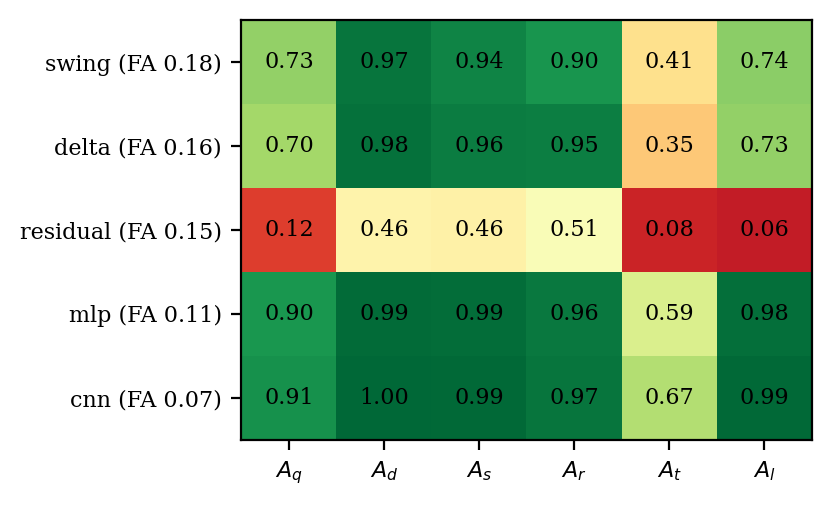

# Localization with `fdia_graph.localization`

Which buses are under attack, per scan.

```python
import fdia_graph as fg
from fdia_graph.localization import SwingThreshold, DeltaThreshold, ResidualLocalizer, BusCNN, BusMLP

train = fg.load("ieee14", split="train")
test  = fg.load("ieee14", split="test")

loc  = SwingThreshold(fa_target=0.01).fit(train)   # thresholds set on benign records only
flag = loc.localize(test)                          # [n, N] bool: which buses are called attacked
rep  = loc.score(test)                             # per-family metrics + benign false alarms
```

- Mirrors [`fdia_graph.se`](../se/README.md): one base class owns calibration and metrics, each
  method class changes only the per-bus score.
- `fit()` sets a per-bus threshold at the `(1 - fa_target)` benign quantile. Every method runs at
  the same false-alarm budget and no attack data is used to tune.
- `score()` reports per family: **strict localization accuracy** (predicted set equals the truth
  exactly), node precision/recall/F1, per-bus macro-F1, per-sample macro-F1, and detection rate.
  The benign false-alarm rate is always reported next to it. A detector that flags everything has
  DR 1.0 and FA 1.0, so DR alone means nothing. The `"all"` entry pools every record and its
  `macro_f1` is the papers' headline number.

## The methods

| Class | Score | Needs |
|---|---|---|
| `SwingThreshold` | The shard's windowed swing feature: each scan's injection change as a z-score of the bus's typical recent change | numpy only |
| `DeltaThreshold` | The raw one-scan change scaled by the bus's benign RMS. Same signal without the windowing, so the gap shows what windowing buys | numpy only |
| `ResidualLocalizer` | Largest normalized residual from a state-estimation solve (any `fdia_graph.se` estimator, default `WLS`), aggregated to each bus's own meters and incident flows. Textbook bad-data identification | `[se]` extra |
| `BusMLP` | The papers' lightweight arm: one 4x128 MLP applied to every bus's own 14-dim vector (readings, meter mask, partial KCL residual, delta, swing). 52k parameters | `[torch]` extra |
| `BusCNN` | The papers' best localizer: a 1-D convolution across the bus axis over the same 14-dim vector, 4 layers of 128 channels, kernel 3. No graph read. 154k parameters | `[torch]` extra |

The learned arms train on whatever records they are given, so the protocol is the load call.
`fit(train, val=val)` also picks the papers' single validation-best threshold instead of the
false-alarm calibration.

## Results 1: common protocol, IEEE-14, `fa_target=0.01`

Every method fits on the unfiltered train split (all six families in-distribution for the learned
arms), calibrates on benign records at the same budget, and scores the full test split.



Node F1 per family. Row labels carry each method's benign record-level false-alarm rate. Full
metrics in [`results/loc_ieee14.json`](results/loc_ieee14.json), figure data in the CSV sidecar.

| method | benign FA | Aq | Ad | As | Ar | At | Al | pooled macro-F1 |
|---|---|---|---|---|---|---|---|---|
| swing | 0.18 | 0.73 | 0.97 | 0.94 | 0.90 | **0.41** | 0.74 | 0.79 |
| delta | 0.16 | 0.70 | 0.98 | 0.96 | 0.95 | **0.35** | 0.73 | 0.79 |
| residual | 0.15 | **0.12** | 0.46 | 0.46 | 0.51 | **0.08** | **0.06** | 0.40 |
| mlp | 0.11 | 0.90 | 0.99 | 0.99 | 0.96 | **0.59** | 0.98 | 0.91 |
| cnn | 0.07 | 0.91 | 1.00 | 0.99 | 0.97 | **0.67** | 0.99 | 0.92 |

## Results 2: the papers' zero-shot protocol, IEEE-14

Train and val hold benign + `Aq` + `Ad` only. Test adds `As` and `Ar`, never seen in training.
The learned arms use the validation-best global threshold; swing keeps its benign calibration.

| method | macro-F1 | benign FA | Aq | Ad | As (zero-shot) | Ar (zero-shot) | paper, v0.4.1 data |
|---|---|---|---|---|---|---|---|
| cnn | **0.963** | 0.000 | 0.94 | 1.00 | 0.98 | 0.92 | 0.963 |
| mlp | 0.957 | 0.001 | 0.93 | 1.00 | 0.98 | 0.92 | 0.963 |
| swing | 0.884 | 0.180 | 0.73 | 0.97 | 0.94 | 0.90 | |

Same protocol on IEEE-118: cnn 0.962 (paper 0.963), mlp 0.949 (paper 0.957), both at benign FA
under 0.2 percent. The SDK classes reproduce the federated localization paper's headline numbers on
the current shards.

## Three readings

1. **The temporal spike catches almost everything.** Any attack edit above the noise floor shows up
   as a per-bus spike the moment it starts, including the BDD-stealthy families `Aq`/`Al` the
   residual arm cannot see. The one family built to defeat it is the slow ramp `At`, which stays
   inside typical per-scan change by construction. `At` is the open frontier.
2. **The classical arm misses every stealthy family by construction.** `ResidualLocalizer` detects
   `Ad`/`As`/`Ar` (detection rate ≈ 1.0) but localizes them coarsely, since residuals smear over
   neighboring buses. On `Aq`/`At`/`Al` its detection rate (0.18–0.26) matches its benign
   false-alarm rate. Those measurements are physics-consistent, so there is no residual to find.
3. **Learning on top of the feature buys precision, not a new signal.** The learned arms lift
   `Aq` from 0.73 to 0.91 and `Al` from 0.74 to 0.99 at lower false alarms, and generalize to the
   unseen `As`/`Ar` families. On the ramp they reach 0.59–0.67 with every family in-distribution,
   still the weakest column. The CNN's kernel mixes index-adjacent buses and edges out the per-bus
   MLP by a point or two, without reading the graph.

## Regenerate

```bash
python docs/localization/run_localization.py                     # IEEE-14, minutes on a GPU laptop
FG_SYSTEM=ieee118 python docs/localization/run_localization.py   # any system in the ladder
```

Outputs land in `results/`: metrics JSON (both protocols), figure, and a CSV sidecar so the figure
can be restyled without re-running.
