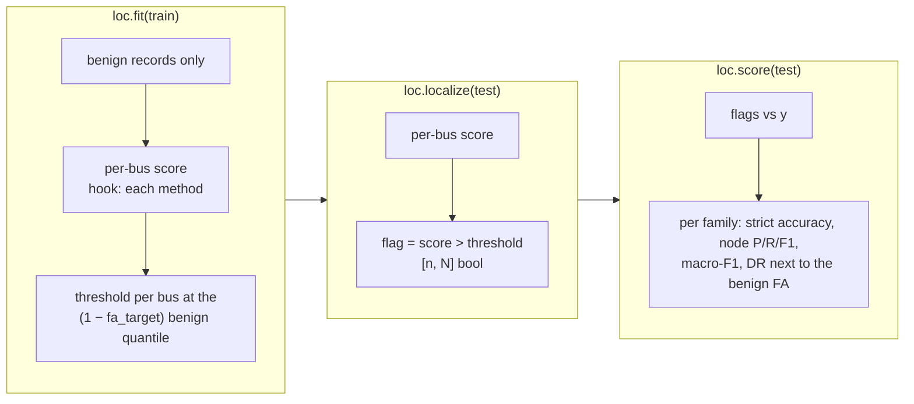

# Localization with `fdia_graph.localization`

Which buses are under attack, per scan.

```python
import fdia_graph as fg
from fdia_graph.localization import SwingThreshold, DeltaThreshold, ResidualLocalizer, BusCNN, BusMLP

train = fg.load("ieee14", split="train")
test  = fg.load("ieee14", split="test")

loc  = SwingThreshold(fa_target=0.01).fit(train)   # thresholds set on benign records only
flag = loc.localize(test)                          # [n, N] bool: which buses are called attacked
rep  = loc.score(test)                             # per-family metrics + benign false alarms
```



| | |
|---|---|
| shared | calibration and metrics in `LocalizerBase`; each method changes only the per-bus score |
| budget | every method runs at the same false-alarm rate; no attack data is used to tune |
| `"all"` entry | pools every record; the papers' per-bus macro F1, DR and FR over the attackable buses |

## The methods

| Class | Score | Needs |
|---|---|---|
| `SwingThreshold` | The shard's windowed swing feature: each scan's injection change as a z-score of the bus's typical recent change | numpy only |
| `DeltaThreshold` | The raw one-scan change scaled by the bus's benign RMS. Same signal without the windowing, so the gap shows what windowing buys | numpy only |
| `ResidualLocalizer` | Largest normalized residual from a state-estimation solve (any `fdia_graph.se` estimator, default `WLS`), aggregated to each bus's own meters and incident flows. Textbook bad-data identification | `[se]` extra |
| `BusMLP` | The papers' lightweight arm: one 4x128 MLP applied to every bus's own 14-dim vector (readings, meter mask, partial KCL residual, delta, swing). 52k parameters | `[torch]` extra |
| `BusCNN` | The papers' best localizer: a 1-D convolution across the bus axis over the same 14-dim vector, 4 layers of 128 channels, kernel 3. No graph read. 154k parameters | `[torch]` extra |

The learned arms train on the records they are given, so the protocol is the load call;
`fit(train, val=val)` picks the papers' validation-best threshold instead of the false-alarm one.

## Results

| protocol | train and val | test | threshold |
|---|---|---|---|
| zero-shot (the paper's) | benign + `Aq` + `Ad` | adds `As` and `Ar`, never seen in training | learned arms validation-best; swing keeps its benign calibration |
| common | every family, unfiltered | the full split | benign quantile at `fa_target=0.01` for every method |

F1, DR and FR are the paper's per-bus macro scores over the attackable buses (F1 and recall over
every test record, FR the per-bus false-positive rate on benign records); full metrics in
`results/loc_ieee{14,118,300}.json`.

**Zero-shot protocol**

| Method | F1 14 | DR 14 | FR 14 | F1 118 | DR 118 | FR 118 | F1 300 | DR 300 | FR 300 |
|---|---:|---:|---:|---:|---:|---:|---:|---:|---:|
| Per-bus MLP | 0.9574 | 0.9455 | 0.0001 | 0.9492 | 0.9056 | 0.0000 | 0.9249 | 0.8681 | 0.0000 |
| **1D CNN** | **0.9625** | 0.9438 | 0.0000 | **0.9618** | 0.9304 | 0.0000 | **0.9483** | 0.9115 | 0.0000 |
| Swing threshold | 0.8835 | 0.9240 | 0.0161 | 0.6638 | 0.9122 | 0.0125 | 0.5128 | 0.9340 | 0.0135 |

The paper reports 0.9634 / 0.9625 / 0.9524 for the CNN and 0.9626 / 0.9570 / 0.9327 for the MLP on
v0.4.1 data. The SDK classes reproduce those numbers on the current v0.7.2 shards.

**Common protocol**

| Method | F1 14 | DR 14 | FR 14 | F1 118 | DR 118 | FR 118 | F1 300 | DR 300 | FR 300 |
|---|---:|---:|---:|---:|---:|---:|---:|---:|---:|
| Swing threshold | 0.7889 | 0.7213 | 0.0161 | 0.6531 | 0.7901 | 0.0125 | 0.5123 | 0.8242 | 0.0135 |
| Delta threshold | 0.7919 | 0.7268 | 0.0132 | 0.6692 | 0.8331 | 0.0122 | 0.5265 | 0.8345 | 0.0127 |
| Residual (LNR) | 0.3976 | 0.4215 | 0.0258 | 0.1906 | 0.4226 | 0.0155 | 0.1561 | 0.5152 | 0.0150 |
| Per-bus MLP | 0.9098 | 0.8917 | 0.0108 | 0.7389 | 0.8854 | 0.0107 | 0.6150 | 0.8728 | 0.0096 |
| **1D CNN** | **0.9173** | 0.9321 | 0.0163 | **0.7335** | 0.8986 | 0.0131 | **0.6649** | 0.8820 | 0.0098 |

Per-bus F1 by attack family, common protocol. Row labels carry each method's FR.

| IEEE 14 | IEEE 118 | IEEE 300 |
|---|---|---|
|  |  |  |

## Jacobian-informed features: the digest's ablation

`fdia_graph.se.JacobianFeatures` transforms the measurement change through the estimator's Jacobian
(implied state move `H⁺Δz`, explained and unexplained parts and their ratio, sensitivity, leverage,
weak-direction energy) and aggregates it to buses; `BusCNN` / `BusMLP` take `features=`:

| set | input |
|---|---|
| A | measurements only |
| B | the papers' 14-dim vector (the rows above) |
| C | B + the 8 Jacobian features |
| D | the Jacobian features alone |

| Model (1D CNN, zero-shot) | F1 14 | DR 14 | FR 14 | F1 118 | DR 118 | FR 118 |
|---|---:|---:|---:|---:|---:|---:|
| A: measurements only | 0.6916 | 0.6461 | 0.0003 | 0.2833 | 0.2190 | 0.0006 |
| B: measurements + temporal (the papers' 14) | **0.9625** | 0.9438 | 0.0000 | **0.9618** | 0.9304 | 0.0000 |
| C: B + Jacobian features | 0.9412 | 0.9056 | 0.0000 | 0.9544 | 0.9156 | 0.0000 |
| D: Jacobian features only | 0.8408 | 0.7855 | 0.0000 | 0.8275 | 0.7629 | 0.0000 |

In the common protocol (every family in-distribution) C and B are within noise of each other
(0.911 vs 0.917 on 14, 0.740 vs 0.734 on 118).

| finding | evidence |
|---|---|
| the features carry the digest's signal | on stealthy re-solves the explained energy and implied state move are 10× to 24× benign at the attacked buses; D alone reaches 0.93 node-F1 on `Aq` |
| they add nothing to the papers' vector | B already encodes that spike per bus; C costs one to nine zero-shot points on replay |
| where they could still pay | as the localizer that gates the estimator, [`../se/README.md`](../se/README.md) |

## Three readings

| reading | evidence | open case |
|---|---|---|
| the temporal spike catches almost everything | any edit above the noise floor spikes the bus the moment it starts, BDD-stealthy `Aq` / `Al` included | the slow ramp `At` stays inside typical per-scan change by construction |
| the classical arm misses every stealthy family | `ResidualLocalizer` finds in-place corruption but smears it over neighbours; on `Aq` / `At` / `Al` its F1 sits near zero, there is no residual | |
| learning buys precision and holds with size | zero-shot CNN F1 above 0.94 from 14 to 300 buses at FR 1e-4 or below; the swing threshold alone falls 0.88 to 0.51 as a fixed per-bus budget gets costlier | the in-distribution `At` rows are where the headroom is |

## Regenerate

```bash
FG_SYSTEM=ieee14 python docs/localization/run_localization.py    # fits, writes results/loc_ieee14.json
FG_SYSTEM=ieee118 python docs/localization/run_localization.py
FG_SYSTEM=ieee300 python docs/localization/run_localization.py
python docs/localization/make_report.py                          # tables (markdown) + figures + CSV from the JSON
```

Minutes for IEEE-14 on a GPU laptop; about half an hour for 300, mostly the residual arm's solves.
