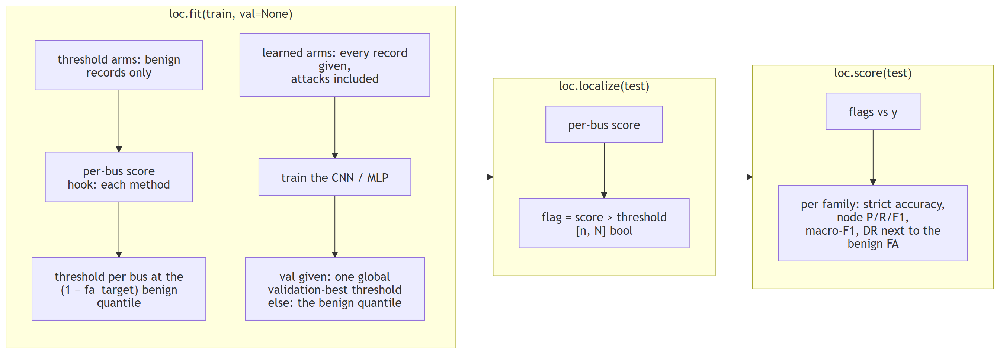
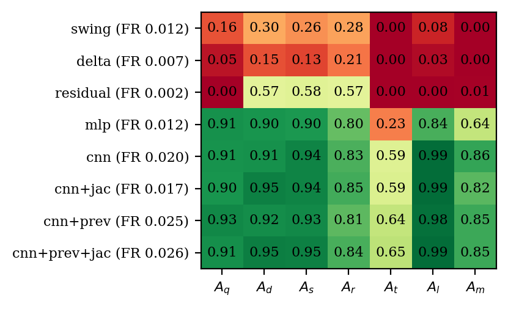
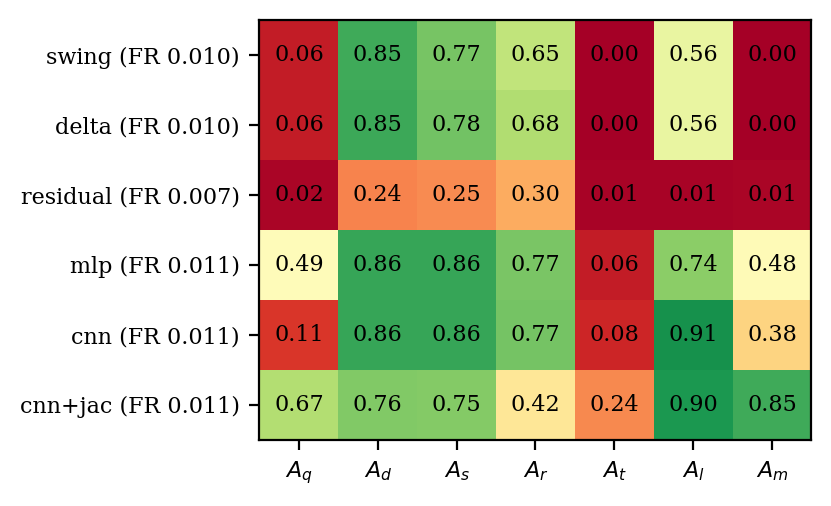
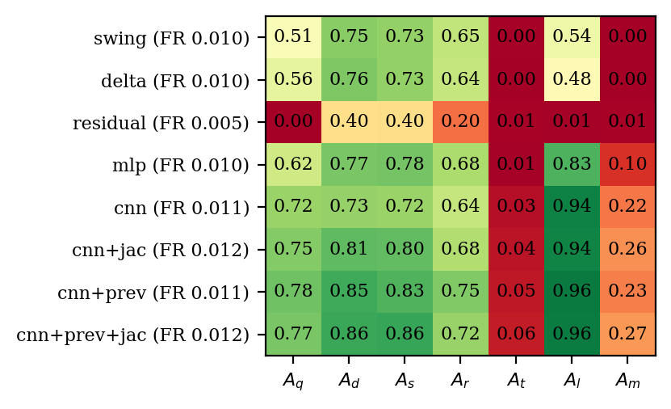

# Localization with `fdia_graph.localization`

Which buses are under attack, per scan.

```python
import fdia_graph as fg
from fdia_graph.localization import SwingThreshold, DeltaThreshold, ResidualLocalizer, BusCNN, BusMLP

train = fg.load("ieee14", split="train")
test  = fg.load("ieee14", split="test")

loc  = SwingThreshold(fa_target=0.01).fit(train)   # thresholds set on benign records only
flag = loc.localize(test)                          # [n, N] bool: which buses are called attacked
rep  = loc.score(test)                             # per-family metrics + benign false alarms
```



| | |
|---|---|
| shared | metrics and the benign-quantile calibration in `LocalizerBase`; a threshold arm changes only the per-bus score, a learned arm also overrides `fit` to train on every record and, given `val`, the threshold |
| budget | every method is calibrated to the same false-alarm target (`fa_target`), set per bus on benign training records, and the measured test FR differs by method; the one exception is a learned arm given `val`, which picks one global validation-best threshold from labelled records (the papers' zero-shot protocol) |
| `"all"` entry | pools every record; the papers' per-bus macro F1, DR and FR over the buses attacked somewhere in the scored split |

## The methods

| Class | Score | Needs |
|---|---|---|
| `SwingThreshold` | The dataset's windowed swing feature: each scan's injection change as a z-score of the bus's typical recent change | numpy only |
| `DeltaThreshold` | The raw one-scan change scaled by the bus's benign RMS. Same signal without the windowing, so the gap shows what windowing buys | numpy only |
| `ResidualLocalizer` | Largest normalized residual from a state-estimation solve (any `fdia_graph.se` estimator, default `WLS`), aggregated to each bus's own meters and incident flows. Textbook bad-data identification | `[se]` extra |
| `BusMLP` | The papers' lightweight arm: one 4x128 MLP applied to every bus's own 14-dim vector (readings, meter mask, partial KCL residual, delta, swing). 52k parameters | `[torch]` extra |
| `BusCNN` | The papers' best localizer: a 1-D convolution across the bus axis over the same 14-dim vector, 4 layers of 128 channels, kernel 3. No graph read. 154k parameters | `[torch]` extra |

The learned arms train on the records they are given, so the protocol is the load call.
`fit(train, val=val)` picks the papers' validation-best threshold instead of the false-alarm one.

## Feature sets

`BusMLP`, `BusCNN` and the federated arms take `features=`, the per-bus vector the encoder reads
(`localization.learned.FEATURE_SETS`):

| `features=` | channels | per bus | needs |
|---|---:|---|---|
| `"meas"` | 8 | the readings and the meter mask | any dataset |
| `"full14"` (default) | 14 | the papers' vector: readings, mask, partial KCL residual, `temporal_delta`, `swing` | any dataset |
| `"full14+prev"` | 16 | `full14` and the previous frame's swing (`prev_swing`) | a timeline |
| `"full14+jac"` | 22 | `full14` and the 8 Jacobian features | a timeline, `[se]` |
| `"full14+prev+jac"` | 24 | `full14`, `prev_swing` and the 8 Jacobian features | a timeline, `[se]` |
| `"jac"` | 8 | the Jacobian features alone | a timeline, `[se]` |

The previous frame's swing separates a one-frame attack from the frame after it, which carries
the same jump back with the opposite sign. The Jacobian block takes each frame's measurement change
against the previous frame's estimate, so both read the previous frame and need a timeline
(`ds.export` serves `prev_node_x`, `prev_edge_x`, `prev_timestep` and `prev_swing` on request).

## Results

| protocol | train and val | test | threshold |
|---|---|---|---|
| zero-shot (the paper's) | benign + `Aq` + `Ad` | adds `As` and `Ar`, never seen in training | learned arms validation-best; swing keeps its benign calibration |
| common | every family, unfiltered | the full split | benign quantile at `fa_target=0.01` for every method |

F1, DR and FR are the paper's per-bus macro scores, averaged over the buses attacked somewhere in the
test split (F1 and recall over every test record, FR the per-bus alarm rate on benign records); full metrics in
the results store, experiments `localization.zero_shot` and `localization.common` (`results/`). Bold marks the papers' headline localizer, not the best cell.

**Zero-shot protocol**

<!-- results: loc.table zero_shot -->
| Method | F1 14 | DR 14 | FR 14 | F1 118 | DR 118 | FR 118 | F1 300 | DR 300 | FR 300 |
|---|---:|---:|---:|---:|---:|---:|---:|---:|---:|
| Per-bus MLP | 0.7397 | 0.6352 | 0.0058 | 0.7033 | 0.6020 | 0.0013 | 0.7229 | 0.6211 | 0.0003 |
| **1D CNN** | 0.8037 | 0.7303 | 0.0010 | 0.8124 | 0.7406 | 0.0002 | 0.8108 | 0.7587 | 0.0000 |
| 1D CNN + previous swing | 0.8459 | 0.7533 | 0.0001 | 0.9125 | 0.8522 | 0.0000 | 0.8830 | 0.8225 | 0.0000 |
| Swing threshold | 0.2476 | 0.1548 | 0.0116 | 0.5418 | 0.6855 | 0.0100 | 0.4685 | 0.8074 | 0.0099 |
<!-- /results -->

Data release v0.8.3. The paper reports 0.9634 / 0.9625 / 0.9524 for the CNN and 0.9626 / 0.9570 /
0.9327 for the MLP on v0.4.1 data, and the SDK classes reproduce them on the v0.7.2 record shards.
The timeline columns are lower for the same detectors because a timeline's temporal features compare
each frame with the frame emitted one minute earlier. A one-frame attack therefore also spikes the
benign frame after it (the echo), with the jump reversed. Those echo frames stay in the benign
calibration set on purpose: an operator's detector sees them too, so leaving them out would set
lower thresholds and let the realized false-alarm rate exceed `fa_target`. The previous frame's
swing (`full14+prev`) is what tells an echo from an onset, and it recovers most of the gap.

**Common protocol**

<!-- results: loc.table common -->
| Method | F1 14 | DR 14 | FR 14 | F1 118 | DR 118 | FR 118 | F1 300 | DR 300 | FR 300 |
|---|---:|---:|---:|---:|---:|---:|---:|---:|---:|
| Swing threshold | 0.1559 | 0.0942 | 0.0116 | 0.4255 | 0.5143 | 0.0100 | 0.3882 | 0.5770 | 0.0099 |
| Delta threshold | 0.0812 | 0.0452 | 0.0074 | 0.4128 | 0.4982 | 0.0095 | 0.4052 | 0.5897 | 0.0095 |
| Residual (LNR) | 0.3756 | 0.4183 | 0.0017 | 0.2308 | 0.5668 | 0.0072 | 0.2189 | 0.5061 | 0.0049 |
| Per-bus MLP | 0.7650 | 0.6970 | 0.0118 | 0.5962 | 0.7373 | 0.0102 | 0.4550 | 0.6827 | 0.0104 |
| **1D CNN** | 0.8342 | 0.8593 | 0.0199 | 0.4962 | 0.7351 | 0.0118 | 0.4100 | 0.7082 | 0.0109 |
| 1D CNN + Jacobian (C) | 0.8350 | 0.8462 | 0.0167 | 0.3595 | 0.7897 | 0.0116 | 0.3784 | 0.7356 | 0.0121 |
| 1D CNN + previous swing | 0.8216 | 0.8741 | 0.0248 | 0.4813 | 0.7599 | 0.0123 | 0.4032 | 0.7128 | 0.0114 |
| 1D CNN + previous swing + Jacobian | 0.8392 | 0.8843 | 0.0256 | 0.3667 | 0.8026 | 0.0124 | 0.3907 | 0.7413 | 0.0116 |
<!-- /results -->

Per-bus F1 by attack family, common protocol. Row labels carry each method's FR.

| IEEE 14 | IEEE 118 | IEEE 300 |
|---|---|---|
|  |  |  |

The pooled score on 118 and 300 is set by the two sustained families: per family (the figures),
the CNN reads well on `Aq`, `Ad`, `As`, `Ar` and `Al` there and poorly on `At` and `Am`, whose
episodes are long and so carry many of the scored frames.

## Feature ablation

`fdia_graph.se.JacobianFeatures` transforms the measurement change through the estimator's Jacobian
(implied state move `H⁺Δz`, explained and unexplained parts and their ratio, sensitivity, leverage,
weak-direction energy) and aggregates it to buses. The change is taken against the previous frame's
estimate, and the estimator is calibrated from measurements only (`calibrate="measured"`), so every
set below reads observed data only.

| set | `features=` | input |
|---|---|---|
| A | `"meas"` | measurements only |
| B | `"full14"` | the papers' 14-dim vector (the rows above) |
| C | `"full14+jac"` | B + the 8 Jacobian features |
| D | `"jac"` | the Jacobian features alone |
| E | `"full14+prev"` | B + the previous frame's swing |
| F | `"full14+prev+jac"` | E + the 8 Jacobian features |

<!-- results: loc.table ablation -->
| Model (1D CNN, zero-shot) | F1 14 | DR 14 | FR 14 | F1 118 | DR 118 | FR 118 | F1 300 | DR 300 | FR 300 |
|---|---:|---:|---:|---:|---:|---:|---:|---:|---:|
| A: measurements only | 0.621 | 0.610 | 0.0000 | 0.000 | 0.000 | 0.0000 | 0.000 | 0.000 | 0.0000 |
| B: measurements + temporal (the papers' 14) | 0.804 | 0.730 | 0.0010 | 0.812 | 0.741 | 0.0002 | 0.811 | 0.759 | 0.0000 |
| C: B + Jacobian features | 0.846 | 0.773 | 0.0016 | 0.882 | 0.813 | 0.0001 | 0.909 | 0.870 | 0.0000 |
| D: Jacobian features only | 0.773 | 0.733 | 0.0043 | 0.770 | 0.762 | 0.0026 | 0.744 | 0.728 | 0.0008 |
| E: B + the previous frame's swing | 0.846 | 0.753 | 0.0001 | 0.913 | 0.852 | 0.0000 | 0.883 | 0.822 | 0.0000 |
| F: E + Jacobian features | **0.860** | 0.780 | 0.0002 | **0.920** | 0.865 | 0.0000 | **0.923** | 0.886 | 0.0000 |
<!-- /results -->

| finding | evidence |
|---|---|
| the previous swing and the Jacobian block fix different things | E lifts the family the echo hurts most, `Aq`, from <!-- results: v zs ieee118 cnn Aq macro_f1 fmt=.2f -->0.84<!-- /results --> to <!-- results: v zs ieee118 cnn+prev Aq macro_f1 fmt=.2f -->0.95<!-- /results --> on 118 and <!-- results: v zs ieee300 cnn Aq macro_f1 fmt=.2f -->0.84<!-- /results --> to <!-- results: v zs ieee300 cnn+prev Aq macro_f1 fmt=.2f -->0.89<!-- /results --> on 300. C lifts the unseen in-place families, `Ar` from <!-- results: v zs ieee300 cnn Ar macro_f1 fmt=.2f -->0.68<!-- /results --> to <!-- results: v zs ieee300 cnn+jac Ar macro_f1 fmt=.2f -->0.82<!-- /results --> on 300. F keeps both and is the best set on every system |
| measurements alone do not localize at scale | A reads <!-- results: v zs ieee14 cnn_meas all macro_f1 fmt=.2f -->0.62<!-- /results --> on 14 and collapses to <!-- results: v zs ieee118 cnn_meas all macro_f1 fmt=.2f -->0.00<!-- /results --> on 118 and <!-- results: v zs ieee300 cnn_meas all macro_f1 fmt=.2f -->0.00<!-- /results --> on 300 at the validation-best threshold; the temporal channels are what make the vector work |
| the Jacobian block alone is not enough | D trails B on every system, and on 300 its `Aq` F1 is <!-- results: v zs ieee300 cnn_jac Aq macro_f1 fmt=.2f -->0.59<!-- /results --> against <!-- results: v zs ieee300 cnn Aq macro_f1 fmt=.2f -->0.84<!-- /results --> |
| in the common protocol the Jacobian block costs precision | C and F have the highest detection rate on 118 and 300 (<!-- results: v loc ieee118 cnn+jac all macro_dr fmt=.2f -->0.79<!-- /results --> and <!-- results: v loc ieee118 cnn+prev+jac all macro_dr fmt=.2f -->0.80<!-- /results --> against the CNN's <!-- results: v loc ieee118 cnn all macro_dr fmt=.2f -->0.74<!-- /results --> on 118) and lose pooled F1 (<!-- results: v loc ieee118 cnn+jac all macro_f1 fmt=.2f -->0.36<!-- /results --> and <!-- results: v loc ieee118 cnn+prev+jac all macro_f1 fmt=.2f -->0.37<!-- /results --> against <!-- results: v loc ieee118 cnn all macro_f1 fmt=.2f -->0.50<!-- /results -->): they flag the buses around a local false state as well as the labelled ones |

## Three readings

| reading | evidence | open case |
|---|---|---|
| the temporal spike is an onset signal | the swing threshold alone reads <!-- results: v loc ieee14 swing all macro_f1 fmt=.2f -->0.16<!-- /results -->, <!-- results: v loc ieee118 swing all macro_f1 fmt=.2f -->0.43<!-- /results --> and <!-- results: v loc ieee300 swing all macro_f1 fmt=.2f -->0.39<!-- /results --> macro-F1 in the common protocol on 14, 118 and 300, and close to nothing on `At` and `Am` everywhere (the figures): it catches the one-frame families and the first frame of an episode, then the feature fades because each frame is compared with the frame before it | the slow ramp `At` and the held redistribution `Am` inside an episode |
| the classical arm misses every stealthy family | `ResidualLocalizer` finds in-place corruption and smears it over neighbours; on `Aq`, `At`, `Al` and `Am` its node-F1 is near zero (IEEE-14 `Aq`: <!-- results: v loc ieee14 residual Aq node_f1 fmt=.3f -->0.003<!-- /results -->), there is no residual | it opens with a trusted set of meters, [`../trust/README.md`](../trust/README.md) |
| learning plus physics holds with size | zero-shot CNN with the previous swing and the Jacobian block reads <!-- results: v zs ieee14 cnn+prev+jac all macro_f1 fmt=.3f -->0.860<!-- /results -->, <!-- results: v zs ieee118 cnn+prev+jac all macro_f1 fmt=.3f -->0.920<!-- /results --> and <!-- results: v zs ieee300 cnn+prev+jac all macro_f1 fmt=.3f -->0.923<!-- /results --> from 14 to 300 buses (the ablation table) | the common protocol, with `At` and `Am` in distribution, falls to <!-- results: v loc ieee118 cnn+prev+jac all macro_f1 fmt=.2f -->0.37<!-- /results --> and <!-- results: v loc ieee300 cnn+prev+jac all macro_f1 fmt=.2f -->0.39<!-- /results --> on 118 and 300: the per-frame localization of a sustained local false state is the frontier |

The same papers' protocol trained federated across K utilities, with the Jacobian block, is in
[`../federated/README.md`](../federated/README.md).

## Regenerate

```bash
FG_SYSTEM=ieee14 python docs/localization/run_localization.py    # fits, writes runs of localization.* to results/
FG_SYSTEM=ieee118 python docs/localization/run_localization.py
FG_SYSTEM=ieee300 python docs/localization/run_localization.py
python docs/localization/make_report.py                          # figures + CSV sidecars from the store
python tools/results_docs.py --write                             # the README's results blocks
```

IEEE-300 takes the longest, mostly the residual arm's solves.
