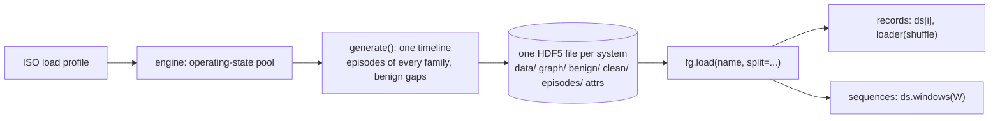

# Plan: one generator, one file, one loader

Status: approved 2026-09-19. Step 1 (#93): the writer and `Am` as `fdia_graph.timeline.generate_timeline`. Step 2: the loader reads timeline files, `order`/`seed`, `ds.windows`, `ds.episodes`, the benign fields, the torch helpers on a dataset; `fg.generate` writes timelines (`generate_shard` keeps the old writer until step 3); the stream entry points warn. Ben: "one path for generation; load should just be out-of-order
load_stream with all the things we have put into them; sidecars make no sense; it makes no sense
that data was stored in HDF5 and then npz." This is a breaking data release; the published 0.7.2
data and the code that reads it stay available for anyone citing them.

## 1. Principle

The continuous timeline is the dataset. A record table is the same frames used independently,
which the DataLoader's shuffle already provides. So there is one generator that writes one
timeline per system, one HDF5 file that carries everything, and one loader with no branches.

## 2. What goes away

| today | why it existed | after |
|---|---|---|
| `generation.py` shard writer: family draw loop, `per_family`, `_write_*`, chronological split by record, `gap` rows | records were drawn independently, several per timestep | deleted; the timeline is the only generator (today's `streams.py` walker, promoted) |
| `streams.py` `.npz` output, `_attach_graph_sidecar`, `_normalize_graph_dtypes`, `graph_ieee*.npz` assets | the series was added after the shards and copied what it needed | deleted; the series *is* the file |
| `mag.npz` magnitude sidecar | the plausibility-band audit had nowhere to go in the shard | a `attack/` group in the file (designed magnitude per attacked bus, per frame) |
| `load_stream`, `generate_stream` | the second path | aliases of `load` / `generate` for one minor version, then removed |
| `Stream` bundle | the second object | `ds.to_numpy()` on a series carries the same fields; `Stream` becomes an alias of `ArraysBundle` for one minor version |
| `pool_ieee*.npz` operating-state pools | generation input, npz | HDF5 too, same release; the loader never touches them |

## 3. The one file

HDF5, the shard's layout extended; every group has one row per frame, in time order.

| group | datasets | note |
|---|---|---|
| attrs | `system, N, E, baseMVA, seed, T, families, kind="timeline"`, the column-order strings, the generation knobs, `attacked_frac`, the outage fields | what `summary()` and `resolve` read |
| `data/` | `node_x [T,N,4]`, `node_m [T,N,4]`, `edge_x [T,E,2]`, `edge_m [T,E,2]`, `y [T,N]`, `family [T]`, `stealthy [T]`, `seq_id [T]` (episode index, -1 benign), `timestep [T]`, `split [T]`, `temporal_delta [T,N,2]`, `swing [T,N,2]` | masks stored per frame so a future N-1 series can switch topology mid-file |
| `benign/` | `node_benign [T,N,4]`, `edge_benign [T,E,2]` | the attack removed, noise kept; exact difference for in-place families |
| `clean/` | `node_clean [T,N,4]`, `edge_clean [T,E,2]` | per frame; `edge_clean_full` derived through `yf` on load as today |
| `graph/` | the full static physics the shards carry today (eight branch columns, shunts, eleven bus attributes, `edge_status`, `edge_is_trafo`, `edge_reactance`) | so `ybus`, `yf`, `yt`, `edge_clean_full` work everywhere |
| `episodes/` | `onset [K]`, `length [K]`, `family [K]`, `buses` (ragged: `bus_ptr [K+1]`, `bus_idx`) | replaces the pickled episode list |
| `attack/` | `mag_ptr [T+1]`, `mag_bus`, `mag` (ragged) | the designed magnitudes, replaces `mag.npz` |

Chunked along the frame axis, gzip level 4: a window of W frames is one chunked read.

## 4. The one loader

- `fg.load(name, split=None, families=None, heldout=False, order="time", seed=None, format="torch", units="physical", preload=False, release=None)`, the signature it has, minus `include_gaps` (no gap rows), plus the order.
- `order="time"` is the timeline; `order="random"` is the record table, the same frames in a
  permutation fixed by `seed` (default 0), so two people asking for the same seed get the same
  order and `ds[i]` means the same record for both. The permutation is a view index, nothing is
  copied, and `ds.windows` refuses on a random order. One upload serves both uses.
- Records: `ds[i]` is frame `i` of the view; `loader(shuffle=True)` reshuffles per epoch as today.
- Sequences: `ds.windows(W, stride, label)` and `ds.to_numpy()` replace `windows(stream, ...)`; `torch_windows` and `pyg_stream` take a dataset.
- `benign` / `edge_benign` are record, batch and export fields like `clean`; `ds.episodes` is a small table.
- `split`: stored codes, chronological 60/20/20 by frame; `heldout` as today.

## 4a. The seventh family: multi-snapshot FDIA (`Am`)

The regeneration adds the attack of Wu et al. 2026 (IEEE TSG 17(1), the multi-snapshot coordinated
FDIA) as family 7, `Am`, built from the pieces the engine has:

| piece | in the engine today | for `Am` |
|---|---|---|
| target and direction | `lra_delta` picks a line and a load redistribution that steers its flow, PTDF-ranked buses, sign masks or manufactures an overload | drawn **once at episode onset** and held for the episode |
| schedule | `ramp_profile` (rise, hold, fall) drives `At` | the same profile scales the redistribution frame by frame; the rise rate keeps every per-bus per-frame change under the noise floor, the plateau reaches the flow target |
| consistency | `solve` with generation pinned, `emit` | every frame re-solved, so every frame is an AC-consistent state |
| sparsity (Wu's l0) | none | after emission, every meter whose change from the benign twin is under `k` sigma is restored to the benign value; the tampered set is the meters that moved beyond noise, stored in `attack/` |
| labels | `y` on the redistribution buses from onset, as `At` labels its buses | same; the sparse tamper set is a second, per-frame mask in `attack/` for the papers that want meter-level truth |

Knobs: `am_rate` (per-frame cap as a fraction of the noise floor, default 0.9), `am_sigma` (sparsity
threshold, default 3), `am_direction` (`"induce"` keeps the engine's redistribution sign, so the target
line reads more loaded than it is, as Wu's attack does; `"mask"` flips it so a real overload reads
lighter; default both, drawn per episode). What it is not: Wu's
Pyomo/IPOPT optimization; the engine's PTDF redistribution is the closed-form version of the same
objective, and the ramp is what their l0-with-noise-floor objective produces. `Am` lands in the same
PR as the writer (step 1) so the eight systems are generated once.

## 5. What the record table loses and gains

| | today's shard | the timeline as records |
|---|---|---|
| attack records per family | fixed by `per_family`, several draws per timestep | set by the episode scheduler (`attacked_frac`, family mix, episode lengths); single-shot families are length-1 episodes when a knob asks for it |
| independence of records | drawn independently | consecutive frames are correlated (the point of a timeline); shuffle removes it for training, and a train/test split is chronological as today |
| benign twin | absent | present on every frame |
| gap rows | present | none; a non-converged frame is re-drawn by the walker |
| numbers in `docs/se` and `docs/localization` | v0.7.2 | re-run on the new release; the papers keep citing v0.7.2 |

## 6. Sequence

| step | PR | contents | data release |
|---|---|---|---|
| 1 | writer | `timeline.generate_timeline` writes the one file (the walker's episode primitives shared with `generate_stream`, whose scheduler stays bit-identical until step 3); the `Am` family and its knobs; `episodes/` and `attack/` groups; families scheduled by inverse expected length; the pool read from HDF5 | no |
| 2 | loader | reads `kind="timeline"` files: `benign/`, `episodes/`, stored split; `order="time" | "random"` with `seed`; `ds.windows`, `ds.episodes`; `torch_windows` / `pyg_stream` on a dataset; `fg.generate` writes timelines; `load_stream` / `generate_stream` / `windows` warn (`Stream` and the `attack/` group reach the loader in step 3) | no |
| 3 | delete | the shard writer, the npz path, both sidecars, the graph sidecar assets; the frozen references re-frozen on the new tiny file | no (references only) |
| 4 | data | the eight systems regenerated with the seven families, pools converted, **one file per system**, one release `v0.8.0`; `registry` points at it; `FDIA_GRAPH_RELEASE=v0.7.2` still loads the old shards through the old layout for one minor version | yes |
| 5 | results and docs | `docs/se` and `docs/localization` re-run (IEEE-300 hours), one "Load" section, the data dictionary as one table with a "series" column, changelog with the number deltas | no |

Steps 1 to 3 are code and ship as 0.18; step 4 is the release that makes it real.

## 7. Decisions for Ben

0. Family letter and code: `Am`, 7 (proposed), and whether `Am` counts as stealthy for the
   `stealthy` flag (proposed: yes, it is re-solved every frame).

1. Keep single-shot families as length-1 episodes (a knob, default on) so `Ad`/`As`/`Ar` records stay independent draws as in the papers, or let every family run as episodes. Implemented as `corrupt_len=1`: the corrupt-in-place families `Ad`/`As`/`Ar` are one-frame draws; `Aq` and `Al` keep their episode bands (their onset is the temporal signal the SE work reads), `At` and `Am` are ramps.
2. Frame count per system: 72,000 as today (one pool pass), or more.
3. Compression: gzip 4 (smaller files, slower first read) or none (the 300-bus file grows to about 4 GB).
4. Drop the old-layout reader after one minor version, or keep it for good for the v0.7.2 citations.
