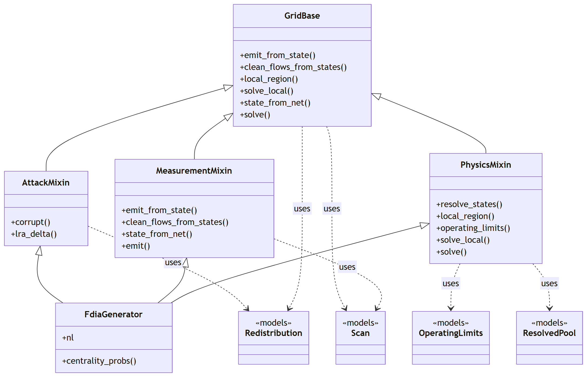
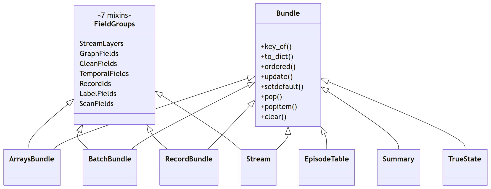
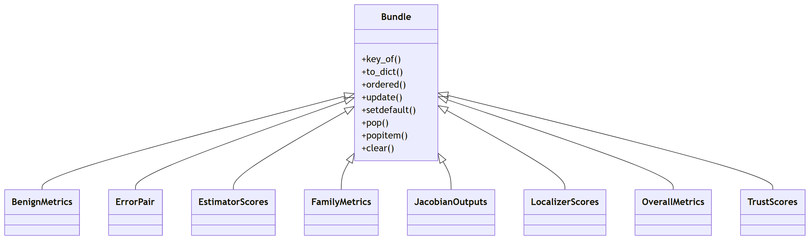

# Class map

How the pieces of `fdia_graph` connect: one module diagram and six class diagrams, all drawn from
the source by `tools/class_diagrams.py` (the AST gives each class's public methods, its bases and the
classes of other modules it names), so they cannot drift from the code. CI checks that the committed
sources match; `python tools/class_diagrams.py` rewrites them and `tools/render_mermaid.py` renders.
Read with [`ROADMAP.md`](../ROADMAP.md) (what each file is for) and
[`CONCEPTS_TO_CODE.md`](CONCEPTS_TO_CODE.md) (which function implements which idea).

An open arrowhead is inheritance, a dashed arrow is a class using another (an argument type, a return
type or a collaborator it builds), and a box marked with another package's name is a participant that
lives there.

## Modules

Which module imports which. Three foundations are read by nearly every module and are left out so the
real dependencies show: `models/` (every returned record), `formulas/` (the equations) and `schema.py`
(the file protocol). `__init__.py`, the `fg.*` public API, imports everything and is left out for the
same reason. `streams.py` and `torch_data.py` retire in 0.19.

## The dataset

`FdiaGraph` is the file. Five mixins over `DatasetBase` give it its faces: the static graph physics
(`GraphMixin`), the admittance matrices (`AdmittanceMixin`), records and batches (`RecordsMixin`), the
exports (`ExportMixin`) and the time-ordered windows and episodes (`SequenceMixin`). Every method returns
a `models` bundle.

## The engine

`FdiaGenerator` is the AC model of one system with its meter plan. `GridBase` declares what the mixins
provide: `MeasurementMixin` emits scans, `PhysicsMixin` solves states (the whole grid, or the attacker's
local region), `AttackMixin` builds the in-place corruptions and the load redistribution. The frame
builders in `engine/records.py` are functions over a generator, and `timeline.py` walks them.

## State estimation

`SEBase` holds the shared solve: the measurement function, the chord Jacobian, the meter weights and the
chord-Newton loop. Each estimator overrides one hook. `GatedPrior` takes a fitted localizer as its gate;
`JacobianFeatures` is the per-bus feature block the localizers can consume.

## Localization and trusted meters

`LocalizerBase` calibrates any per-bus score to one false-alarm budget; the threshold arms score a stored
feature, `ResidualLocalizer` runs an estimator, the learned arms train a per-bus network.
`TrustSelector` chooses the meters to secure on the WLS Jacobian, by row reduction (`TrustedMeters`) or
by a deep Q-network (`TrustedMetersDQN`), and scores the residual test with them secured.

## The records

Everything a call returns is a `Bundle`, a dict with attribute access and a fixed key order. The record
forms share seven field-group mixins, one per group of keys, so a record, a batch, an exported split and
a stream carry the same names.

## The scores

The result of every `score()` is a `Bundle` too: `ErrorPair` and `EstimatorScores` for the estimators,
`OverallMetrics`, `BenignMetrics`, `FamilyMetrics` and `LocalizerScores` for the localizers, `TrustScores`
for the trusted meters, `JacobianOutputs` for the feature block.

The named tuples of `models/frames.py` (`Scan`, `Frame`, `OperatingLimits`, `FrameKnobs`,
`Redistribution`, `ResolvedPool`), `models/grid.py` (the column indices, `BranchModel`, `Admittances`,
`MeterPlan`, `MeterBias`, `Outage`) and `models/assets.py` (`AssetSpec`, `LineCandidate`) are plain
value types with no hierarchy, so they appear only where a class above uses them.
