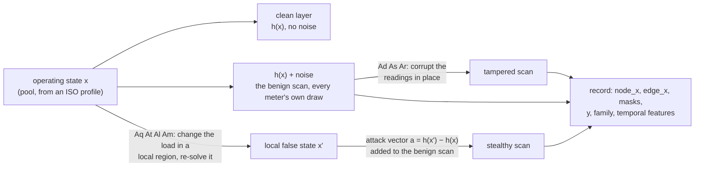

# Concepts to code

Paper ideas → the function that implements them. Pair with `DATA_DICTIONARY.md`.
Paths are under `src/fdia_graph/`.

## One record, start to finish

Re-solve families are attacked before measurement (`engine.physics.solve`), in-place families
after it (`engine.attacks.corrupt`); `engine.records.attack_frame` routes both.

## Modules

The paper's math lives in `engine/`. At the top level, `generation.py`/`profiles.py` drive the
engine; `se/` and `localization/` analyze the shards; the rest load and serve data.

| SDK file | job |
|------|-----|
| `registry.py` | dataset versions, aliases, cache |
| `download.py` | fetch + cache a shard |
| `generation.py` | assemble the classification shard (the recipe) |
| `streams.py` | assemble a continuous timeline |
| `dataset/` | loader → tensors / PyG (what `fg.load` returns); `graph`, `physics`, `records`, `export` concerns |
| `profiles.py` | real load series → operating points |
| `se/` | state estimation classes (`WLS`, robust, `SubspacePrior`) |
| `localization/` | per-bus localization classes: threshold arms (`SwingThreshold`, `DeltaThreshold`, `ResidualLocalizer`) and the papers' learned arms (`BusCNN`, `BusMLP`) |

| engine/ file | formula it implements |
|------|-----|
| `core.py` | `FdiaGenerator`: grid + noise setup (`__init__`), attack targeting; composes the three mixins |
| `measurement.py` | `emit_from_state` (the measurement function `h(x)`), `clean_flows_from_states`, `emit`, `state_from_net` |
| `physics.py` | `solve` / `resolve_states`: AC re-solve under new loads |
| `attacks.py` | `corrupt` (Ad/As/Ar) and `lra_delta` (Al redistribution) |

One column order everywhere: the operating-state pool, `node_x`, and `clean` are all
`[|V|, P_inj, Q_inj, theta]`. Pools saved before 0.12 were P-first; `generation.as_v_first` detects
and converts them on load.

## State estimation

| concept | code |
|---|---|
| WLS `x̂ = argmin (z−h(x))ᵀW(z−h(x))` | `se/base.py` `SEBase._w_solve` (chord-Newton); `h(x)` is `engine/measurement.emit_from_state` |
| Robust reweighting (Huber), residual removal, subspace prior | `se/methods.py`: one class per arm, each overrides one hook |
| Bad-data test `r_i=(z_i−h_i)/σ_i`, `J=Σr_i²` | `σ_i` from the engine `FdiaGenerator.SD`; residuals in `se/base.py` `SEBase._nres`. The `stealthy` flag marks the families that evade it by construction (`Aq`/`At`/`Al`) |
| Noise model | `FdiaGenerator.SD` (accuracy class): reading = true + per-meter bias + per-scan jitter |

Walkthrough: `../guides/state_estimation.md`. Results: `../se/README.md`.

## Attack families

| family | paper | build | code |
|--------|-------|-------|------|
| Aq | `A_o` | scale 1 to 6 loads by 5 to 20 percent, one local false state per frame | `timeline._single_shot_episode` + `engine/records.stealthy_state` |
| At | `A_t` | slow ramp, 0.2 percent per frame, a local false state per frame | `timeline._ramp_episode` |
| Al | `A_l` | load-conserving redistribution around a target line | `engine/attacks.lra_delta` + `engine/records._lra_frame` |
| Am | `A_m` | multi-snapshot: a held redistribution reached in steps under the noise floor [WU26] | `timeline._am_episode` + `engine/records._am_frame` |
| Ad | `A_d` | `z ← z(1±u)` | `engine/attacks.corrupt` |
| As | `A_s` | `z ← βz` | `engine/attacks.corrupt` |
| Ar | `A_r` | replay `z(t−k)` | `engine/attacks.corrupt` |

- Aq/At/Al/Am are local false states [WU26]: the buses within two hops of the attacked loads are
  re-solved with the boundary voltages held true, inside the case's voltage limits and the region's
  generator limits, and the attack vector `h(x') − h(x)` is added to the benign scan. The residual
  test flags them at the benign rate by construction.
- Ad/As/Ar tamper readings in place. Detectable.
- Every designed change sits above the noise floor and inside the 5 to 20 percent band
  (`attack_intensity`); the ramp's per-frame step is the exception, sub-floor by design.

## Temporal feature

| field | meaning | built in |
|---|---|---|
| `temporal_delta` | scan-to-scan `[ΔP, ΔQ]` | `generation._fin`, `streams._store` |
| `swing` | `temporal_delta` as a z-score of recent volatility | same |

Any above-noise attack spikes the swing, so localization is per-bus and needs no graph. The slow ramp
`At` stays inside the swing, so it is the open case.

## The papers' per-bus feature vector and localizers

| concept | code |
|---|---|
| 14-dim per-bus vector: `[|V|,P,Q,θ]` + meter mask + partial KCL residual + `temporal_delta` + `swing` | `localization/learned.py` `full14`, `kcl_residual` |
| standardize all 14 channels on train (sd floored at 1e-3) | `LearnedLocalizer._fit_stats` |
| 1-D CNN across the bus axis (best localizer) | `BusCNN` |
| per-bus MLP (lightweight arm) | `BusMLP` |
| validation-best global threshold on a 0.05..0.95 grid | `LearnedLocalizer.tune_threshold` |

## Metrics

| metric | definition | code |
|---|---|---|
| node precision / recall / F1 | micro over every (record, bus) pair | `localization/base.py` `LocalizerBase.score` |
| per-sample macro-F1 | F1 per record, averaged | same |
| strict localization accuracy | predicted attacked set equals the truth exactly | same |
| DR with FA | detection rate, always reported next to the benign false-alarm rate | same |
| localization macro-F1 | per-bus F1 averaged over attackable buses (the papers' headline) | `LocalizerBase.score(...)["all"]["macro_f1"]`; also `EXAMPLES.md` `macro_f1` |
