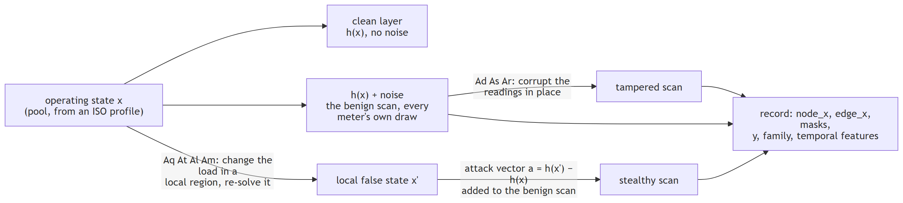

# Concepts to code

Paper ideas → the function that implements them. Pair with `DATA_DICTIONARY.md`.
Paths are under `src/fdia_graph/`.

## One record, start to finish

Every attack is built in `engine.attacks`, the generator's `AttackMixin`: the re-solve families
before measurement (a local false state, `engine.attacks.false_state`), the in-place families after
it (`engine.attacks.corrupt`); `AttackMixin.attack_frame` routes both, and
`engine.records.attack_frame` adds the benign scan.

## Modules

The paper's math lives in `engine/`. At the top level, `generation.py`, `timeline.py` and
`profiles.py` drive the engine; `se/` and `localization/` analyze the timelines; the rest load and
serve data.

| SDK file | job |
|------|-----|
| `registry.py` | dataset versions, aliases, cache |
| `download.py` | fetch + cache a data file |
| `generation.py` | `generate`: load the operating-point pool, call `timeline.generate_timeline`, register the file |
| `timeline.py` | walk the attacked timeline, write the file, and write the temporal layers (`write_temporal_layers`) |
| `streams.py` | deprecated stream entry points over the timeline file |
| `dataset/` | loader → tensors / PyG (what `fg.load` returns); `graph`, `physics`, `records`, `export` concerns |
| `profiles.py` | real load series → operating points |
| `se/` | state estimation classes (`WLS`, robust, `SubspacePrior`) |
| `localization/` | per-bus localization classes: threshold arms (`SwingThreshold`, `DeltaThreshold`, `ResidualLocalizer`) and the papers' learned arms (`BusCNN`, `BusMLP`) |

| engine/ file | formula it implements |
|------|-----|
| `core.py` | `FdiaGenerator`: grid + noise setup (`__init__`), attack targeting; composes the three mixins |
| `measurement.py` | `emit_from_state` (the measurement function `h(x)`), `clean_flows_from_states`, `emit`, `state_from_net` |
| `physics.py` | `solve` / `resolve_states`: AC re-solve under new loads |
| `attacks.py` | `corrupt` (Ad/As/Ar) and `lra_delta` (Al redistribution) |

One column order everywhere: the operating-state pool, `node_x`, and `clean` are all
`[|V|, P_inj, Q_inj, theta]`. Pools saved before 0.12 were P-first; `generation.as_v_first` detects
and converts them on load.

## State estimation

| concept | code |
|---|---|
| WLS `x̂ = argmin (z−h(x))ᵀW(z−h(x))` | `se/base.py` `SEBase._w_solve` (chord-Newton); `h(x)` is `engine/measurement.emit_from_state` |
| Robust reweighting (Huber), residual removal, subspace prior | `se/methods.py`: one class per arm, each overrides one hook |
| Bad-data test `r_i=(z_i−h_i)/σ_i`, `J=Σr_i²` | `σ_i` is the RMS of the benign residuals at the training truth (`se/base.py` `SEBase.fit`); residuals in `se/base.py` `SEBase._nres`. The `stealthy` flag marks the families that evade it by construction (`Aq`/`At`/`Al`/`Am`, `schema.STEALTHY_FAMILIES`) |
| Noise model | `FdiaGenerator.SD` (accuracy class): reading = true + per-meter bias + per-scan jitter. The estimator does not read it; it calibrates `σ_i` from data |

Walkthrough: `../guides/state_estimation.md`. Results: `../se/README.md`.

## Attack families

| family | paper | build | code |
|--------|-------|-------|------|
| Aq | `A_o` | scale 1 to 6 loads by 5 to 20 percent, one local false state, one frame per episode | `engine/attacks/episodes.single_shot_design` + `engine/attacks/false_state.stealthy_state` |
| At | `A_t` | slow ramp, 0.2 percent per frame, a local false state per frame | `engine/attacks/episodes.ramp_design` + `ramp_step` |
| Al | `A_l` | load-conserving redistribution around a target line, one frame per episode | `engine/attacks/redistribution.lra_delta` + `engine/attacks/stealthy._lra_frame` |
| Am | `A_m` | the overload attack of [WU26]: a rated line's reported flow driven to its rating over the window, the fewest devices tampered (v0.8.3: a held redistribution reached in steps) | `engine/attacks/overload.am_overload_design` + `overload_step` (v0.8.3: `episodes.am_design` + `am_step` + `stealthy._am_frame`) |
| Ad | `A_d` | `z ← z(1±u)` | `engine/attacks/corrupt.corrupt` |
| As | `A_s` | `z ← βz` | `engine/attacks/corrupt.corrupt` |
| Ar | `A_r` | replay `z(t−k)` | `engine/attacks/corrupt.corrupt` |

- Aq/At/Al/Am are local false states: the buses within two hops of the attacked loads are re-solved
  with the boundary voltages held true, inside the case's voltage limits and the region's generator
  limits, and the attack vector `h(x') − h(x)` is added to the benign scan. The residual test flags
  them at the benign rate by construction. They satisfy equations (13)-(18) and (21)-(23) of [WU26]
  (the SCADA measurements, the PMU voltage magnitudes and angles, and the operating limits; the PMU
  branch-current phasors (19)-(20) are not modeled yet). New generation also solves its objective,
  eq. (12): each `At` and `Am` episode is held on the support that tampers the fewest devices, and
  `Am` drives a rated line's reported flow to its PGLib-OPF rating (eqs. 24-25). The released files'
  stealthy families drew their targets at random and drove no line to its limit; `LEGACY_FAMILIES`
  with `am_attack="redistribution"` and `min_tamper=False` reproduces them
  (`docs/plans/WU_MSFDIA_PLAN.md`).
- With `min_tamper=True` an At episode is held on the support that tampers the fewest devices over
  the episode, the objective of [WU26, eq. 12] (`engine/attacks/minimize.MinimizeMixin.min_tamper`,
  called by `engine/attacks/episodes.ramp_design`).
- Ad/As/Ar tamper readings in place. Detectable.
- Every designed change sits above the noise floor and below `attack_intensity` (20 percent by
  default). Aq draws its per-bus load change from 5 to 20 percent; Ad, As and Al use the 2 to 20
  percent band, whose lower edge is the noise floor (`generation.NOISE_FLOOR`). The multi-snapshot
  families are the exception, by design: the At ramp and the Am redistribution move in per-frame
  steps under the noise floor.

## Temporal feature

| field | meaning | built in |
|---|---|---|
| `temporal_delta` | scan-to-scan `[ΔP, ΔQ]` of the observed frames | `timeline.write_temporal_layers` (`formulas.temporal.temporal_delta`) |
| `swing` | `temporal_delta` as a z-score of the recent observed change | `timeline.write_temporal_layers` (`formulas.temporal.swing_zscore`, scale from `recent_change_scale`) |

Both layers are written after the walk from the observed injections only, so a detector reads
what an operator sees.

Any above-noise attack spikes the swing, so localization is per-bus and needs no graph. The slow ramp
`At` stays inside the swing, so it is the open case.

## The papers' per-bus feature vector and localizers

| concept | code |
|---|---|
| 14-dim per-bus vector: `[|V|,P,Q,θ]` + meter mask + partial KCL residual + `temporal_delta` + `swing` | `localization/learned.py` `full14`, `kcl_residual` |
| standardize all 14 channels on train (sd floored at 1e-3) | `LearnedLocalizer._fit_stats` |
| 1-D CNN across the bus axis (best localizer) | `BusCNN` |
| per-bus MLP (lightweight arm) | `BusMLP` |
| validation-best global threshold on a 0.05..0.95 grid | `LearnedLocalizer.tune_threshold` |

## Metrics

| metric | definition | code |
|---|---|---|
| node precision / recall / F1 | micro over every (record, bus) pair | `localization/base.py` `LocalizerBase.score` |
| per-sample macro-F1 | F1 per record, averaged | same |
| strict localization accuracy | predicted attacked set equals the truth exactly | same |
| DR with FA | detection rate, always reported next to the benign false-alarm rate | same |
| localization macro-F1 | per-bus F1 averaged over the active buses, those attacked somewhere in the records scored (the papers' headline) | `LocalizerBase.score(...)["all"]["macro_f1"]`; also `EXAMPLES.md` `macro_f1` |
