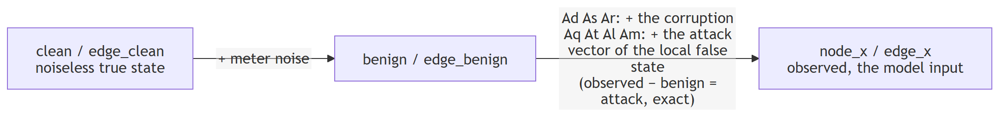

# Data dictionary

What every array from `fg.load()` holds, as a record (`order="random"`) or as a frame of the
timeline (`order="time"`).

**N** = number of buses (nodes), **E** = number of branches (edges). A shape is "values per item":
`[N,4]` = 4 numbers per bus, `[E,8]` = an 8-dim vector per branch, `[2,E]` = 2 rows × E branches.

## Cheat sheet

| field | shape | columns | meaning |
|---|---|---|---|
| `node_x` | `[N,4]` | <code>&#124;V&#124;</code>, `P_inj`, `Q_inj`, `theta` | bus meter readings |
| `node_m` | `[N,4]` | same columns | 1 metered, 0 not (value zero-filled) |
| `edge_x` | `[E,2]` | `P_from`, `Q_from` | power leaving the branch (sign = direction) |
| `edge_m` | `[E,2]` | same columns | 1 metered, 0 not |
| `edge_index` | `[2,E]` | row 0 `from_bus`, row 1 `to_bus` | connectivity |
| `edge_attr` | `[E,8]` | `r`, `x`, `b`, `g`, `gs`, `bs`, `tap`, `shift` | static branch electrical properties |
| `y` | `[N]` | | 1 attacked, 0 clean. Which buses |
| `family` | scalar | | 0 benign, 1 Aq, 2 Ad, 3 As, 4 Ar, 5 At, 6 Al, 7 Am. Which attack |
| `temporal_delta` | `[N,2]` | `ΔP`, `ΔQ` | injection change against the previous frame |
| `swing` | `[N,2]` | `ΔP`, `ΔQ` | `temporal_delta` as a z-score of recent volatility |
| `benign` | `[N,4]` | same as `node_x` | the same scan with the attack removed, noise kept (timelines) |
| `edge_benign` | `[E,2]` | same as `edge_x` | the same flows with the attack removed, noise kept (timelines) |
| `clean` | `[N,4]` | same as `node_x` | noiseless truth, all buses. The SE target (v0.7.2+) |
| `edge_clean` | `[E,2]` | same as `edge_x` | noiseless true flows, unmetered branches zeroed |
| `edge_clean_full` | `[E,2]` | same as `edge_x` | noiseless true flows on every branch, metered or not (computed from `clean` through `yf` on load; equals `edge_clean` where a flow meter exists) |

## Labels: `y` says which buses, `family` says which attack

Two fields, two questions. `y` `[N]` is binary per bus because a bus is either tampered with or not.
`family` is one code per record because the generator runs one attack episode at a time, on one
or more buses at once; episodes never overlap, so each frame has one active family. That is a
property of how these files were built, not of the schema: concurrent attacks of different families would need a separate per-bus family map, say
`bus_family` `[N]` with 0 on clean buses (so `y = bus_family > 0`), added next to the scalar `family`
in a new data release.

| | shape | values | in a batch |
|---|---|---|---|
| `y` | `[N]` | 0 clean, 1 attacked | `batch["y"]` `[B,N]` (PyG: `batch.y` `[B*N]`) |
| `family` | scalar | 0 benign, 1 Aq, 2 Ad, 3 As, 4 Ar, 5 At, 6 Al, 7 Am (timelines only) | `batch["family"]` `[B]` (PyG: `batch.family` `[B]`) |

- Names: `fg.FAMILIES[code]`. Stealthy subset: `fg.STEALTHY_FAMILIES` = `{1, 5, 6, 7}`.
- Per-bus family label, if a model needs one: `y * family[:, None]` gives `[B,N]` with 0 on clean buses.
- Every attacked record flags at least one bus. Benign records flag none.
- Per-family evaluation: filter by `family` and score `y` inside each group. `fg.load(..., families=[...])`
  does the filtering at load time.

## `node_x` `[N,4]`: bus measurements (voltage first)

The column order is defined once, in `fdia_graph.models.NodeColumns` (`v`, `p_inj`, `q_inj`, `theta`);
every record, batch, split and stream exposes named views of it through `.node()` and `.edge()`,
and the generator, loader and estimator index columns through `NODE` and `EDGE` rather than literals:

```python
rec = ds[0]
rec.node().theta  # the angle column, a view of rec.node_x[..., 3]
NodeColumns.of(s.clean).v  # works on any [..., 4] array, a stream's clean layer included
```

| col | name | physical units | pu units |
|-----|------|----------------|----------|
| 0 | <code>&#124;V&#124;</code> | per-unit | per-unit |
| 1 | `P_inj` | MW | pu |
| 2 | `Q_inj` | MVAr | pu |
| 3 | `theta` | degrees | radians |

Sign of `P_inj`/`Q_inj`: `+` = net consumption (load), `−` = net injection (gen). This is pandapower's
`res_bus` convention. Example (case14): the slack bus reads ≈ −235 MW, a 94 MW load bus reads ≈ +93 MW.

## `edge_attr` `[E,8]`: static branch properties (per-unit, never change)

| col | name | meaning |
|-----|------|---------|
| 0 | `r` | series **impedance**, real part (resistance). `Z = r + jx` |
| 1 | `x` | series impedance, imag part (reactance) |
| 2 | `b` | total line-charging susceptance. The pi model puts `b/2` at each end; it is stored whole, not halved |
| 3 | `g` | total charging conductance (transformer iron losses, 0 on lines), also stored whole |
| 4 | `gs` | series **admittance**, real part (conductance). `Y = 1/(r+jx) = gs + j·bs` |
| 5 | `bs` | series admittance, imag part (susceptance) |
| 6 | `tap` | transformer tap ratio (1.0 = plain line) |
| 7 | `shift` | transformer phase shift, degrees (0 = plain line) |

- `r,x` and `gs,bs` are the same branch inverted (`Y = 1/Z`). Both ship so you never compute one from the other.
- Bus shunts are not branch properties and are not in this table: `ds.bus_shunt_g` / `ds.bus_shunt_b` in
  MW / MVAr at 1 pu (divide by `ds.baseMVA` for per-unit admittance). `ds.ybus` already includes them on
  the diagonal, together with the halved charging and the tap / shift handling.
- In PyG format (`fg.load(..., format="pyg")` and `fg.pyg_stream`), `Data.edge_attr` is the `[E,2]` flows
  (also exposed as `Data.edge_x`) and this `[E,8]` table is `Data.edge_phys`. On the dataset object it is `ds.edge_attr`.

## Where the branch flows live, per format

| you have | flows `[E,2]` | flow mask `[E,2]` | static line physics `[E,8]` |
|---|---|---|---|
| dict record `ds[i]` or a `ds.loader()` batch | `["edge_x"]` | `["edge_m"]` | `["edge_attr"]` |
| PyG `Data` or `DataBatch` (`format="pyg"`, `fg.pyg_stream`) | `.edge_attr` or `.edge_x` | `.edge_mask` | `.edge_phys` |
| `ds.export()` | `["edge_x"]` `[n,E,2]` | `["edge_m"]` | `ds.edge_attr` |
| stream dict `fg.load_stream()` | `["edge_x"]` `[T,E,2]` | `["edge_m"]` | `["edge_attr"]` |

One name to watch: the static table's `graph/edge_x` is the per-unit series reactance of each branch
(`ds.branch_x`), unrelated to the per-record flow layer `edge_x` above; the on-disk name changes at
the next data release, the reader already spells the two apart.

The `[E,8]` physics keep the name `edge_attr` on dicts and the dataset, and become `edge_phys` on PyG
objects because PyG's `edge_attr` slot is its conventional home for per-edge model input, which
here are the flows.

Flows are per record, so they only exist on records and batches. The static per-unit branch
physics live on the dataset as `ds.edge_attr` `[E,8]` and one column each as `ds.branch_r`,
`ds.branch_x`, `ds.branch_b`, `ds.branch_g`, `ds.branch_gs`, `ds.branch_bs`, `ds.branch_tap`,
`ds.branch_shift`. The older `ds.edge_r` … `ds.edge_shift` spellings of all eight still work but raise
a `DeprecationWarning`; the rename exists because `ds.edge_x` (the reactance) collided with the flows' name.

## The rest

| field | shape | meaning |
|---|---|---|
| `edge_x` | `[E,2]` | `[P_from, Q_from]`, power leaving the from-end (sign = direction). MW/MVAr or pu. |
| `node_m`, `edge_m` | `[N,4]`, `[E,2]` | `1` metered, `0` not. Metering is sparse: read the mask. |
| `edge_index` | `[2,E]` | row 0 from-bus, row 1 to-bus |
| `y`, `family` | `[N]`, scalar | see Labels above (Aq = paper `A_o`) |
| `slack` | dataset attribute | index of the reference (slack) bus, `ds.slack`. Derived from the clean layer, so v0.7.2+ only. Also `Data.slack` in PyG format |
| `ybus` | dataset attribute | full nodal admittance matrix `[N,N]`, complex per-unit, in `node_x` bus order: `ds.ybus` (torch complex128) or `ds.ybus_np`. Built from `edge_attr` and the bus shunts with pandapower's branch model, equal to the engine's matrix. Static per shard, so it lives on the dataset, not on each record |
| `yf`, `yt` | dataset attributes | from-end and to-end branch admittance matrices `[E,N]` (rows follow `edge_index`, columns `node_x` bus order): `ds.yf` / `ds.yt` (torch complex128) or `ds.yf_np` / `ds.yt_np`. For a complex bus voltage vector `V`, `V[from] * conj(Yf @ V)` is the from-end branch flow in per-unit (times `baseMVA` gives `edge_x` / `edge_clean` units). Same construction as makeYbus |
| `stealthy` | scalar | 1 for the re-solve families `Aq`/`At`/`Al` (BDD-evading by construction), 0 for benign and `Ad`/`As`/`Ar` |
| `split` | scalar | 0/1/2 = train/val/test |
| `timestep` | scalar | position in the source load profile |

### `clean`, `edge_clean` and `edge_clean_full` (v0.7.2+, `edge_clean_full` v0.15.0+)

- The noiseless, attack-free truth at the record's timestep, in `node_x` column order.
- `clean` covers every bus with no mask, whatever the meter placement.
- `edge_clean` zeroes unmetered branches, like `edge_x`.
- `edge_clean_full` is the same true flow on every branch, metered or not, computed from `clean`
  through `yf` when the shard is loaded (`V[from] * conj(Yf @ V)`, times `baseMVA`). It equals
  `edge_clean` wherever a flow meter exists, so a graph model can supervise every edge.
- On benign records `node_x − clean` is the meter error.
- This is the state-estimation target.

## The three layers of a frame

Every frame of a timeline carries three aligned layers, for node and for edge measurements:



| layer | meaning |
|-------|---------|
| `node_x` / `edge_x` | observed (attacked + noise). The model input. |
| `benign` / `edge_benign` | attack removed, noise kept |
| `clean` / `edge_clean` | noiseless true state. The SE target. |

- `benign − clean` = noise.
- `observed − benign` = the attack, exactly, for every family: the observed scan is the benign
  draw plus the attack. For Aq/At/Al/Am that is the attack vector of the local false state on the
  meters it moves (the tamper masks); the rest read `benign` exactly. `clean` is the SE target.

## The timeline file

| group | datasets | note |
|---|---|---|
| attrs | `system, N, E, baseMVA, seed, T, families, kind="timeline"`, the knobs, `attacked_frac` | `ds.summary()` and the registry read these |
| `data/` | `node_x, node_m, edge_x, edge_m, y, family, stealthy, seq_id, timestep, split, temporal_delta, swing` | one row per frame, time order |
| `benign/` | `node_benign, edge_benign` | the attack removed |
| `clean/` | `node_clean, edge_clean` | the noiseless truth per frame |
| `graph/` | `edge_index` and the static branch physics and bus shunts | the same for every frame |
| `episodes/` | `onset, length, family, bus_ptr, bus_idx` | `ds.episodes` |
| `attack/` | `mag_ptr, mag_bus, mag, node_tamper, edge_tamper` | designed magnitude per attacked bus, unsigned (a load rise and a drop of the same size record the same value); the meters the attacker wrote |

Chunked along the frame axis so a window of W frames is one read. The v0.7.2 record shards (the
same `data/`, `clean/` once per pool timestep, a `gap` column, no `benign/`) still load through
`fg.load(..., release="v0.7.2")`.

<!-- models:begin -->
## Models

Every dict the package returns is a typed bundle (`fdia_graph.models.Bundle`): a frozen
dataclass that is also the `dict` it always was, so `out["node_x"]`, `**out` and iteration
keep working and `out.node_x` is new. Fields set to None are absent from the dict. Generated
by `tools/models_doc.py` from the dataclasses.

### `RecordBundle` (`fdia_graph.models.data`)

One record as `FdiaGraph[i]` returns it (format="torch"): tensors in self.units with no leading axis, the static graph shared by every record, the label and provenance, and the optional layers the file carries (the benign layer on a timeline file). A dict as well, so DataLoaders, `**item` and `item["node_x"]` keep working.

Field groups: `StreamLayers`, `GraphFields`, `CleanFields`, `TemporalFields`, `RecordIds`, `LabelFields`, `ScanFields`.

| field | dict key | type | required | meaning |
|---|---|---|---|---|
| `edge_index` | `edge_index` | Array | yes | [2, E] from and to bus of every branch (GraphFields) |
| `node_x` | `node_x` | Array | yes | [..., N, 4] &#124;V&#124;, P_inj, Q_inj, theta (zero where unmetered) (ScanFields) |
| `node_m` | `node_m` | Array | yes | [..., N, 4] meter mask, 1 metered (ScanFields) |
| `edge_x` | `edge_x` | Array | yes | [..., E, 2] P_from, Q_from (ScanFields) |
| `edge_m` | `edge_m` | Array | yes | [..., E, 2] flow-meter mask (ScanFields) |
| `y` | `y` | Array | yes | [..., N] per-bus attack label, 1 attacked (LabelFields) |
| `family` | `family` | Scalars | yes | [...] 0 benign, 1 Aq, 2 Ad, 3 As, 4 Ar, 5 At, 6 Al, 7 Am (timeline) (LabelFields) |
| `stealthy` | `stealthy` | Scalars | yes | [...] 1 for the re-solve families Aq, At, Al, Am (RecordIds) |
| `seq_id` | `seq_id` | Scalars | yes | [...] ramp sequence id, -1 otherwise (RecordIds) |
| `timestep` | `timestep` | Scalars | yes | [...] position in the source load profile (RecordIds) |
| `edge_attr` | `edge_attr` | Array |  | [E, 8] per-unit line physics r, x, b, g, gs, bs, tap, shift (v0.5.0+) (GraphFields) |
| `temporal_delta` | `temporal_delta` | Array |  | [..., N, 2] injection change vs the previous pool scan (v0.3+) (TemporalFields) |
| `swing` | `swing` | Array |  | [..., N, 2] that change as a z-score of recent change (v0.4.1+) (TemporalFields) |
| `clean` | `clean` | Array |  | [..., N, 4] true state at the record's timestep (CleanFields) |
| `edge_clean` | `edge_clean` | Array |  | [..., E, 2] exact true flows on metered branches (CleanFields) |
| `edge_clean_full` | `edge_clean_full` | Array |  | [..., E, 2] exact true flows on every branch (v0.15.0+) (CleanFields) |
| `benign` | `benign` | Array |  | [..., N, 4] attack removed, noise kept (StreamLayers) |
| `edge_benign` | `edge_benign` | Array |  | [..., E, 2] attack removed, noise kept (StreamLayers) |

### `BatchBundle` (`fdia_graph.models.data`)

A batch of records as `FdiaGraph.collate` builds it: per-record tensors stacked along a leading batch axis B, the static graph once (the first record's), scalar metadata as long tensors [B].

Field groups: `StreamLayers`, `GraphFields`, `CleanFields`, `TemporalFields`, `RecordIds`, `LabelFields`, `ScanFields`.

| field | dict key | type | required | meaning |
|---|---|---|---|---|
| `node_x` | `node_x` | Array | yes | [..., N, 4] &#124;V&#124;, P_inj, Q_inj, theta (zero where unmetered) (ScanFields) |
| `node_m` | `node_m` | Array | yes | [..., N, 4] meter mask, 1 metered (ScanFields) |
| `edge_x` | `edge_x` | Array | yes | [..., E, 2] P_from, Q_from (ScanFields) |
| `edge_m` | `edge_m` | Array | yes | [..., E, 2] flow-meter mask (ScanFields) |
| `y` | `y` | Array | yes | [..., N] per-bus attack label, 1 attacked (LabelFields) |
| `temporal_delta` | `temporal_delta` | Array |  | [..., N, 2] injection change vs the previous pool scan (v0.3+) (TemporalFields) |
| `swing` | `swing` | Array |  | [..., N, 2] that change as a z-score of recent change (v0.4.1+) (TemporalFields) |
| `clean` | `clean` | Array |  | [..., N, 4] true state at the record's timestep (CleanFields) |
| `edge_clean` | `edge_clean` | Array |  | [..., E, 2] exact true flows on metered branches (CleanFields) |
| `edge_clean_full` | `edge_clean_full` | Array |  | [..., E, 2] exact true flows on every branch (v0.15.0+) (CleanFields) |
| `benign` | `benign` | Array |  | [..., N, 4] attack removed, noise kept (StreamLayers) |
| `edge_benign` | `edge_benign` | Array |  | [..., E, 2] attack removed, noise kept (StreamLayers) |
| `edge_index` | `edge_index` | Array |  | [2, E] from and to bus of every branch (GraphFields) |
| `edge_attr` | `edge_attr` | Array |  | [E, 8] per-unit line physics r, x, b, g, gs, bs, tap, shift (v0.5.0+) (GraphFields) |
| `family` | `family` | Scalars |  | [...] 0 benign, 1 Aq, 2 Ad, 3 As, 4 Ar, 5 At, 6 Al, 7 Am (timeline) (LabelFields) |
| `stealthy` | `stealthy` | Scalars |  | [...] 1 for the re-solve families Aq, At, Al, Am (RecordIds) |
| `seq_id` | `seq_id` | Scalars |  | [...] ramp sequence id, -1 otherwise (RecordIds) |
| `timestep` | `timestep` | Scalars |  | [...] position in the source load profile (RecordIds) |

### `ArraysBundle` (`fdia_graph.models.data`)

A whole split of n records as `export` returns it (arrays, or tensors with format="torch" or "tf"), leading axis n: every per-record field that was requested and the file carries, plus the static graph. Fields not requested are absent from the dict view.

Field groups: `PreviousFrameFields`, `StreamLayers`, `GraphFields`, `CleanFields`, `TemporalFields`, `RecordIds`, `LabelFields`, `ScanFields`.

| field | dict key | type | required | meaning |
|---|---|---|---|---|
| `edge_index` | `edge_index` | Array |  | [2, E] from and to bus of every branch (GraphFields) |
| `edge_reactance` | `edge_reactance` | array |  | [E], deprecated units, kept for old callers |
| `node_x` | `node_x` | Array |  | [..., N, 4] &#124;V&#124;, P_inj, Q_inj, theta (zero where unmetered) (ScanFields) |
| `node_m` | `node_m` | Array |  | [..., N, 4] meter mask, 1 metered (ScanFields) |
| `edge_x` | `edge_x` | Array |  | [..., E, 2] P_from, Q_from (ScanFields) |
| `edge_m` | `edge_m` | Array |  | [..., E, 2] flow-meter mask (ScanFields) |
| `y` | `y` | Array |  | [..., N] per-bus attack label, 1 attacked (LabelFields) |
| `temporal_delta` | `temporal_delta` | Array |  | [..., N, 2] injection change vs the previous pool scan (v0.3+) (TemporalFields) |
| `swing` | `swing` | Array |  | [..., N, 2] that change as a z-score of recent change (v0.4.1+) (TemporalFields) |
| `clean` | `clean` | Array |  | [..., N, 4] true state at the record's timestep (CleanFields) |
| `edge_clean` | `edge_clean` | Array |  | [..., E, 2] exact true flows on metered branches (CleanFields) |
| `edge_clean_full` | `edge_clean_full` | Array |  | [..., E, 2] exact true flows on every branch (v0.15.0+) (CleanFields) |
| `benign` | `benign` | Array |  | [..., N, 4] attack removed, noise kept (StreamLayers) |
| `edge_benign` | `edge_benign` | Array |  | [..., E, 2] attack removed, noise kept (StreamLayers) |
| `family` | `family` | Scalars |  | [...] 0 benign, 1 Aq, 2 Ad, 3 As, 4 Ar, 5 At, 6 Al, 7 Am (timeline) (LabelFields) |
| `stealthy` | `stealthy` | Scalars |  | [...] 1 for the re-solve families Aq, At, Al, Am (RecordIds) |
| `seq_id` | `seq_id` | Scalars |  | [...] ramp sequence id, -1 otherwise (RecordIds) |
| `timestep` | `timestep` | Scalars |  | [...] position in the source load profile (RecordIds) |
| `prev_node_x` | `prev_node_x` | Array |  | [..., N, 4] the previous frame's node readings (PreviousFrameFields) |
| `prev_edge_x` | `prev_edge_x` | Array |  | [..., E, 2] the previous frame's branch-flow readings (PreviousFrameFields) |
| `prev_timestep` | `prev_timestep` | Array |  | [...] the previous frame's pool timestep (PreviousFrameFields) |
| `prev_swing` | `prev_swing` | Array |  | [..., N, 2] the previous frame's swing (dimensionless) (PreviousFrameFields) |
| `edge_attr` | `edge_attr` | Array |  | [E, 8] per-unit line physics r, x, b, g, gs, bs, tap, shift (v0.5.0+) (GraphFields) |

### `Summary` (`fdia_graph.models.data`)

`FdiaGraph.summary()`: the system, its size, the number of records in the view, and the record count per family present.

| field | dict key | type | required | meaning |
|---|---|---|---|---|
| `system` | `system` | int | yes | bus count of the system (14, 118, 300, ...) |
| `N` | `N` | int | yes | buses |
| `E` | `E` | int | yes | branches |
| `n` | `n` | int | yes | records in this view |
| `families` | `families` | dict[str, int] | yes | record count per family name present |

### `EpisodeTable` (`fdia_graph.models.data`)

`FdiaGraph.episodes` on a timeline file: one row per attack episode in the view.

| field | dict key | type | required | meaning |
|---|---|---|---|---|
| `onset` | `onset` | array | yes | [K] the file row (frame) the episode starts at |
| `length` | `length` | array | yes | [K] frames |
| `family` | `family` | array | yes | [K] family code |
| `buses` | `buses` | list[array] | yes | K arrays, the buses the episode labelled |

### `Stream` (`fdia_graph.models.data`)

A continuous attacked time series as `generate_stream` and `load_stream` return it, leading axis T: three aligned measurement layers per frame (observed `node_x`, `benign`, `clean`), the same three for branch flows, the static graph and meter masks, labels, the two temporal features, and the episode list. `stealthy`, `seq_id` and `edge_clean_full` are not part of a stream. A dict as well, so `windows`, `pyg_stream` and every `s["node_x"]` keep working.

Field groups: `StreamLayers`, `GraphFields`, `CleanFields`, `TemporalFields`, `RecordIds`, `LabelFields`, `ScanFields`.

| field | dict key | type | required | meaning |
|---|---|---|---|---|
| `node_x` | `node_x` | Array | yes | [..., N, 4] &#124;V&#124;, P_inj, Q_inj, theta (zero where unmetered) (ScanFields) |
| `benign` | `benign` | Array | yes | [..., N, 4] attack removed, noise kept (StreamLayers) |
| `clean` | `clean` | Array | yes | [..., N, 4] true state at the record's timestep (CleanFields) |
| `edge_x` | `edge_x` | Array | yes | [..., E, 2] P_from, Q_from (ScanFields) |
| `edge_benign` | `edge_benign` | Array | yes | [..., E, 2] attack removed, noise kept (StreamLayers) |
| `edge_clean` | `edge_clean` | Array | yes | [..., E, 2] exact true flows on metered branches (CleanFields) |
| `edge_index` | `edge_index` | Array | yes | [2, E] from and to bus of every branch (GraphFields) |
| `edge_attr` | `edge_attr` | Array | yes | [E, 8] per-unit line physics r, x, b, g, gs, bs, tap, shift (v0.5.0+) (GraphFields) |
| `node_m` | `node_m` | Array | yes | [..., N, 4] meter mask, 1 metered (ScanFields) |
| `edge_m` | `edge_m` | Array | yes | [..., E, 2] flow-meter mask (ScanFields) |
| `y` | `y` | Array | yes | [..., N] per-bus attack label, 1 attacked (LabelFields) |
| `family` | `family` | Scalars | yes | [...] 0 benign, 1 Aq, 2 Ad, 3 As, 4 Ar, 5 At, 6 Al, 7 Am (timeline) (LabelFields) |
| `temporal_delta` | `temporal_delta` | Array | yes | [..., N, 2] injection change vs the previous pool scan (v0.3+) (TemporalFields) |
| `swing` | `swing` | Array | yes | [..., N, 2] that change as a z-score of recent change (v0.4.1+) (TemporalFields) |
| `timestep` | `timestep` | Scalars | yes | [...] position in the source load profile (RecordIds) |
| `episodes` | `episodes` | list[dict[str, Any]] | yes | list of {onset, length, family, buses} |
| `system` | `system` | int |  | bus count (generate_stream and load_stream both set it) |
| `attacked_frac` | `attacked_frac` | float |  | fraction of frames with at least one attacked bus (both set it) |
| `stealthy` | `stealthy` | Scalars |  | [...] 1 for the re-solve families Aq, At, Al, Am (RecordIds) |
| `seq_id` | `seq_id` | Scalars |  | [...] ramp sequence id, -1 otherwise (RecordIds) |
| `edge_clean_full` | `edge_clean_full` | Array |  | [..., E, 2] exact true flows on every branch (v0.15.0+) (CleanFields) |

### `EstimatorScores` (`fdia_graph.models.scores`)

`SEBase.score`: the error pair of every record class present and their geometric mean (`geo`, the estimation paper's table cell). Indexable by family name as before, `geo` last.

| field | dict key | type | required | meaning |
|---|---|---|---|---|
| `benign` | `benign` | ErrorPair |  | attack-free records |
| `Aq` | `Aq` | ErrorPair |  | stealthy re-solve attack |
| `Ad` | `Ad` | ErrorPair |  | additive bias |
| `As` | `As` | ErrorPair |  | scaling |
| `Ar` | `Ar` | ErrorPair |  | replay |
| `At` | `At` | ErrorPair |  | slow ramp |
| `Al` | `Al` | ErrorPair |  | load redistribution |
| `Am` | `Am` | ErrorPair |  | multi-snapshot (timeline files) |
| `geo` | `geo` | ErrorPair | yes | geometric mean over the classes present |

### `ErrorPair` (`fdia_graph.models.scores`)

Mean absolute error of one record class: angles in degrees, voltage magnitudes per unit.

| field | dict key | type | required | meaning |
|---|---|---|---|---|
| `angle_mae_deg` | `angle_mae_deg` | float | yes | mean &#124;theta_hat - theta&#124; over buses and records, degrees |
| `voltage_mae_pu` | `voltage_mae_pu` | float | yes | mean &#124;&#124;V&#124;_hat - &#124;V&#124;&#124; over buses and records, per unit |

### `LocalizerScores` (`fdia_graph.models.scores`)

`LocalizerBase.score`: `all` (pooled), `benign`, and one entry per attacked family present. Indexable by family name as before.

| field | dict key | type | required | meaning |
|---|---|---|---|---|
| `all` | `all` | OverallMetrics | yes | pooled over every record |
| `benign` | `benign` | BenignMetrics |  | attack-free records |
| `Aq` | `Aq` | FamilyMetrics |  | stealthy re-solve attack |
| `Ad` | `Ad` | FamilyMetrics |  | additive bias |
| `As` | `As` | FamilyMetrics |  | scaling |
| `Ar` | `Ar` | FamilyMetrics |  | replay |
| `At` | `At` | FamilyMetrics |  | slow ramp |
| `Al` | `Al` | FamilyMetrics |  | load redistribution |
| `Am` | `Am` | FamilyMetrics |  | multi-snapshot (timeline files) |

### `TrustScores` (`fdia_graph.models.scores`)

`TrustedMeters.score`: what securing the selected meters does. `cost` is the attack cost after each secured meter (the meters the cheapest stealthy attack still has to touch, inf once none is left); `detected_before` / `detected_after` the fraction of attacked records of each family present whose largest normalized residual crosses the benign alarm level, with the attacker free to write every meter and with the secured meters reading their un-attacked value; `false_alarm` the benign record fraction over the alarm level (the calibration target).

| field | dict key | type | required | meaning |
|---|---|---|---|---|
| `order` | `order` | list[int] | yes | the secured meters, in the order they were secured (masked measurement index) |
| `cost` | `cost` | list[float] | yes | the attack cost after each |
| `detected_before` | `detected_before` | dict[str, float] | yes | per family present: detection rate with every meter writable |
| `detected_after` | `detected_after` | dict[str, float] | yes | per family present: detection rate with the secured meters pinned |
| `false_alarm` | `false_alarm` | float | yes | benign records over the alarm level |

### `OverallMetrics` (`fdia_graph.models.scores`)

Pooled over every record, benign included: the papers' per-bus macro F1, detection rate and false-positive rate over the attackable buses, and the micro node F1.

| field | dict key | type | required | meaning |
|---|---|---|---|---|
| `macro_f1` | `macro_f1` | float | yes | mean per-bus F1 over the attackable buses |
| `macro_dr` | `macro_dr` | float | yes | mean per-bus detection rate over the attackable buses |
| `macro_fr` | `macro_fr` | float | yes | mean per-bus false-positive rate on benign records |
| `node_f1` | `node_f1` | float | yes | micro F1 over every bus call |

### `BenignMetrics` (`fdia_graph.models.scores`)

On benign records: the record-level false-alarm rate and the mean per-bus alarm rate.

| field | dict key | type | required | meaning |
|---|---|---|---|---|
| `false_alarm_rate` | `false_alarm_rate` | float | yes | benign records with any bus flagged |
| `bus_alarm_rate` | `bus_alarm_rate` | float | yes | mean per-bus flag rate on benign records (calibrated to fa_target) |

### `FamilyMetrics` (`fdia_graph.models.scores`)

On one attacked family: strict localization accuracy, micro node precision/recall/F1, per-bus macro F1 over the buses the family attacks, per-sample F1, and the record-level detection rate.

| field | dict key | type | required | meaning |
|---|---|---|---|---|
| `strict_acc` | `strict_acc` | float | yes | records whose flagged set equals the attacked set |
| `node_precision` | `node_precision` | float | yes | micro precision over bus calls |
| `node_recall` | `node_recall` | float | yes | micro recall over bus calls |
| `node_f1` | `node_f1` | float | yes | micro F1 over bus calls |
| `macro_f1` | `macro_f1` | float | yes | mean per-bus F1 over the buses the family attacks |
| `sample_f1` | `sample_f1` | float | yes | mean per-record F1 |
| `detection_rate` | `detection_rate` | float | yes | records with any bus flagged |

### `JacobianOutputs` (`fdia_graph.models.scores`)

`JacobianFeatures.transform`: the per-bus block [n, N, 8], the global features [n, 4] (under the dict key "global"), the implied state change [n, SD] and the unexplained residual [n, m].

| field | dict key | type | required | meaning |
|---|---|---|---|---|
| `bus` | `bus` | array | yes | [n, N, 8] per-bus features |
| `global_` | `global` | array | yes | [n, 4] per-record features, dict key "global" |
| `dx_hat` | `dx_hat` | array | yes | [n, 2N-1] implied state change (H^T W H)^-1 H^T W dz |
| `r_perp` | `r_perp` | array | yes | [n, m] residual the Jacobian cannot explain, (I - P) dz |

### `PerBusScores` (`fdia_graph.models.scores`)

`LocalizerBase.score_perbus`: `all` over every record, and per attacked family the block over that family's records plus the benign ones (the paper's per-type convention).

| field | dict key | type | required | meaning |
|---|---|---|---|---|
| `all` | `all` | PerBusMetrics | yes | every record |
| `Aq` | `Aq` | PerBusMetrics |  | stealthy re-solve attack (+ benign) |
| `Ad` | `Ad` | PerBusMetrics |  | additive bias (+ benign) |
| `As` | `As` | PerBusMetrics |  | scaling (+ benign) |
| `Ar` | `Ar` | PerBusMetrics |  | replay (+ benign) |
| `At` | `At` | PerBusMetrics |  | slow ramp (+ benign) |
| `Al` | `Al` | PerBusMetrics |  | load redistribution (+ benign) |
| `Am` | `Am` | PerBusMetrics |  | multi-snapshot (+ benign) |

### `PerBusMetrics` (`fdia_graph.models.scores`)

One block of per-bus localization metrics at the localizer's thresholds, the federated paper's node-wise table: arrays aligned to `bus_index`, and their means over those buses.

| field | dict key | type | required | meaning |
|---|---|---|---|---|
| `bus_index` | `bus_index` | array | yes | [B] the buses reported |
| `threshold` | `threshold` | array | yes | [B] each bus's decision threshold |
| `f1` | `f1` | array | yes | [B] per-bus F1 |
| `dr` | `dr` | array | yes | [B] per-bus detection rate |
| `fr` | `fr` | array | yes | [B] per-bus false-alarm rate over the negatives counted (see fr_over) |
| `auprc` | `auprc` | array | yes | [B] per-bus average precision of the score, NaN where never attacked |
| `n_pos` | `n_pos` | array | yes | [B] attacked records per bus |
| `macro_f1` | `macro_f1` | float | yes | mean of f1 |
| `macro_dr` | `macro_dr` | float | yes | mean of dr |
| `macro_fr` | `macro_fr` | float | yes | mean of fr |
| `macro_auprc` | `macro_auprc` | float | yes | mean of auprc over the buses where it exists (NaN if none) |

### `GridScores` (`fdia_graph.models.scores`)

`LearnedLocalizer.score_grid`: record-level detection, a record flagged when its highest attackable-bus probability exceeds `tau` (tuned on validation for grid F1).

| field | dict key | type | required | meaning |
|---|---|---|---|---|
| `tau` | `tau` | float | yes | the grid threshold |
| `false_alarm` | `false_alarm` | float | yes | benign records flagged |
| `detection_rate` | `detection_rate` | float | yes | attacked records flagged (every family) |
| `by_family` | `by_family` | dict | yes | detection rate per attacked family present |

### `LineCandidate` (`fdia_graph.models.assets`)

One line of `line_outage_candidates`: its pandapower index and branch position, terminals, name, intact-case active flow, and, when rejected, the reason.

| field | dict key | type | required | meaning |
|---|---|---|---|---|
| `line` | `line` | int | yes | pandapower line index (N-1 timeline generation is disabled; the engine keeps `outage`) |
| `pos` | `pos` | int | yes | branch position in edge_index |
| `from_bus` | `from_bus` | int | yes | from-end bus |
| `to_bus` | `to_bus` | int | yes | to-end bus |
| `name` | `name` | str | yes | line name from the case, or line<idx> |
| `base_flow_mw` | `base_flow_mw` | float | yes | active flow in the intact case, MW |
| `reason` | `reason` | str |  | why the line was rejected (islands the grid), rejected list only |
<!-- models:end -->
