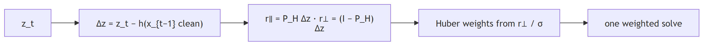

# State estimation with `fdia_graph.se`

Given a scan of noisy, possibly attacked measurements, estimate the true bus voltages and angles.
Every timeline ships a noiseless `clean` layer, so the estimate is scored against exact ground truth.

```python
import fdia_graph as fg
from fdia_graph.se import WLS, AdaptiveWeighting, SubspacePrior

train = fg.load("ieee14", split="train")
test  = fg.load("ieee14", split="test")

est  = SubspacePrior(rank_frac=0.2, reweight="huber", c=1.5).fit(train)
xhat = est.estimate(test)   # [n, 2N-1] = [theta rad (non-slack) | V pu (all buses)]
rep  = est.score(test)      # per-family angle/voltage MAE vs the clean truth
```


| needs | `pip install "fdia-graph[se]"`, a timeline (v0.8.0) or a v0.7.2 record shard, `units="physical"` |
|---|---|
| walkthrough | [`../guides/state_estimation.md`](../guides/state_estimation.md) |
| state | 2N-1: every voltage magnitude, every non-slack angle; slack angle pinned per frame (`ds.slack`) |

## The method classes

| Class | What it changes | Knobs |
|---|---|---|
| `WLS` | Nothing. The audited baseline: least squares weighted by accuracy-class meter error | |
| `ResidualRemoval` | Classical largest-normalized-residual removal: the one largest residual above the threshold per pass, re-solved, with an observability guard | `threshold` |
| `AdaptiveWeighting` | Iteratively reweighted least squares (the Huber M-estimator) | `c` |
| `SubspacePrior` | Restricts the solve to a low-rank benign operating subspace, optionally composed with Huber | `rank_frac`, `reweight` |
| `JacobianWeighting` | Huber weights from the physically unexplained part of the scan-to-scan measurement change (the Jacobian-informed digest), one solve; `reweight="huber"` adds the classical passes on top | `c`, `reweight`, `huber_c` |
| `GatedPrior` | The proposed estimator with a localizer gated the weights: meters on flagged buses and their incident flows are down-weighted so the prior fills in the state there; `secured` meters are never down-weighted | `gate`, `gate_factor`, `secured` |

## Results

| protocol | |
|---|---|
| partition | test split, hyperparameters validation-selected in the estimation paper |
| Huber `c` / rank fraction | 1.5 / 0.20 (14), 2.5 / 0.50 (118), 6.0 / 0.50 (300) |
| removal threshold | 4.0 (14), 5.0 (118), 5.0 (300); the 300 column ran it on the v0.8.0 timeline (3.2 hours, the per-record observability guard), where it does not beat WLS |
| cell | geometric mean of the MAE over the eight record classes (benign and the seven families); full metrics in `results/se_ieee{14,118,300}.json` |

**Estimator comparison**

| Estimator | IEEE 14 | IEEE 118 | IEEE 300 |
|---|---:|---:|---:|
| *Angle MAE (deg)* | | | |
| WLS baseline | 0.097 | 0.023 | 0.027 |
| Residual removal | 0.066 | 0.016 | 0.037 |
| Adaptive weighting | 0.061 | 0.016 | 0.020 |
| **Prior + Huber (proposed)** | **0.050** | **0.012** | **0.016** |
| Jacobian weighting | 0.083 | 0.018 | 0.021 |
| **Prior + Huber + CNN gate** | **0.060** | **0.014** | **0.016** |
| Prior + Huber + oracle gate (ceiling) | 0.050 | 0.012 | 0.015 |
| WLS error reduction | 48% | 48% | 42% |

| Estimator | IEEE 14 | IEEE 118 | IEEE 300 |
|---|---:|---:|---:|
| *Voltage MAE (10^-3 pu)* | | | |
| WLS baseline | 0.871 | 0.198 | 0.219 |
| Residual removal | 0.630 | 0.141 | 0.178 |
| Adaptive weighting | 0.551 | 0.137 | 0.175 |
| **Prior + Huber (proposed)** | **0.154** | **0.029** | **0.063** |
| Jacobian weighting | 0.711 | 0.154 | 0.181 |
| **Prior + Huber + CNN gate** | **0.272** | **0.040** | **0.066** |
| Prior + Huber + oracle gate (ceiling) | 0.212 | 0.034 | 0.060 |
| WLS error reduction | 82% | 86% | 71% |

| paper (v0.4.1 data) | 14 | 118 | 300 |
|---|---:|---:|---:|
| angle, WLS → proposed | 0.164 → 0.068 | 0.075 → 0.033 | 0.129 → 0.068 |
| voltage reduction | 57% | 85% | 68% |

The v0.8.0 timelines carry the accuracy-class meter model (since v0.7.2), so absolute errors are
lower than the paper's; the ordering and the reductions hold.

**Per-family results of the proposed estimator.** Baseline cells are the WLS error, reduction is
the proposed estimator's percent reduction over that baseline.

| Family | Base angle (deg) 14 | Base angle (deg) 118 | Base angle (deg) 300 | Base volt (10^-3) 14 | Base volt (10^-3) 118 | Base volt (10^-3) 300 | Angle red. (%) 14 | Angle red. (%) 118 | Angle red. (%) 300 | Volt red. (%) 14 | Volt red. (%) 118 | Volt red. (%) 300 |
|---|---:|---:|---:|---:|---:|---:|---:|---:|---:|---:|---:|---:|
| Benign | 0.008 | 0.009 | 0.015 | 0.14 | 0.09 | 0.15 | -61 | 25 | 23 | 56 | 80 | 68 |
| Bias (Ad) | 0.127 | 0.028 | 0.025 | 3.70 | 0.53 | 0.33 | 79 | 66 | 43 | 97 | 95 | 82 |
| Scaling (As) | 0.235 | 0.031 | 0.025 | 1.18 | 0.34 | 0.26 | 67 | 67 | 41 | 85 | 92 | 75 |
| Replay (Ar) | 0.234 | 0.049 | 0.131 | 1.18 | 0.21 | 0.44 | 87 | 84 | 90 | 93 | 91 | 87 |
| Stealthy re-solve (Aq) | 0.290 | 0.033 | 0.024 | 2.35 | 0.23 | 0.18 | 25 | 18 | 14 | 80 | 82 | 59 |
| Slow ramp (At) | 0.117 | 0.014 | 0.019 | 1.06 | 0.11 | 0.17 | 34 | 21 | 19 | 82 | 81 | 64 |
| Load redistribution (Al) | 0.069 | 0.030 | 0.026 | 0.45 | 0.23 | 0.20 | 17 | 19 | 12 | 56 | 76 | 59 |
| Multi-snapshot (Am) | 0.056 | 0.017 | 0.020 | 0.40 | 0.12 | 0.16 | 14 | 18 | 18 | 56 | 70 | 61 |

Angle MAE per estimator and family (degrees, lower is better, `geo` is the summary column):

| IEEE 14 | IEEE 118 | IEEE 300 |
|---|---|---|
|  |  |  |

| families | what happens | angle reduction | why |
|---|---|---|---|
| `Ad` `As` `Ar` (in place) | robustness cleans up what it can see | 67 to 87% on 14, 66 to 84% on 118, 41 to 90% on 300; voltage 75 to 97% everywhere | corrupted meters leave large residuals for removal, Huber and the prior to reject |
| `Aq` `At` `Al` `Am` (stealthy) | move part of the way, through the prior alone | 14 to 34% on 14, 18 to 21% on 118, 12 to 19% on 300; voltage 56 to 82% | the local false state is a consistent AC state, so no residual exists and Huber sees nothing; it also sits off the benign operating subspace, so the prior pulls the estimate back part of the way; the rest needs temporal information ([`../localization/README.md`](../localization/README.md)) |

## Jacobian-informed weighting



| result | 14 | 118 | 300 |
|---|---:|---:|---:|
| WLS angle error reduction | 14% | 23% | 22% |
| where it comes from | `Ad` 0.127 → 0.082, `As` 0.235 → 0.168, `Ar` 0.234 → 0.143 | in-place families only | `Ar` 0.131 → 0.029 |
| stealthy families | untouched, as `(I − P_H)a = 0` predicts: `Aq` 0.290, `At` 0.117, `Al` 0.069, `Am` 0.056 on both | same | same |
| against iterated Huber | 0.083 vs 0.061 | 0.018 vs 0.016 | 0.021 vs 0.020 |

The temporal unexplained residual carries what Huber already recovers from the estimate's own
residual, so this route cannot move the proposed estimator. The routes that can are a localizer gate
and, ahead of it, a trusted set of meters.

## Localization-gated estimation


Angle mean absolute error in degrees on the v0.8.0 timelines, the proposed estimator alone, with the
CNN localizer as the gate, and with the true labels as the gate (the ceiling for any gate):

| | IEEE 14 | | | IEEE 118 | | | IEEE 300 | | |
|---|---:|---:|---:|---:|---:|---:|---:|---:|---:|
| angle MAE (deg) | proposed | + CNN gate | + oracle | proposed | + CNN gate | + oracle | proposed | + CNN gate | + oracle |
| Aq stealthy load scale | 0.219 | 0.284 | 0.219 | 0.027 | 0.033 | 0.026 | 0.021 | 0.023 | 0.021 |
| Ad / As / Ar in place | 0.027 / 0.077 / 0.030 | 0.022 / 0.023 / 0.024 | 0.020 / 0.021 / 0.020 | 0.009 / 0.010 / 0.008 | 0.008 / 0.008 / 0.008 | 0.007 / 0.007 / 0.007 | 0.014 / 0.015 / 0.014 | 0.012 / 0.012 / 0.012 | 0.012 / 0.012 / 0.012 |
| At slow ramp | 0.077 | 0.151 | 0.081 | 0.011 | 0.014 | 0.012 | 0.016 | 0.020 | 0.016 |
| Al redistribution | 0.057 | 0.162 | 0.142 | 0.024 | 0.037 | 0.033 | 0.023 | 0.025 | 0.023 |
| Am multi-snapshot | 0.048 | 0.139 | 0.131 | 0.014 | 0.021 | 0.020 | 0.017 | 0.017 | 0.016 |
| geometric mean | **0.050** | 0.060 | 0.050 | **0.012** | 0.014 | 0.012 | 0.016 | 0.016 | **0.015** |

| families | what the gate does | why |
|---|---|---|
| `Ad` `As` `Ar` (in place) | finishes the job at every size: 0.020 on 14, 0.007 on 118, 0.012 on 300 | the flagged bus's meters are the corrupted ones, the prior fills a hole that held nothing true |
| `Aq` `At` `Al` `Am` (stealthy) | makes them worse, with the true labels too: `Al` 0.057 → 0.162 on 14, 0.024 → 0.037 on 118 | a local false state is a consistent AC state, so the flagged bus's meters are the evidence the prior was using; pulled out, the prior guesses from the neighbours, which describe the false state |

On the v0.8.0 timelines gating alone does not lower the geometric mean on any system; the in-place
gain and the stealthy loss cancel. The gate pays when it has something true to leave in: with 20
meters secured by the DQN selector of [`../trust/README.md`](../trust/README.md) and exempt from the
gate, the same CNN gate takes IEEE-14 from 0.050 to 0.020 degrees. Recovering a stealthy false state
from one scan otherwise needs the previous scan, the temporal direction.

## Regenerate

```bash
FG_SYSTEM=ieee14 python docs/se/run_se.py      # fits, writes results/se_ieee14.json (estimates cached per arm)
FG_SYSTEM=ieee118 python docs/se/run_se.py
FG_SYSTEM=ieee300 python docs/se/run_se.py
python docs/se/make_report.py                  # tables (markdown) + figures + CSV from the JSON
```

| | |
|---|---|
| skip arms | `FG_SKIP=removal,...` (every published column ran every arm) |
| wall time, CPU, IEEE-300 (v0.8.0 run) | WLS about a minute, residual removal 3.2 h, Huber 2.8 h, prior + Huber 56 min, Jacobian weighting 4 min, each gated arm 56 min |
| re-runs | score from `results/cache/` in about a minute per arm |
