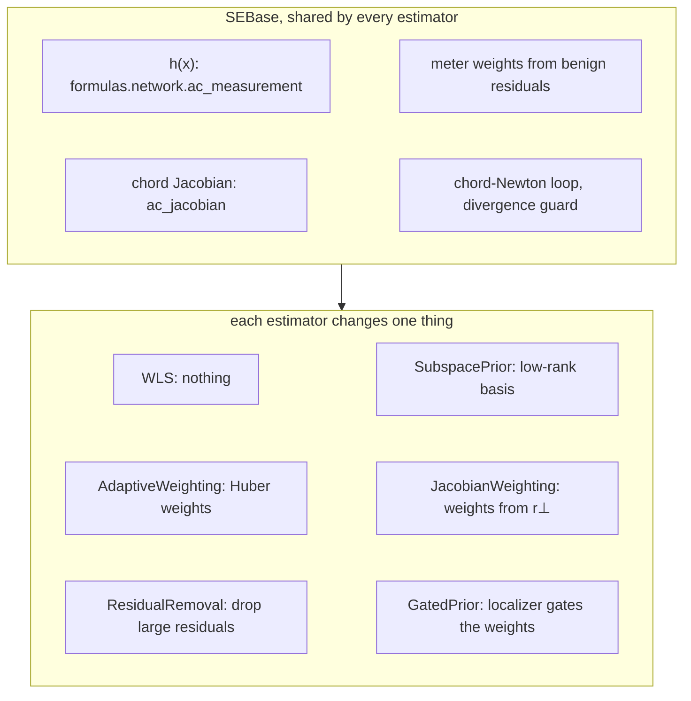
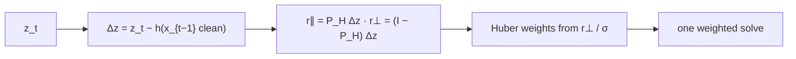
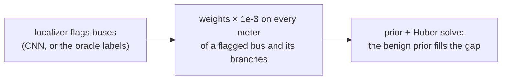

# State estimation with `fdia_graph.se`

Given a scan of noisy, possibly attacked measurements, estimate the true bus voltages and angles.
Every shard ships a noiseless `clean` layer, so the estimate is scored against exact ground truth.

```python
import fdia_graph as fg
from fdia_graph.se import WLS, AdaptiveWeighting, SubspacePrior

train = fg.load("ieee14", split="train")
test  = fg.load("ieee14", split="test")

est  = SubspacePrior(rank_frac=0.2, reweight="huber", c=1.5).fit(train)
xhat = est.estimate(test)   # [n, 2N-1] = [theta rad (non-slack) | V pu (all buses)]
rep  = est.score(test)      # per-family angle/voltage MAE vs the clean truth
```



| needs | `pip install "fdia-graph[se]"`, a v0.7.2+ shard |
|---|---|
| walkthrough | [`../guides/state_estimation.md`](../guides/state_estimation.md) |
| state | 2N-1: every voltage magnitude, every non-slack angle; slack angle pinned per record (`ds.slack`) |

## The method classes

| Class | What it changes | Knobs |
|---|---|---|
| `WLS` | Nothing. The audited baseline: least squares weighted by accuracy-class meter error | |
| `ResidualRemoval` | Largest-normalized-residual removal with an observability guard | `threshold` |
| `AdaptiveWeighting` | Iteratively reweighted least squares (the Huber M-estimator) | `c` |
| `SubspacePrior` | Restricts the solve to a low-rank benign operating subspace, optionally composed with Huber | `rank_frac`, `reweight` |
| `JacobianWeighting` | Huber weights from the physically unexplained part of the scan-to-scan measurement change (the Jacobian-informed digest), one solve; `reweight="huber"` adds the classical passes on top | `c`, `reweight`, `huber_c` |
| `GatedPrior` | The proposed estimator with a localizer gating the weights: meters on flagged buses and their incident flows are down-weighted so the prior fills in the state there | `gate`, `gate_factor` |

## Results

| protocol | |
|---|---|
| partition | test split, hyperparameters validation-selected in the estimation paper |
| Huber `c` / rank fraction | 1.5 / 0.20 (14), 2.5 / 0.50 (118), 6.0 / 0.50 (300) |
| removal threshold | 4.0 (14), 5.0 (118), 5.0 (300); the 300 column ran it on the v0.8.0 timeline (3.2 hours, the per-record observability guard), where it does not beat WLS |
| cell | geometric mean of the MAE over the eight record classes (benign and the seven families); full metrics in `results/se_ieee{14,118,300}.json` |

**Estimator comparison**

| Estimator | IEEE 14 | IEEE 118 | IEEE 300 |
|---|---:|---:|---:|
| *Angle MAE (deg)* | | | |
| WLS baseline | 0.097 | 0.023 | 0.027 |
| Residual removal | 0.066 | 0.016 | 0.037 |
| Adaptive weighting | 0.061 | 0.016 | 0.020 |
| **Prior + Huber (proposed)** | **0.050** | **0.012** | **0.016** |
| Jacobian weighting | 0.083 | 0.018 | 0.021 |
| **Prior + Huber + CNN gate** | **0.060** | **0.014** | **0.016** |
| Prior + Huber + oracle gate (ceiling) | 0.050 | 0.012 | 0.015 |
| WLS error reduction | 48% | 48% | 42% |

| Estimator | IEEE 14 | IEEE 118 | IEEE 300 |
|---|---:|---:|---:|
| *Voltage MAE (10^-3 pu)* | | | |
| WLS baseline | 0.871 | 0.198 | 0.219 |
| Residual removal | 0.630 | 0.141 | 0.178 |
| Adaptive weighting | 0.551 | 0.137 | 0.175 |
| **Prior + Huber (proposed)** | **0.154** | **0.029** | **0.063** |
| Jacobian weighting | 0.711 | 0.154 | 0.181 |
| **Prior + Huber + CNN gate** | **0.272** | **0.040** | **0.066** |
| Prior + Huber + oracle gate (ceiling) | 0.212 | 0.034 | 0.060 |
| WLS error reduction | 82% | 86% | 71% |

| paper (v0.4.1 data) | 14 | 118 | 300 |
|---|---:|---:|---:|
| angle, WLS → proposed | 0.164 → 0.068 | 0.075 → 0.033 | 0.129 → 0.068 |
| voltage reduction | 57% | 85% | 68% |

The v0.7.2 shards carry the accuracy-class meter model, so absolute errors are lower; the ordering
and the reductions hold.

**Per-family results of the proposed estimator.** Baseline cells are the WLS error, reduction is
the proposed estimator's percent reduction over that baseline.

| Family | Base angle (deg) 14 | Base angle (deg) 118 | Base angle (deg) 300 | Base volt (10^-3) 14 | Base volt (10^-3) 118 | Base volt (10^-3) 300 | Angle red. (%) 14 | Angle red. (%) 118 | Angle red. (%) 300 | Volt red. (%) 14 | Volt red. (%) 118 | Volt red. (%) 300 |
|---|---:|---:|---:|---:|---:|---:|---:|---:|---:|---:|---:|---:|
| Benign | 0.008 | 0.009 | 0.015 | 0.14 | 0.09 | 0.15 | -61 | 25 | 23 | 56 | 80 | 68 |
| Bias (Ad) | 0.127 | 0.028 | 0.025 | 3.70 | 0.53 | 0.33 | 79 | 66 | 43 | 97 | 95 | 82 |
| Scaling (As) | 0.235 | 0.031 | 0.025 | 1.18 | 0.34 | 0.26 | 67 | 67 | 41 | 85 | 92 | 75 |
| Replay (Ar) | 0.234 | 0.049 | 0.131 | 1.18 | 0.21 | 0.44 | 87 | 84 | 90 | 93 | 91 | 87 |
| Stealthy re-solve (Aq) | 0.290 | 0.033 | 0.024 | 2.35 | 0.23 | 0.18 | 25 | 18 | 14 | 80 | 82 | 59 |
| Slow ramp (At) | 0.117 | 0.014 | 0.019 | 1.06 | 0.11 | 0.17 | 34 | 21 | 19 | 82 | 81 | 64 |
| Load redistribution (Al) | 0.069 | 0.030 | 0.026 | 0.45 | 0.23 | 0.20 | 17 | 19 | 12 | 56 | 76 | 59 |
| Multi-snapshot (Am) | 0.056 | 0.017 | 0.020 | 0.40 | 0.12 | 0.16 | 14 | 18 | 18 | 56 | 70 | 61 |

Angle MAE per estimator and family (degrees, lower is better, `geo` is the summary column):

| IEEE 14 | IEEE 118 | IEEE 300 |
|---|---|---|
|  |  |  |

| families | what happens | angle reduction | why |
|---|---|---|---|
| `Ad` `As` `Ar` (in place) | robustness cleans up what it can see | 67 to 87% on 14, 66 to 84% on 118, 41 to 90% on 300; voltage 75 to 97% everywhere | corrupted meters leave large residuals for removal, Huber and the prior to reject |
| `Aq` `At` `Al` `Am` (stealthy) | move part of the way, through the prior alone | 14 to 34% on 14, 18 to 21% on 118, 12 to 19% on 300; voltage 56 to 82% | the local false state is a consistent AC state, so no residual exists and Huber sees nothing; it also sits off the benign operating subspace, so the prior pulls the estimate back part of the way; the rest needs temporal information ([`../localization/README.md`](../localization/README.md)) |

> The sections below (the Jacobian-informed weighting and the localization-gated estimation, with their
> numbers) were derived on the v0.7.2 record shards and stay as written until they are re-derived on
> the v0.8.0 timelines; the tables above are v0.8.0.

## Jacobian-informed weighting



| result | 14 | 118 | 300 |
|---|---:|---:|---:|
| WLS angle error reduction | 19% | 26% | 23% |
| where it comes from | `Ad` 0.136 → 0.087, `As` 0.246 → 0.177, `Ar` 0.137 → 0.066 | in-place families only | `Ar` 0.132 → 0.032 |
| stealthy families | untouched, as `(I − P_H)a = 0` predicts | same | same |
| against iterated Huber | 0.087 vs 0.068 | | 0.074 vs 0.068 |
| composed with Huber passes | 0.067, Huber's number | | |

The temporal unexplained residual carries what Huber already recovers from the estimate's own
residual, so this route cannot move the proposed estimator. The route that can is a localizer gate.

## Localization-gated estimation



| | IEEE 14 | | | IEEE 118 | | | IEEE 300 | | |
|---|---:|---:|---:|---:|---:|---:|---:|---:|---:|
| angle MAE (deg) | proposed | + CNN gate | + oracle | proposed | + CNN gate | + oracle | proposed | + CNN gate | + oracle |
| Aq stealthy re-solve | 0.402 | 0.256 | 0.227 | 0.168 | 0.168 | 0.168 | 0.391 | 0.391 | 0.391 |
| Ad / As / Ar in-place | 0.027 / 0.080 / 0.025 | 0.020 / 0.021 / 0.020 | 0.020 / 0.021 / 0.019 | 0.009 / 0.011 / 0.008 | 0.008 / 0.008 / 0.008 | 0.008 / 0.007 / 0.007 | 0.015 / 0.015 / 0.014 | 0.013 / 0.012 / 0.013 | 0.012 / 0.012 / 0.012 |
| At slow ramp | 0.064 | 0.044 | 0.040 | 0.032 | 0.033 | 0.033 | 0.068 | 0.068 | 0.068 |
| Al redistribution | 0.154 | 0.153 | 0.152 | 0.764 | 0.766 | 0.765 | 2.276 | 2.277 | 2.277 |
| geometric mean | 0.059 | **0.041** | 0.039 | 0.030 | **0.028** | 0.027 | 0.058 | **0.055** | 0.054 |

| system | gain over the proposed estimator | on which families | why |
|---|---|---|---|
| IEEE 14 | 31%, within 4% of the oracle | the first thing that moves stealthy `Aq` | removing a few buses' meters removes most evidence of the re-solved state, the prior pulls back to typical operation |
| IEEE 118, 300 | 5% | in-place families only; `Aq` `At` `Al` unchanged even with the oracle | the attack's footprint spreads over many unflagged branches, the rest still describes the attacked physics |

Gating helps the in-place families at any size and the stealthy families only on a small grid.
Recovering the pre-attack state under a stealthy re-solve needs the previous state (the streams).
A CNN gate on the Jacobian features gives the same numbers; voltage error rises slightly under
gating since voltage meters are among those removed.

## Regenerate

```bash
FG_SYSTEM=ieee14 python docs/se/run_se.py      # fits, writes results/se_ieee14.json (estimates cached per arm)
FG_SYSTEM=ieee118 python docs/se/run_se.py
FG_SYSTEM=ieee300 python docs/se/run_se.py
python docs/se/make_report.py                  # tables (markdown) + figures + CSV from the JSON
```

| | |
|---|---|
| skip arms | `FG_SKIP=removal,...` (every published column ran every arm) |
| wall time, CPU, IEEE-300 (v0.8.0 run) | WLS about a minute, residual removal 3.2 h, Huber 2.8 h, prior + Huber 56 min, Jacobian weighting 4 min, each gated arm 56 min |
| re-runs | score from `results/cache/` in about a minute per arm |
