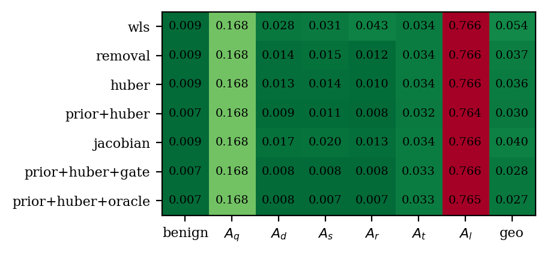
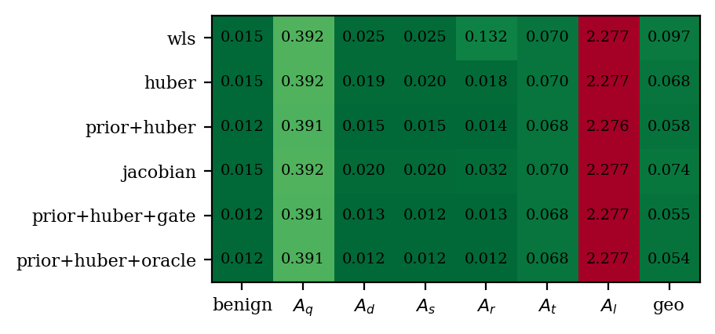

# State estimation with `fdia_graph.se`

Given a scan of noisy, possibly attacked measurements, estimate the true bus voltages and angles.
Every shard ships a noiseless `clean` layer, so the estimate is scored against exact ground truth.

```python
import fdia_graph as fg
from fdia_graph.se import WLS, AdaptiveWeighting, SubspacePrior

train = fg.load("ieee14", split="train")
test  = fg.load("ieee14", split="test")

est  = SubspacePrior(rank_frac=0.2, reweight="huber", c=1.5).fit(train)
xhat = est.estimate(test)   # [n, 2N-1] = [theta rad (non-slack) | V pu (all buses)]
rep  = est.score(test)      # per-family angle/voltage MAE vs the clean truth
```

- Needs the `[se]` extra (`pip install "fdia-graph[se]"`) and a v0.7.2+ shard.
- sklearn style: one base class owns the shared machinery (AC measurement model, chord-Newton solve,
  meter-weight calibration, the 2N-1 state with the slack angle as reference, `ds.slack`). Each
  method class changes exactly one thing, so comparing two methods compares estimators, not
  implementations.
- Walkthrough: [`../guides/state_estimation.md`](../guides/state_estimation.md).

## The method classes

| Class | What it changes | Knobs |
|---|---|---|
| `WLS` | Nothing. The audited baseline: least squares weighted by accuracy-class meter error | |
| `ResidualRemoval` | Largest-normalized-residual removal with an observability guard | `threshold` |
| `AdaptiveWeighting` | Iteratively reweighted least squares (the Huber M-estimator) | `c` |
| `SubspacePrior` | Restricts the solve to a low-rank benign operating subspace, optionally composed with Huber | `rank_frac`, `reweight` |
| `JacobianWeighting` | Huber weights from the physically unexplained part of the scan-to-scan measurement change (the Jacobian-informed digest), one solve; `reweight="huber"` adds the classical passes on top | `c`, `reweight`, `huber_c` |
| `GatedPrior` | The proposed estimator with a localizer gating the weights: meters on flagged buses and their incident flows are down-weighted so the prior fills in the state there | `gate`, `gate_factor` |

## Results

Test partition, validation-selected hyperparameters from the estimation paper (Huber `c` 1.5 / 2.5 /
6.0, rank fraction 0.20 / 0.50 / 0.50, removal threshold 4.0 / 5.0 on IEEE 14 / 118 / 300). Each cell
is the mean absolute error aggregated over the seven record classes as a geometric mean. Full metrics
in `results/se_ieee{14,118,300}.json`. Residual removal is not run on IEEE 300: its per-record
observability guard takes many hours at that size, and the estimation paper found no removal
threshold that helped on 300.

**Estimator comparison**

| Estimator | IEEE 14 | IEEE 118 | IEEE 300 |
|---|---:|---:|---:|
| *Angle MAE (deg)* | | | |
| WLS baseline | 0.108 | 0.054 | 0.097 |
| Residual removal | 0.070 | 0.037 | not run |
| Adaptive weighting | 0.068 | 0.036 | 0.068 |
| **Prior + Huber (proposed)** | **0.059** | **0.030** | **0.058** |
| Jacobian weighting | 0.087 | 0.040 | 0.074 |
| **Prior + Huber + CNN gate** | **0.041** | **0.028** | **0.055** |
| Prior + Huber + oracle gate (ceiling) | 0.039 | 0.027 | 0.054 |
| WLS error reduction (proposed) | 45% | 45% | 40% |
| WLS error reduction (gated) | 62% | 48% | 43% |

| Estimator | IEEE 14 | IEEE 118 | IEEE 300 |
|---|---:|---:|---:|
| *Voltage MAE (10^-3 pu)* | | | |
| WLS baseline | 0.606 | 0.165 | 0.321 |
| Residual removal | 0.427 | 0.113 | not run |
| Adaptive weighting | 0.380 | 0.111 | 0.250 |
| **Prior + Huber (proposed)** | **0.147** | **0.028** | **0.114** |
| Jacobian weighting | 0.494 | 0.125 | 0.261 |
| **Prior + Huber + CNN gate** | **0.161** | **0.029** | **0.106** |
| Prior + Huber + oracle gate (ceiling) | 0.158 | 0.027 | 0.105 |
| WLS error reduction (proposed) | 76% | 83% | 64% |

The estimation paper reports, on v0.4.1 data, angle 0.164 → 0.068 (14), 0.075 → 0.033 (118) and
0.129 → 0.068 (300) from WLS to the proposed estimator, and voltage reductions of 57%, 85% and 68%.
The v0.7.2 shards carry the accuracy-class meter model, so absolute errors are lower, and the
ordering and the reductions hold on all three systems.

**Per-family results of the proposed estimator.** Baseline cells are the WLS error, reduction is
the proposed estimator's percent reduction over that baseline.

| Family | Base angle (deg) 14 | Base angle (deg) 118 | Base angle (deg) 300 | Base volt (10^-3) 14 | Base volt (10^-3) 118 | Base volt (10^-3) 300 | Angle red. (%) 14 | Angle red. (%) 118 | Angle red. (%) 300 | Volt red. (%) 14 | Volt red. (%) 118 | Volt red. (%) 300 |
|---|---:|---:|---:|---:|---:|---:|---:|---:|---:|---:|---:|---:|
| Benign | 0.008 | 0.009 | 0.015 | 0.15 | 0.09 | 0.15 | -45 | 25 | 23 | 58 | 80 | 68 |
| Bias (Ad) | 0.136 | 0.028 | 0.025 | 3.90 | 0.55 | 0.33 | 80 | 66 | 41 | 97 | 95 | 81 |
| Scaling (As) | 0.246 | 0.031 | 0.025 | 1.17 | 0.33 | 0.26 | 67 | 66 | 39 | 85 | 91 | 73 |
| Replay (Ar) | 0.137 | 0.043 | 0.132 | 1.12 | 0.17 | 0.45 | 82 | 82 | 89 | 93 | 88 | 86 |
| Stealthy re-solve (Aq) | 0.382 | 0.168 | 0.392 | 0.62 | 0.10 | 0.34 | -5 | 0 | 0 | 30 | 63 | 23 |
| Slow ramp (At) | 0.065 | 0.034 | 0.070 | 0.19 | 0.09 | 0.17 | 1 | 4 | 2 | 48 | 79 | 56 |
| Load redistribution (Al) | 0.180 | 0.766 | 2.277 | 0.34 | 0.14 | 1.01 | 15 | 0 | 0 | 4 | 39 | 6 |

Angle MAE per estimator and family (degrees, lower is better, `geo` is the summary column):

| IEEE 14 | IEEE 118 | IEEE 300 |
|---|---|---|
|  |  |  |

Two readings:

1. **Robustness cleans up what it can see.** `Ad`/`As`/`Ar` corrupt meters in place and leave large
   residuals. Removal and Huber each cut their angle error, and the prior on top takes 66 to 82
   percent off the baseline angle error on 14 and 118 (39 to 89 percent on 300, where the in-place
   families start closer to the noise floor) and 73 to 97 percent off the voltage error everywhere.
2. **The stealthy families barely move.** `Aq`/`At`/`Al` re-solve the physics, so there is nothing
   for a robust weight or a residual test to reject. Angle reduction sits between -5 and 15 percent
   on 14, 0 to 4 percent on 118 and 0 to 2 percent on 300 for every method. Recovering the truth
   under a stealthy attack
   needs temporal information, not better weighting. The detection side of that story is in
   [`../localization/README.md`](../localization/README.md).

## Jacobian-informed weighting

`JacobianWeighting` applies the digest's idea to estimation: the part of the measurement change
since the previous clean state that no state change can explain, `r⊥ = (I − P_H)Δz`, sets Huber
weights before a single solve. It cuts WLS angle error by 19% on 14, 26% on 118 and 23% on 300,
entirely on the in-place corruption families (`Ad` 0.136 → 0.087, `As` 0.246 → 0.177, `Ar` 0.137 →
0.066 on 14; `Ar` 0.132 → 0.032 on 300), and leaves the stealthy families untouched, exactly as
`(I − P_H)a = 0` predicts. It does not reach the iterated Huber arm (0.068 on 14 and on 300), and
composing the two (Jacobian weights first, Huber passes on
top) lands on Huber's number (0.067). The temporal unexplained residual carries the information
Huber already recovers from the estimate's own residual, so this route cannot move the proposed
estimator; the route that can is gating it with a localizer (`GatedPrior`), since localization sees
the stealthy families that no residual does.

## Localization-gated estimation

`GatedPrior` runs the proposed estimator with a localizer deciding which meters to trust: every meter
on a flagged bus and every flow on a branch incident to it is down-weighted by 1e-3, so the benign
prior supplies the state there. The CNN gate is the papers' localizer trained on the same train split
(all families); the oracle gate uses the true labels and is the ceiling for any gate.

| | IEEE 14 | | | IEEE 118 | | | IEEE 300 | | |
|---|---:|---:|---:|---:|---:|---:|---:|---:|---:|
| angle MAE (deg) | proposed | + CNN gate | + oracle | proposed | + CNN gate | + oracle | proposed | + CNN gate | + oracle |
| Aq stealthy re-solve | 0.402 | 0.256 | 0.227 | 0.168 | 0.168 | 0.168 | 0.391 | 0.391 | 0.391 |
| Ad / As / Ar in-place | 0.027 / 0.080 / 0.025 | 0.020 / 0.021 / 0.020 | 0.020 / 0.021 / 0.019 | 0.009 / 0.011 / 0.008 | 0.008 / 0.008 / 0.008 | 0.008 / 0.007 / 0.007 | 0.015 / 0.015 / 0.014 | 0.013 / 0.012 / 0.013 | 0.012 / 0.012 / 0.012 |
| At slow ramp | 0.064 | 0.044 | 0.040 | 0.032 | 0.033 | 0.033 | 0.068 | 0.068 | 0.068 |
| Al redistribution | 0.154 | 0.153 | 0.152 | 0.764 | 0.766 | 0.765 | 2.276 | 2.277 | 2.277 |
| geometric mean | 0.059 | **0.041** | 0.039 | 0.030 | **0.028** | 0.028 | 0.058 | **0.055** | 0.054 |

Reading: on IEEE 14 the predicted gate takes 31 percent off the proposed estimator and lands within 4
percent of the oracle, and it is the first thing that moves the stealthy `Aq` family. On IEEE 118 and
300 the gain shrinks to 5 percent, all of it on the in-place families, and `Aq`, `At` and `Al` do not
move even with the oracle gate. Removing a few buses'
meters on a small grid removes most of the evidence of the re-solved state and the prior pulls the
estimate back toward typical operation; on a large grid the attack's footprint spreads over many
unflagged branches and the remaining measurements still describe the attacked physics. Gating helps
the in-place families at any size and the stealthy families only when the grid is small. Recovering
the pre-attack state under a stealthy re-solve needs the previous state, which is the streams'
territory, not a better weight. A CNN gate with the Jacobian features gives the same numbers as the
CNN gate. Voltage error rises slightly under gating (voltage meters are among those removed).

## Regenerate

```bash
FG_SYSTEM=ieee14 python docs/se/run_se.py      # fits, writes results/se_ieee14.json (estimates cached per arm)
FG_SYSTEM=ieee118 python docs/se/run_se.py
FG_SYSTEM=ieee300 python docs/se/run_se.py
python docs/se/make_report.py                  # tables (markdown) + figures + CSV from the JSON
```

`FG_SKIP=removal,...` leaves arms out of a run; the IEEE-300 column was made with `FG_SKIP=removal`.
Wall time on the CPU with 0.14.1's batched solver: minutes on IEEE-14; on IEEE-300 WLS 1 min, Huber
2.1 h, prior + Huber 47 min, Jacobian weighting 5 min, each gated arm 48 min (the IEEE-118 arms were
run before the 0.14.1 speedups and took 1 to 6 h each). Re-runs score from `results/cache/` in about
a minute per arm.
