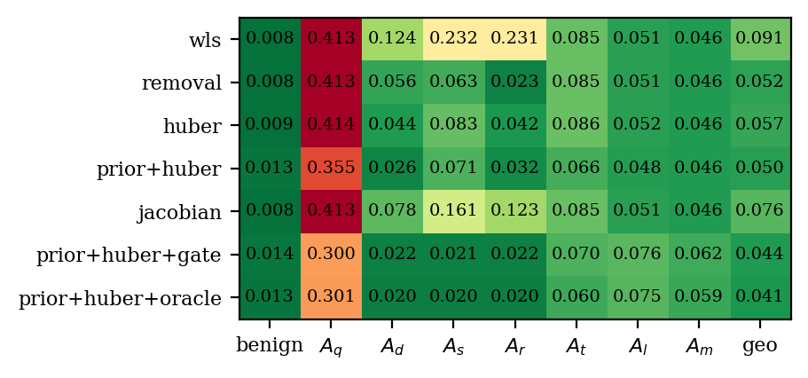

# State estimation with `fdia_graph.se`

Given a scan of noisy, possibly attacked measurements, estimate the true bus voltages and angles.
Every shard ships a noiseless `clean` layer, so the estimate is scored against exact ground truth.

```python
import fdia_graph as fg
from fdia_graph.se import WLS, AdaptiveWeighting, SubspacePrior

train = fg.load("ieee14", split="train")
test  = fg.load("ieee14", split="test")

est  = SubspacePrior(rank_frac=0.2, reweight="huber", c=1.5).fit(train)
xhat = est.estimate(test)   # [n, 2N-1] = [theta rad (non-slack) | V pu (all buses)]
rep  = est.score(test)      # per-family angle/voltage MAE vs the clean truth
```

- Needs the `[se]` extra (`pip install "fdia-graph[se]"`) and a v0.7.2+ shard.
- sklearn style: one base class owns the shared machinery (AC measurement model, chord-Newton solve,
  meter-weight calibration, the 2N-1 state with the slack angle as reference). Each method class
  changes exactly one thing, so comparing two methods compares estimators, not implementations.
- Walkthrough: [`../guides/state_estimation.md`](../guides/state_estimation.md).

## The method classes

| Class | What it changes | Knobs |
|---|---|---|
| `WLS` | Nothing. The audited baseline: least squares weighted by accuracy-class meter error | |
| `AdaptiveWeighting` | Iteratively reweighted least squares (the Huber M-estimator) | `c` |
| `ResidualRemoval` | Largest-normalized-residual removal with an observability guard | `threshold` |
| `SubspacePrior` | Restricts the solve to a low-rank benign operating subspace, optionally composed with Huber | `rank_frac`, `reweight` |

## Results: IEEE-14, test split, validation-selected hyperparameters



Angle MAE in degrees per family. `geo` is the geometric mean over families. Full metrics including
voltage MAE in [`results/se_ieee14.json`](results/se_ieee14.json), figure data in the CSV sidecar.

| method | benign | Aq | Ad | As | Ar | At | Al | geo |
|---|---|---|---|---|---|---|---|---|
| wls | 0.008 | 0.382 | 0.136 | 0.246 | 0.137 | 0.065 | 0.180 | 0.108 |
| huber | 0.009 | 0.384 | 0.046 | 0.092 | 0.038 | 0.065 | 0.180 | 0.068 |
| prior+huber | 0.012 | 0.402 | **0.027** | **0.080** | **0.025** | 0.064 | **0.154** | **0.059** |

Two readings:

1. **Robustness cleans up what it can see.** `Ad`/`As`/`Ar` corrupt meters in place and leave large
   residuals. Huber cuts their angle error 3–5x, the prior tightens it further (geo 0.108 → 0.059
   degrees, voltage geo 6x better, see the JSON).
2. **The stealthy families barely move.** `Aq`/`At`/`Al` re-solve the physics, so there is nothing
   for a robust weight or a residual test to reject. Every method lands within a few percent of WLS.
   Recovering the truth under a stealthy attack needs temporal information, not better weighting.
   The detection side of that story is in [`../localization/README.md`](../localization/README.md).

## Regenerate

```bash
python docs/se/run_se.py                       # IEEE-14, minutes on a laptop
FG_SYSTEM=ieee118 python docs/se/run_se.py     # any system in the ladder
```

Outputs land in `results/`: metrics JSON, figure, and a CSV sidecar so the figure can be restyled
without re-running.
