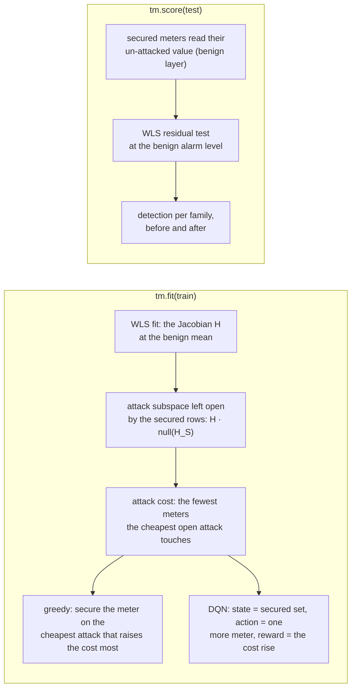

# Trusted meters with `fdia_graph.trust`

Which meters to secure so that a stealthy attack stops being stealthy.

```python
import fdia_graph as fg
from fdia_graph.trust import TrustedMeters, TrustedMetersDQN

train = fg.load("ieee14", split="train")
test = fg.load("ieee14", split="test", order="time")

tm = TrustedMeters(k=20).fit(train)  # the greedy row-reduction selection on the Jacobian
tm.order, tm.cost  # the meters secured in order, the attack cost after each
rep = tm.score(test)  # residual detection per family, with and without the trust

rl = TrustedMetersDQN(k=20, episodes=200).fit(train)  # the same selection as an MDP with a DQN policy
```



## The idea

A stealthy attack `a = H c` moves the meters the way a real state change `c` would, so the residual
test does not see it. A meter the attacker cannot write pins its row: `a_S = 0`, so `H_S c = 0`
and the attack lives in the null space of the secured rows. Every secured meter shrinks that space;
once `H_S` has full column rank there is no stealthy attack left. The attack cost is how many
meters the cheapest attack in the open subspace must touch (the sparsest row of its reduced row
echelon basis, an upper bound on the exact NP-hard minimum). Both selectors read the same kernel,
`fdia_graph.formulas.trust`.

| class | picks the next meter by | needs |
|---|---|---|
| `TrustedMeters` | the greedy rule: on the cheapest open attack, the meter whose protection leaves the attacker the costliest cheapest attack | `[se]` |
| `TrustedMetersDQN` | a Q-network trained on the MDP (state the secured set, reward the cost rise), rolled out greedily; one rollout of `m` forward passes picks a set where the greedy rule re-evaluates every candidate at every step | `[se]`, `[torch]` |

`score(test)` needs a time-ordered timeline view: on every attacked frame the secured meters are
set back to their benign reading (the attacker cannot write them) and a WLS residual test at the
benign false-alarm level says whether the attack now shows. `detected_before` is the residual test
with every meter writable, `detected_after` with the trust in place.

## Results

`python docs/trust/run_trust.py` (set `FG_SYSTEM`) writes `results/trust_<system>.json`: the
selection, the attack-cost curve, and the detection table. Read the detection table first: the
attack cost is the sparsest row of an echelon basis of the open subspace, an upper bound on the
true sparsest attack, so it is not monotone in the secured set (a DQN selection on IEEE-14 walks
54 to 3 while its detection of Aq, Al and Am rises from 0.02, 0.00, 0.00 to 0.86, 0.80, 0.84).

WLS residual detection rate per family at a 1% benign alarm level, before and after securing 20
meters (v0.8.0 timelines, test split; IEEE-118 row filled when its run completes):

| system | selector | Aq | At | Al | Am | Ad / As / Ar |
|---|---|---|---|---|---|---|
| ieee14 | greedy | 0.02 → 0.86 | 0.02 → 0.29 | 0.00 → 0.85 | 0.00 → 0.77 | 1.00 / 1.00 / 0.95 → 1.00 / 1.00 / 0.93 |
| ieee14 | DQN | 0.02 → 0.86 | 0.02 → 0.49 | 0.00 → 0.80 | 0.00 → 0.84 | 1.00 / 1.00 / 0.95 → 1.00 / 1.00 / 0.93 |
IEEE118_ROWS

Source: the multi-snapshot attack and the trusted-PMU defence of [WU26] (`docs/reference/REFERENCES.md`).
